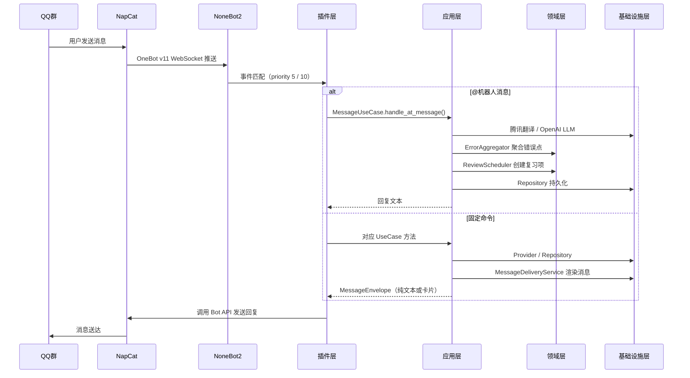
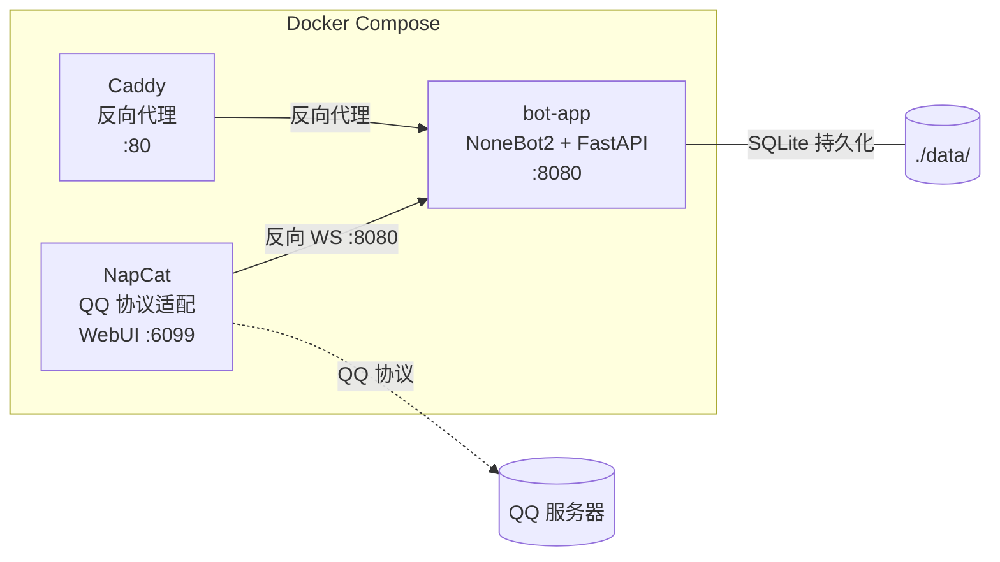

本文档是 **English Learning QQ Bot** 项目的总览入口。你将了解到这个机器人"能做什么"、"怎么组织的"、"用了哪些技术栈"以及"代码里谁依赖谁"。阅读完本页后，你可以根据底部推荐路径继续深入各个子系统。

---

## 项目定位与核心能力

English Learning QQ Bot 是一个运行在 QQ 群里的英语学习辅助机器人，基于 **NoneBot2 + NapCat + SQLite + FastAPI** 构建。它不是简单的翻译工具，而是一个围绕"**纠错 → 聚合 → 复习 → 测验 → 报告**"闭环的学习系统。

机器人提供了两大类交互入口，且严格分离：

| 交互方式 | 触发条件 | 用途 | 实现入口 |
|---------|---------|------|---------|
| **@机器人** | 群内 `@机器人 + 文本` | 翻译、英文纠错、表达润色、语法解释 | [at_message.py](src/plugins/at_message.py) |
| **固定命令** | 直接发送命令文本 | 报名学习、今日任务、提交任务、复习、等级、周测、周报 | [commands.py](src/plugins/commands.py) |

这种分离确保了"随手问英语"和"系统化学习"两个场景互不干扰——如果你在群内 @机器人 发了"报名学习"，机器人会明确提示你改用固定命令直接发送。

Sources: [README.md](README.md#L1-L19), [command_catalog.py](src/plugins/command_catalog.py#L1-L51)

### 支持的固定命令一览

```
报名学习          — 加入学习系统
今日任务          — 获取当天学习任务
提交任务 <ID> <内容> — 提交任务答案
复习一下          — 触发间隔复习
我的等级          — 查看当前学习等级
开始周测          — 开始本周测验
答题 <试卷ID> 1:A 2:B — 提交周测答案
本周总结          — 生成周报
帮助              — 查看命令列表
```

### 定时任务能力

除用户主动触发外，机器人还通过 APScheduler 注册了五个定时任务：每日任务推送（早 8 点）、每日提醒（晚 8 点）、周报生成（周一早 9 点）、周测生成（周日晚 7 点）和数据库夜间备份（凌晨 2 点）。所有定时任务均带有分布式任务锁（`acquire_job_lock`）确保幂等执行。

Sources: [scheduler.py](src/plugins/scheduler.py#L1-L55)

---

## 技术栈总览

| 层级 | 技术 | 用途 |
|------|------|------|
| **机器人框架** | NoneBot2 + onebot-adapter-v11 | 消息接收、事件分发、插件加载 |
| **QQ 协议** | NapCat（Docker） | OneBot v11 反向 WebSocket 连接 QQ |
| **异步数据库** | SQLite + SQLAlchemy 2.0 + aiosqlite | 用户、学习记录、配置持久化 |
| **翻译服务** | 腾讯云机器翻译 TextTranslate | 中英互译 |
| **大模型** | OpenAI 兼容 chat/completions 接口 | 纠错、表达优化、测验生成、周报总结 |
| **内容源** | TED RSS + 内置短文回退 | 每日学习材料 |
| **管理后台** | FastAPI + Jinja2 + SessionMiddleware | 仪表盘、用户管理、运行时配置、调试页 |
| **定时调度** | nonebot-plugin-apscheduler | cron 任务注册与执行 |
| **反向代理** | Caddy（Docker） | HTTP 反代管理后台 |
| **包管理** | uv | Python 依赖管理与虚拟环境 |
| **数据库迁移** | Alembic | Schema 版本管理 |
| **测试** | pytest + pytest-asyncio | 异步单元测试 |

Sources: [pyproject.toml](pyproject.toml#L1-L28), [Dockerfile](deploy/Dockerfile#L1-L22), [docker-compose.yml](deploy/docker-compose.yml#L1-L48)

---

## 架构全景与分层

项目遵循 **Clean Architecture（整洁架构）**，分为四个清晰的层次。依赖方向严格从外向内——外层可以引用内层，内层绝不引用外层。

```mermaid
graph TB
    subgraph "插件层（Plugins / 入口适配器）"
        P1[at_message.py<br/>@机器人消息处理]
        P2[commands.py<br/>固定命令分发]
        P3[scheduler.py<br/>定时任务注册]
    end

    subgraph "应用层（Application / 用例编排）"
        U1[MessageUseCase<br/>翻译/纠错编排]
        U2[LearningUseCase<br/>学习流程编排]
        U3[QuizUseCase<br/>测验流程编排]
        U4[ReportUseCase<br/>周报流程编排]
        U5[PageUseCases<br/>学习页数据编排]
        U6[AdminUseCase<br/>后台管理编排]
    end

    subgraph "领域层（Domain / 纯业务规则）"
        D1["entities/<br/>数据实体"]
        D2["services/<br/>ErrorAggregator<br/>ReviewScheduler<br/>LevelService"]
        D3["value_objects/<br/>TranslationResult<br/>CorrectionResult<br/>MessageEnvelope"]
    end

    subgraph "基础设施层（Infrastructure / 外部依赖）"
        I1[providers/<br/>腾讯翻译 · OpenAI · TED RSS]
        I2[db/<br/>SQLAlchemy 模型 · Repository]
        I3[settings/<br/>双层配置 · DI 容器]
        I4[auth/<br/>卡片签名 · 管理员鉴权]
        I5[cache/<br/>LRU 上下文缓存]
        I6[messaging/<br/>消息渲染与投递]
    end

    P1 --> U1
    P2 --> U2
    P2 --> U3
    P2 --> U4
    P3 --> U2
    P3 --> U3
    P3 --> U4

    U1 --> D2
    U1 --> D3
    U2 --> D2
    U2 --> D3
    U3 --> D2
    U4 --> D2

    U1 --> I1
    U1 --> I2
    U1 --> I5
    U2 --> I1
    U2 --> I2
    U2 --> I6
    U3 --> I2
    U3 --> I6
    U4 --> I1
    U4 --> I2
    U4 --> I6
    U5 --> I2
    U6 --> I2
    U6 --> I3

    I2 -.->|ORM 映射| D1
    I6 -.->|使用| D3
```

### 各层职责速览

| 层 | 目录 | 职责 | 关键特征 |
|---|------|------|---------|
| **插件层** | `src/plugins/` | NoneBot2 消息/调度入口，解析原始事件后委托给应用层 | 知道 QQ 协议细节，不包含业务逻辑 |
| **应用层** | `src/application/` | 编排用例流程，协调领域服务和基础设施 | 一个 UseCase 对应一个业务场景 |
| **领域层** | `src/domain/` | 纯业务规则，零外部依赖 | 实体用 `dataclass`，不引用任何框架 |
| **基础设施层** | `src/infrastructure/` | 数据库、外部 API、配置、鉴权、缓存 | 所有与外部世界交互的代码都在这里 |
| **管理后台** | `src/admin/` | FastAPI 路由 + Jinja2 模板 | 独立于 NoneBot，挂载在同一 FastAPI 实例上 |

Sources: [AGENTS.md](AGENTS.md#L26-L33), [container.py](src/infrastructure/settings/container.py#L61-L187)

---

## 项目目录结构详解

```
.
├── src/                          # 主要源代码
│   ├── main.py                   # 应用入口：初始化 NoneBot、FastAPI、DI 容器
│   ├── plugins/                  # NoneBot2 插件（消息与调度入口）
│   │   ├── at_message.py         #   @机器人消息处理
│   │   ├── commands.py           #   固定命令注册与分发
│   │   ├── command_catalog.py    #   命令名匹配与帮助文本
│   │   └── scheduler.py          #   APScheduler 定时任务注册
│   ├── application/              # 应用层：用例编排
│   │   ├── message_usecases.py   #   翻译/纠错用例
│   │   ├── learning_usecases.py  #   学习流程用例
│   │   ├── quiz_usecases.py      #   测验用例
│   │   ├── report_usecases.py    #   周报用例
│   │   ├── page_usecases.py      #   学习页用例
│   │   └── admin_usecases.py     #   后台管理用例
│   ├── domain/                   # 领域层：纯业务规则
│   │   ├── entities/models.py    #   数据实体（UserProfile, ErrorPoint, ReviewItem...）
│   │   ├── services/             #   领域服务
│   │   │   ├── error_points.py   #     错误点聚合与去重
│   │   │   ├── review.py         #     间隔复习调度
│   │   │   └── leveling.py       #     用户分级
│   │   └── value_objects/        #   值对象
│   │       ├── learning.py       #     学习相关值对象
│   │       └── messaging.py      #     消息信封与卡片载荷
│   ├── infrastructure/           # 基础设施层：外部依赖
│   │   ├── auth/                 #   卡片链接签名、管理员鉴权
│   │   ├── cache/                #   LRU 上下文缓存
│   │   ├── db/                   #   SQLAlchemy 模型 + Repository
│   │   ├── messaging/            #   消息渲染（纯文本 / NapCat 卡片）
│   │   ├── providers/            #   外部服务 Provider
│   │   │   ├── translate_tencent.py  # 腾讯翻译
│   │   │   ├── llm_openai.py         # OpenAI 兼容大模型
│   │   │   └── content_ted.py        # TED RSS 内容
│   │   └── settings/             #   配置加载 + DI 容器
│   └── admin/                    # FastAPI 管理后台
│       ├── routes.py             #   路由定义
│       ├── templates/            #   Jinja2 HTML 模板
│       └── static/               #   CSS 静态资源
├── deploy/                       # Docker 部署配置
│   ├── Dockerfile                #   应用镜像
│   ├── docker-compose.yml        #   三容器编排（bot + napcat + caddy）
│   ├── Caddyfile                 #   反向代理配置
│   ├── .env.example              #   环境变量模板
│   └── config.example.yaml       #   静态配置模板
├── alembic/                      # 数据库迁移脚本
├── tests/                        # 测试用例
├── config.yaml                   # 静态配置（本地开发用）
├── pyproject.toml                # 项目元数据与依赖
└── uv.lock                      # 依赖锁定文件
```

Sources: [README.md](README.md#L21-L29), [AGENTS.md](AGENTS.md#L26-L33)

---

## 核心数据模型

机器人的持久化数据围绕以下核心实体组织，均定义在领域层并以 `dataclass(slots=True)` 声明：

| 实体 | 用途 | 关键字段 |
|------|------|---------|
| **UserProfile** | 用户档案 | `qq_user_id`, `nickname`, `joined_at` |
| **Enrollment** | 学习报名关系 | `user_id`, `group_id`, `status` |
| **ErrorPointEntity** | 错误点（纠错沉淀） | `error_type`, `source_fragment`, `correct_fragment`, `frequency` |
| **ReviewItemEntity** | 复习项（间隔复习） | `interval_days`, `next_review_at`, `correct_streak` |
| **DailyTaskEntity** | 每日学习任务 | `task_type`, `prompt`, `answer_key` |
| **QuizSessionEntity** | 周测会话 | `biz_week`, `total_score`, `status` |
| **WeeklyReportEntity** | 周报 | `summary_text`, `report_json` |

这些实体在领域层定义为纯数据类，通过基础设施层的 SQLAlchemy ORM 模型映射到 SQLite 表，并通过 Repository 模式提供数据访问接口。

Sources: [models.py](src/domain/entities/models.py#L1-L79)

---

## 消息处理总流程

当一条 QQ 群消息到达时，NoneBot2 通过 OneBot v11 适配器接收事件，根据优先级和匹配规则分发给不同的处理器：



**优先级机制**：固定命令处理器（priority=5）优先于 @机器人处理器（priority=10）。这意味着命令匹配成功后事件即被消费（`block=True`），不会继续传递到 @机器人处理器。

Sources: [commands.py](src/plugins/commands.py#L27-L28), [at_message.py](src/plugins/at_message.py#L13), [message_usecases.py](src/application/message_usecases.py#L15-L23)

---

## 依赖注入与服务容器

项目采用**手动依赖注入**模式，核心是 [ServiceContainer](src/infrastructure/settings/container.py)——一个在应用启动时构建的 `dataclass` 单例。它持有所有服务实例，并通过构造函数注入的方式将它们连接起来。

构建流程在 `src/main.py` 的 `on_startup` 事件中触发：

1. `load_settings()` 加载双层配置（`.env` + `config.yaml`）
2. `ensure_container(settings)` 构建完整的 `ServiceContainer`
3. `register_jobs()` 注册定时任务

容器内的依赖关系清晰：Repository 注入到 UseCase，Provider 注入到 UseCase，领域服务也注入到 UseCase。添加新依赖的标准步骤是：在 `ServiceContainer` 添加字段 → 在 `build_container()` 中构造 → 注入到需要的 UseCase。

Sources: [main.py](src/main.py#L50-L55), [container.py](src/infrastructure/settings/container.py#L31-L56)

---

## 配置体系概览

项目采用**双层配置**设计，将敏感凭证与业务参数分离：

| 配置层 | 文件 | 加载方式 | 内容 |
|-------|------|---------|------|
| **运行时配置** | `.env` | pydantic-settings 自动加载 | 端口、密钥、API Key、数据库 URL |
| **静态配置** | `config.yaml` | Pydantic BaseModel 解析 | 调度 cron、学习参数、消息渲染模式 |
| **动态配置** | SQLite 数据库 | 管理后台 API 修改 | 可在运行时覆盖静态配置的部分字段 |

运行时配置 `AppRuntimeSettings` 和静态配置 `StaticConfig` 被合并为 `EffectiveSettings`，后者作为容器的顶层配置对象。

Sources: [models.py](src/infrastructure/settings/models.py#L10-L108), [config.yaml](config.yaml#L1-L43), [.env.example](deploy/.env.example#L1-L22)

---

## Provider 模式与降级策略

所有外部服务都抽象为 Provider 接口，未配置 API Key 时走降级逻辑而非报错：

| Provider | 实现类 | 外部服务 | 降级行为 |
|----------|--------|---------|---------|
| **翻译** | `TencentTranslateProvider` | 腾讯云机器翻译 | 返回原文 |
| **大模型** | `OpenAICompatibleProvider` | OpenAI 兼容 API | 返回 mock 纠错结果 |
| **内容源** | `TedContentProvider` | TED RSS feeds | 回退到内置短文 |

这种设计确保了即使在开发环境未配置任何外部密钥时，机器人仍然可以启动和基本运行。

Sources: [AGENTS.md](AGENTS.md#L43-L49), [container.py](src/infrastructure/settings/container.py#L70-L84)

---

## Docker 部署架构

生产环境通过 `docker-compose.yml` 编排三个容器：



- **bot-app**：核心应用，监听 8080 端口，数据持久化到 `./data/` 目录
- **napcat**：QQ 协议适配层，通过反向 WebSocket 连接 bot-app，WebUI 用于扫码登录
- **caddy**：轻量反向代理，对外暴露 80 端口（管理后台 + 健康检查）

Sources: [docker-compose.yml](deploy/docker-compose.yml#L1-L48), [Caddyfile](deploy/Caddyfile), [Dockerfile](deploy/Dockerfile#L1-L22)

---

## 当前边界与限制

了解项目的当前边界有助于合理设置预期：

- **单群试点**：第一版只面向单个 QQ 群，`enabled_group_ids` 配置控制
- **客观题周测**：周测目前只支持选择/填空类客观题
- **TED 回退**：TED RSS 内容源不可用时自动回退到内置短文
- **降级优先**：未配置翻译或大模型密钥时走降级逻辑，不阻断服务
- **NapCat 卡片限制**：默认做"整卡点击跳转"，不保证官方机器人那种稳定的按钮回调

Sources: [README.md](README.md#L93-L100)

---

## 推荐阅读路径

根据你的目标，选择以下路径继续深入：

**🚀 快速上手（建议所有人先读）**
1. [快速启动：本地开发环境搭建](2-kuai-su-qi-dong-ben-di-kai-fa-huan-jing-da-jian) — 从零跑起来
2. [Docker 部署与 NapCat 对接](3-docker-bu-shu-yu-napcat-dui-jie) — 部署到服务器
3. [管理后台与联调调试页](4-guan-li-hou-tai-yu-lian-diao-diao-shi-ye) — 可视化管理

**🏗️ 理解架构（深入了解设计）**
4. [整体架构：Clean Architecture 四层分层](5-zheng-ti-jia-gou-clean-architecture-si-ceng-fen-ceng) — 架构全貌

**💬 消息处理专题**
5. [@机器人 消息处理流程](6-atji-qi-ren-xiao-xi-chu-li-liu-cheng-yu-yan-jian-ce-fan-yi-yu-jiu-cuo) → [命令系统](7-gu-ding-ming-ling-zhu-ce-yu-fen-fa-ji-zhi) → [消息渲染](8-xiao-xi-xuan-ran-yu-tou-di-chun-wen-ben-yu-napcat-qia-pian)

**🧠 领域逻辑专题**
6. [领域实体](9-ling-yu-shi-ti-yu-zhi-dui-xiang-she-ji) → [错误聚合](10-cuo-wu-dian-ju-he-erroraggregator-yu-qu-zhong-qian-ming) → [间隔复习](11-jian-ge-fu-xi-diao-du-reviewscheduler-yu-bei-zeng-ce-lue) → [用户分级](12-yong-hu-fen-ji-xi-tong-levelservice)

**🔧 开发实践**
7. [测试体系](24-ce-shi-ti-xi-pytest-yi-bu-ce-shi-yu-provider-mock) → [扩展指南](25-kuo-zhan-zhi-nan-tian-jia-xin-ming-ling-yu-xin-provider)