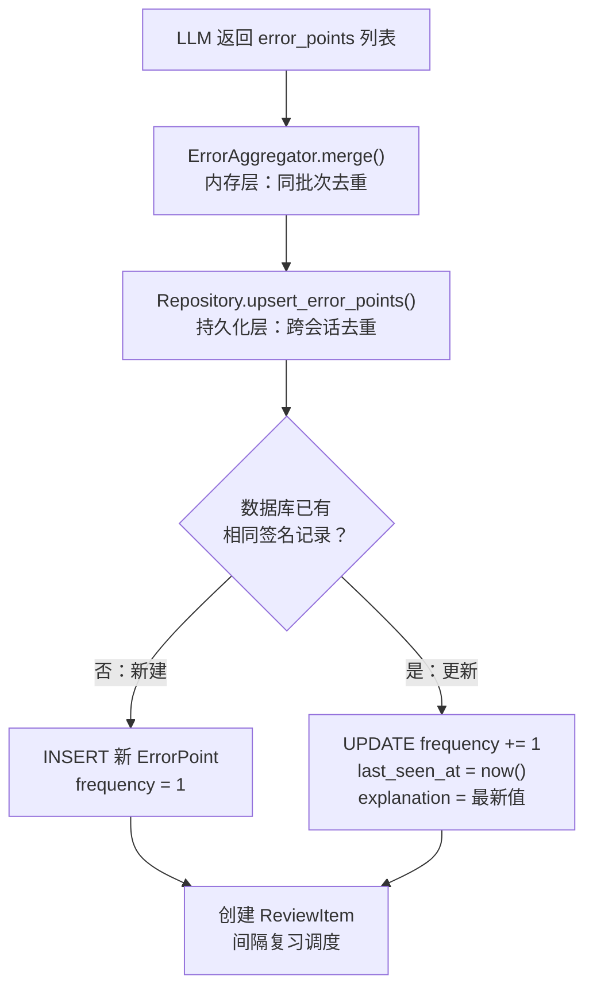
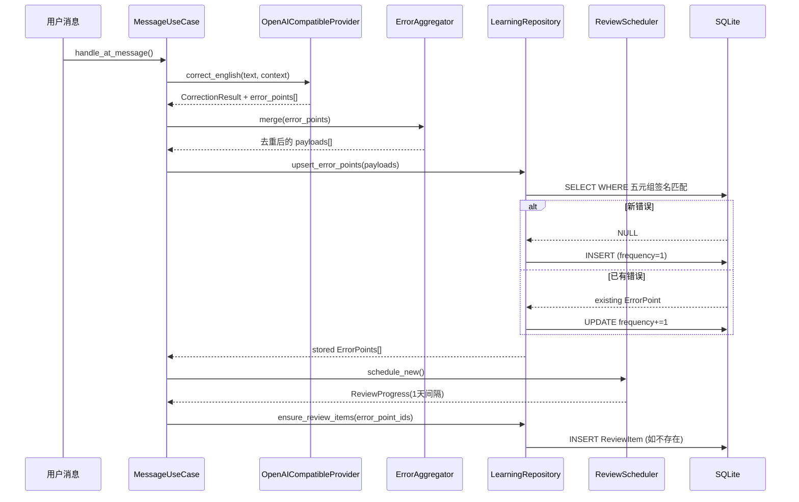

当用户在 QQ 群里 @机器人发送英文句子时，LLM 会返回纠错结果，其中包含零到多条错误点（如时态错误、冠词遗漏、介词误用等）。**ErrorAggregator** 的职责是将这些原始错误点进行**内存层去重**，避免同一次纠错返回的重复条目被重复写入数据库。配合数据库层的 `UniqueConstraint` 签名唯一约束，系统形成了**双层去重**机制——先在应用层合并同批次重复项，再在持久化层按用户+群+三元组签名做 upsert，既保证数据唯一性，又通过 `frequency` 字段追踪同一错误反复出现的频次。

## 核心数据结构：从 LLM 输出到领域实体

错误点的数据在流转过程中依次经过三种形态：**值对象（Value Object）→ 领域实体（Entity）→ ORM 模型**。理解这三者的映射关系是掌握整个错误点生命周期的基础。

Sources: [learning.py](src/domain/value_objects/learning.py#L24-L28), [models.py](src/domain/entities/models.py#L25-L35), [models.py](src/infrastructure/db/models.py#L65-L86)

### ErrorPointPayload：跨层传输的值对象

`ErrorPointPayload` 是一个不可变的 dataclass（使用 `slots=True` 优化内存），由基础设施层的 `OpenAICompatibleProvider` 从 LLM JSON 响应中解析生成，随后贯穿应用层和领域层，最终抵达 Repository 进行持久化。它只携带"业务语义"字段，不含任何数据库标识或频率统计信息：

| 字段 | 类型 | 含义 | 示例 |
|------|------|------|------|
| `error_type` | `str` | 错误分类 | `"tense"`, `"article"`, `"word_choice"` |
| `source_fragment` | `str` | 用户原文中的错误片段 | `"go"` |
| `correct_fragment` | `str` | 正确的表达 | `"went"` |
| `explanation` | `str` | 该条错误的解释 | `"past tense required"` |

LLM 的 system prompt 中预定义了九种错误类型枚举：`tense`（时态）、`article`（冠词）、`preposition`（介词）、`word_choice`（选词）、`spelling`（拼写）、`expression`（表达）、`grammar`（语法）、`agreement`（一致性）、`natural_expression`（自然表达）。

Sources: [llm_openai.py](src/infrastructure/providers/llm_openai.py#L32-L49)

### ErrorPointEntity：领域层抽象

`ErrorPointEntity` 在 `ErrorPointPayload` 基础上增加了持久化身份（`id`）、空间归属（`user_id`、`group_id`）以及频次追踪字段（`frequency`、`last_seen_at`）。这个设计遵循了 Clean Architecture 的分层隔离原则——领域实体不依赖任何 ORM 框架，可以被应用层自由使用而无需关心底层数据库实现。

Sources: [models.py](src/domain/entities/models.py#L25-L35)

### ErrorPoint ORM 模型：数据库层签名唯一约束

```python
class ErrorPoint(Base, TimestampMixin):
    __tablename__ = "error_points"
    __table_args__ = (
        UniqueConstraint(
            "user_id",
            "group_id",
            "error_type",
            "source_fragment",
            "correct_fragment",
            name="uq_error_points_signature",
        ),
    )
```

数据库层通过 `uq_error_points_signature` 唯一约束，将 `(user_id, group_id, error_type, source_fragment, correct_fragment)` 五元组作为**持久化签名**。这意味着同一用户在同一个群内，相同的错误类型+原始片段+修正片段组合只会存在一条记录。`frequency` 字段记录该错误被观测到的总次数，`last_seen_at` 记录最近一次出现时间——两者在 Repository 的 upsert 逻辑中自动更新。

Sources: [models.py](src/infrastructure/db/models.py#L65-L86)

## 签名算法：确定性去重的核心

`ErrorAggregator` 的签名算法极为简洁但设计精确。它将 `ErrorPointPayload` 的三个语义字段拼接为管道分隔的字符串，并统一做 `strip().lower()` 归一化处理，确保大小写和首尾空格差异不会导致误判为不同错误：

```python
@staticmethod
def signature(payload: ErrorPointPayload) -> str:
    return "|".join([
        payload.error_type.strip().lower(),
        payload.source_fragment.strip().lower(),
        payload.correct_fragment.strip().lower(),
    ])
```

**为什么签名不含 `explanation`？** 这是关键的设计决策——`explanation` 是 LLM 每次生成的自由文本，同一种错误在不同上下文中可能得到不同解释。将 `explanation` 排除在签名之外，确保了去重的**稳定性**：只要错误类型和片段一致，就视为同一错误点。而 `explanation` 在数据库 upsert 时会被更新为最新值，保持解释的时效性。

Sources: [error_points.py](src/domain/services/error_points.py#L11-L19)

### merge 方法：同批次去重

`merge` 方法对一次 LLM 返回的多个 `ErrorPointPayload` 执行去重。它使用 `dict.setdefault` 语义——遇到相同签名的第二条记录时，**保留首次出现的 `payload`，丢弃后续重复项**：

```python
def merge(self, payloads: Iterable[ErrorPointPayload]) -> list[ErrorPointPayload]:
    merged: dict[str, ErrorPointPayload] = {}
    for payload in payloads:
        signature = self.signature(payload)
        merged.setdefault(signature, payload)
    return list(merged.values())
```

这意味着 LLM 即使在同一次纠错中返回了两条相同的时态错误（例如在长句中同时指出两处 "go→went"），`merge` 也会将其收敛为一条。

Sources: [error_points.py](src/domain/services/error_points.py#L21-L26)

## 双层去重机制详解

系统的去重设计分为**内存层**和**持久化层**两个阶段，两者协同工作但职责边界清晰：



### 内存层：ErrorAggregator.merge()

内存层去重发生在 `_persist_error_points` 方法中，是同一次 LLM 调用内的去重。它的输入是 `CorrectionResult.error_points` 列表，输出是去重后的子集。这一层的作用是**过滤掉 LLM 在单次响应中产生的重复错误点**，减少不必要的数据库查询。

Sources: [message_usecases.py](src/application/message_usecases.py#L104-L106)

### 持久化层：Repository upsert

持久化去重发生在 `LearningRepository.upsert_error_points` 中。对每个经内存层去重后的 payload，Repository 会查询数据库中是否存在 `(user_id, group_id, error_type, source_fragment, correct_fragment)` 完全匹配的记录。若不存在则创建新记录（`frequency = 1`）；若已存在则累加 `frequency`、更新 `last_seen_at` 和 `explanation`。

这个两层设计的精妙之处在于：内存层过滤的是**同批次内的逻辑重复**（一次 LLM 调用），持久化层处理的是**跨时间的语义重复**（多次用户交互）。数据库层的 `UniqueConstraint` 作为最终防线，即使应用层去重失效，也能通过数据库约束保证一致性。

Sources: [learning.py](src/infrastructure/db/repositories/learning.py#L129-L170)

## 完整数据流：从消息到复习调度

以下展示当用户 @机器人发送英文消息时，错误点从产生到持久化的完整流程：



`MessageUseCase._persist_error_points` 是整个流程的编排方法。它在确认 `payloads` 非空后，依次执行：①内存去重 → ②数据库 upsert → ③为每条新建的错误点创建间隔复习项。`ReviewItem` 的 `error_point_id` 字段将复习项与具体错误点关联起来，使间隔复习调度系统能够针对用户的个性化错误进行精准复习。

Sources: [message_usecases.py](src/application/message_usecases.py#L98-L121), [review.py](src/domain/services/review.py#L15-L25)

## 错误点的下游消费

错误点不仅在纠错时产生，还在两个关键场景中被消费——**周测出题**和**周报统计**。

### 周测：高频错误变考题

`QuizUseCase._build_review_questions` 从 `list_top_error_fragments` 获取用户频率最高的错误点，将其转化为选择题。题干展示错误类型和原始片段，选项包含正确答案、错误片段和 "No change needed"。题目的 `source_type` 编码为 `"review:error_point:{id}"` 格式，以便在用户答错时能精确回溯到对应错误点，重新调度间隔复习。

| 要素 | 值 |
|------|-----|
| 题干 | `"你的高频错误类型是 {error_type}。哪个片段更适合替换 \`{source_fragment}\`？"` |
| 选项 A | `source_fragment`（原始错误） |
| 选项 B | `correct_fragment`（正确答案）✅ |
| 选项 C | `"No change needed"` |
| 答案 | B |
| source_type | `"review:error_point:{id}"` |

当用户在周测中答错 review 类题目时，系统会调用 `ensure_review_items` 为对应错误点重新创建 1 天间隔的复习项，实现**错题强化循环**。

Sources: [quiz_usecases.py](src/application/quiz_usecases.py#L217-L237), [quiz_usecases.py](src/application/quiz_usecases.py#L150-L155), [quiz_usecases.py](src/application/quiz_usecases.py#L170-L180)

### 查询排序：按频率和时间

`list_top_error_fragments` 的排序策略是**频率优先、时间次之**——先按 `frequency` 降序（最高频的错误排在前面），再按 `last_seen_at` 降序（最近出现的优先）。`limit` 参数默认为 5，由 `weekly_quiz_review_ratio` 配置控制 review 题目占比后计算得出。

Sources: [learning.py](src/infrastructure/db/repositories/learning.py#L789-L800)

## 签名设计的边界与权衡

| 设计选择 | 优势 | 潜在局限 |
|----------|------|----------|
| `strip().lower()` 归一化 | 容忍大小写和空格差异，减少误判 | 无法区分专有名词大小写（如 `china` vs `China`） |
| `explanation` 不参与签名 | 签名稳定，去重不受 LLM 输出波动影响 | 不同上下文的解释可能覆盖先前解释 |
| 管道符 `\|` 分隔 | 简单直观，满足当前英文纠错场景 | 若 source_fragment 本身含 `\|` 则可能碰撞（实际极低） |
| 五元组数据库唯一约束 | 用户+群维度隔离，跨群独立追踪 | 转群后错误点不跟随（但这是合理的业务语义） |

当前签名方案针对 v1 阶段设计，英文纠错场景中片段均为单词或短语，管道符碰撞的概率极低。若未来需要支持更复杂的语言或更长的片段，可以考虑切换为哈希签名（如 SHA-256）。

Sources: [error_points.py](src/domain/services/error_points.py#L12-L19)

## 依赖注入与实例化

`ErrorAggregator` 是无状态的领域服务——`merge` 方法仅依赖输入参数，不持有任何实例属性。在 [手动依赖注入容器（ServiceContainer）](14-shou-dong-yi-lai-zhu-ru-rong-qi-servicecontainer) 中，它被实例化为单例并注入到 `MessageUseCase`：

```python
error_aggregator = ErrorAggregator()

message_usecase = MessageUseCase(
    ...,
    error_aggregator=error_aggregator,
    ...
)
```

无状态设计使得 `ErrorAggregator` 天然线程安全，无需加锁即可在异步环境中并发调用。

Sources: [container.py](src/infrastructure/settings/container.py#L89-L107)

## 测试验证

测试文件 `test_error_aggregation.py` 验证了核心去重行为——将完全相同的 `ErrorPointPayload` 传入两次，确认 `merge` 后仅保留一条记录。这覆盖了最常见的去重场景，即 LLM 在同一响应中返回重复条目。

Sources: [test_error_aggregation.py](tests/test_error_aggregation.py#L1-L16)

## 相关页面

错误点持久化后即进入间隔复习调度系统，通过 `ReviewItem` 关联实现个性化复习——详见 [间隔复习调度（ReviewScheduler）与倍增策略](11-jian-ge-fu-xi-diao-du-reviewscheduler-yu-bei-zeng-ce-lue)。错误点的完整生命周期（从 LLM 产生到翻译纠错响应）的上游流程请参考 [@机器人 消息处理流程：语言检测、翻译与纠错](6-atji-qi-ren-xiao-xi-chu-li-liu-cheng-yu-yan-jian-ce-fan-yi-yu-jiu-cuo)。领域实体与值对象的整体设计模式参见 [领域实体与值对象设计](9-ling-yu-shi-ti-yu-zhi-dui-xiang-she-ji)。