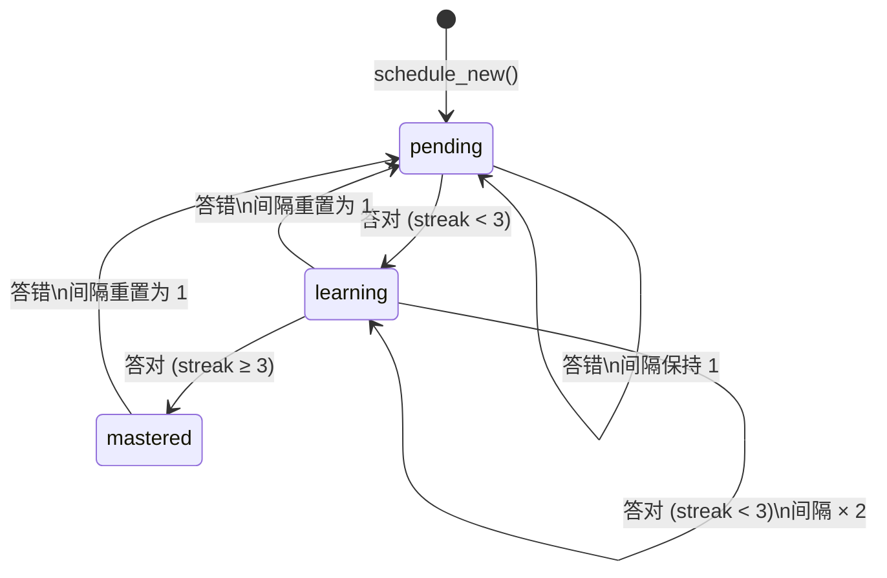
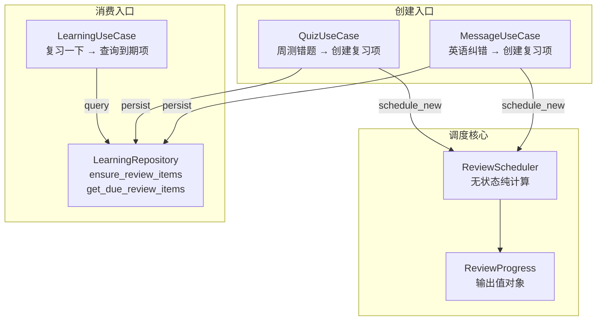

ReviewScheduler 是本项目中实现**间隔重复（Spaced Repetition）**的领域服务，采用"2 倍递增 + 30 天上限"的策略来决定复习间隔。它本身是一个无状态的纯计算类——不持有任何数据库连接，不依赖外部配置，仅通过 `schedule_new()` 和 `update_after_answer()` 两个方法输出 `ReviewProgress` 值对象，由上层 UseCase 负责持久化。这种设计使得调度算法的测试极为简洁，也为未来替换为更复杂的 SM-2 算法预留了清晰的边界。

Sources: [review.py](src/domain/services/review.py#L1-L51)

## 核心数据结构

调度服务围绕两个数据结构展开——**ReviewProgress**（领域层输出值对象）和 **ReviewItemEntity / ReviewItem**（持久化实体 / ORM 模型）。前者是调度算法的纯计算结果，后者是写入 SQLite 的持久化记录。理解这两个层次的区别，是掌握整个复习调度流程的关键。

### ReviewProgress — 调度算法的输出

`ReviewProgress` 是一个 `@dataclass(slots=True)` 值对象，仅包含四个字段，代表了调度算法对"某个复习项当前应该处于什么状态"的完整描述：

| 字段 | 类型 | 含义 |
|---|---|---|
| `interval_days` | `int` | 下一次复习的间隔天数 |
| `correct_streak` | `int` | 连续答对的累计次数 |
| `next_review_at` | `datetime` | 下一次应复习的时间（UTC） |
| `status` | `str` | 当前阶段标签：`"pending"` / `"learning"` / `"mastered"` |

它不包含任何持久化信息（如 `user_id`、`error_point_id`），纯粹是调度策略的输出契约。

Sources: [review.py](src/domain/services/review.py#L7-L13)

### ReviewItemEntity — 领域层的持久化实体

在领域实体层，`ReviewItemEntity` 描述了复习项的完整业务语义：它关联一个用户 (`user_id`)、一个错误点 (`error_point_id`)、记录来源类型 (`source_type`) 和来源引用 ID (`source_ref_id`)，同时保存调度所需的状态 (`interval_days`, `next_review_at`, `correct_streak`, `status`)。这个实体定义了**调度策略和业务上下文的交汇点**。

Sources: [models.py](src/domain/entities/models.py#L38-L48)

### ReviewItem — ORM 模型

在基础设施层，`ReviewItem` 是 `ReviewItemEntity` 的 SQLAlchemy 映射，对应 `review_items` 表。它在实体字段基础上继承了 `TimestampMixin`（自动维护 `created_at`、`updated_at`），并通过 `ForeignKey` 关联 `users` 和 `error_points` 表。`error_point_id` 允许为 `None`，意味着复习项不一定绑定到具体的错误点——周测错题等场景可能只有 `source_type` 和 `source_ref_id`。

Sources: [models.py](src/infrastructure/db/models.py#L89-L101)

## 倍增调度策略详解

### 状态机与流转规则

`ReviewScheduler` 实现了一个精简的三态状态机。每个复习项从创建到掌握，经历 `pending → learning → mastered` 的流转；答错时回退到 `pending`。以下 Mermaid 图展示了完整的状态流转：



状态机的核心决策逻辑在 `update_after_answer()` 方法中。当用户答对时，`correct_streak` 递增，`interval_days` 以 `min(max(interval_days, 1) * 2, 30)` 的方式倍增（确保最低从 1 天开始，上限封顶 30 天）。当 `correct_streak` 达到 3 时，状态跃迁为 `"mastered"`；否则保持 `"learning"`。答错时，`correct_streak` 归零、`interval_days` 重置为 1、状态回退为 `"pending"`——无论之前处于什么阶段。

Sources: [review.py](src/domain/services/review.py#L27-L49)

### 间隔递增的数值演进

下表展示了从新创建到掌握的典型递增路径。假设用户在每次复习时都答对：

| 复习轮次 | 答前 interval_days | 答后 correct_streak | 答后 interval_days | 状态 |
|---|---|---|---|---|
| 第 1 次 | 1（初始） | 1 | 2 | learning |
| 第 2 次 | 2 | 2 | 4 | learning |
| 第 3 次 | 4 | 3 | 8 | **mastered** |
| 第 4 次 | 8 | 4 | 16 | mastered |
| 第 5 次 | 16 | 5 | 30（封顶） | mastered |

关键公式 `min(max(interval_days, 1) * 2, 30)` 的设计意图在于：`max(interval_days, 1)` 确保即使因数据异常出现 0 或负值，间隔也会从 1 天起步；`* 2` 是经典的倍增策略，以 2 的幂次逐步拉长间隔；`min(..., 30)` 封顶防止间隔无限增长，30 天约为一个月，符合"已掌握的知识点每月回顾一次"的认知科学建议。

Sources: [review.py](src/domain/services/review.py#L34-L37)

### 答错时的重置策略

与许多间隔重复系统（如 Anki 的 SM-2）采用"间隔减半"的软化策略不同，`ReviewScheduler` 采用了**全量重置**：答错后 `interval_days` 直接回到 1，`correct_streak` 归零。这种激进重置的设计权衡在于——本系统针对的是英语学习中的"错误点"（如语法误用、用词不当），而非一般性记忆卡片。错误点的核心价值在于"纠正肌肉记忆"，如果用户仍然犯错，说明之前的纠正尚未内化，需要重新从短间隔开始强化。

这一行为已被单元测试明确覆盖：在 `test_review_scheduler_resets_interval_after_wrong_answer` 中，一个间隔 4 天、连续答对 2 次的复习项在答错后，间隔被重置为 1，连续次数归零，状态回到 `"pending"`。

Sources: [test_review_service.py](tests/test_review_service.py#L4-L13), [review.py](src/domain/services/review.py#L38-L41)

## 调度服务的使用场景

`ReviewScheduler` 被三个 UseCase 共享注入，分别服务于不同的复习项创建入口。以下 Mermaid 图展示了它们之间的关系：



Sources: [container.py](src/infrastructure/settings/container.py#L90), [container.py](src/infrastructure/settings/container.py#L107-L128)

### 场景一：英语纠错 → 自动创建复习项

当用户在群里 @机器人 发送英文消息时，`MessageUseCase.handle_at_message()` 会调用 OpenAI 兼容大模型进行纠错，提取错误点 (`ErrorPointPayload`)。随后 `_persist_error_points()` 方法将这些错误点通过 `ErrorAggregator` 去重合并后写入数据库，紧接着为每个错误点调用 `review_scheduler.schedule_new()` 创建初始复习项——间隔 1 天，状态 `"pending"`。

这意味着用户每次用英文和机器人对话被纠正后，相关的错误点会在**次日**出现在"复习一下"的待复习列表中，形成"即时纠错 → 次日巩固"的学习闭环。

Sources: [message_usecases.py](src/application/message_usecases.py#L98-L121)

### 场景二：周测错题 → 重新创建复习项

在 `QuizUseCase.submit_weekly_quiz()` 中，系统对用户的每道答题进行评判。对于 `source_type` 以 `"review:error_point:"` 开头的题目（即基于历史错误点生成的复习题），如果用户答错，系统会提取 `error_point_id`，然后调用 `schedule_new()` 为这些错误点创建新的复习项（如果已存在则更新间隔为 1 天、状态为 `"pending"`，实现"温故知新"的效果）。

这里的 `ensure_review_items()` 方法在 Repository 层实现了幂等性：对于同一个 `user_id` + `error_point_id` 组合，如果复习项已存在则更新，不存在则创建——避免了重复纠错场景下的数据冗余。

Sources: [quiz_usecases.py](src/application/quiz_usecases.py#L141-L180), [learning.py](src/infrastructure/db/repositories/learning.py#L172-L207)

### 场景三："复习一下" → 查询到期复习项

用户在群中发送"复习一下"命令后，`LearningUseCase.review_now()` 通过 `get_due_review_items()` 查询所有 `next_review_at <= now()` 的复习项，按到期时间倒序排列，返回给用户。同时系统会为此次复习会话奖励积分 (`points_per_review`)。

值得注意的是，当前 v1 版本的"复习一下"命令**仅展示到期项列表**，并未实现交互式的"逐题答对/答错 → 更新间隔"闭环。`update_after_answer()` 方法已预留在 `ReviewScheduler` 中，但尚未有调用方将其接入命令流程。这为后续版本扩展交互式复习留下了清晰的扩展点。

Sources: [learning_usecases.py](src/application/learning_usecases.py#L163-L183), [learning.py](src/infrastructure/db/repositories/learning.py#L354-L365), [review.py](src/domain/services/review.py#L27-L49)

## 数据持久化与幂等保护

### ensure_review_items 的幂等逻辑

复习项的创建和更新集中在 `LearningRepository.ensure_review_items()` 方法中。它接受一组 `error_point_ids`，逐个查询 `review_items` 表中是否已存在 `user_id + error_point_id` 的组合。如果不存在则 INSERT，如果已存在则 UPDATE（覆盖 `interval_days`、`next_review_at`、`status`）。这种 upsert 语义确保了同一用户对同一错误点不会产生重复的复习项——无论触发来源是纠错还是周测错题。

Sources: [learning.py](src/infrastructure/db/repositories/learning.py#L172-L207)

### 到期查询策略

`get_due_review_items()` 使用 `next_review_at <= datetime.now(UTC)` 作为过滤条件，按 `next_review_at` 降序排列，通过 `limit` 参数控制返回数量。降序排列意味着**最晚到期的项排在前面**——这些是间隔最长的项，也是用户最可能已经遗忘的内容，优先展示符合认知科学中"遗忘曲线临界点"的直觉。

Sources: [learning.py](src/infrastructure/db/repositories/learning.py#L354-L365)

## 依赖注入与实例化

`ReviewScheduler` 在 `ServiceContainer` 中以**单例**形式创建（`review_scheduler = ReviewScheduler()`），并通过构造函数注入到 `MessageUseCase`、`LearningUseCase` 和 `QuizUseCase` 三个 UseCase 中。由于 `ReviewScheduler` 是无状态的（没有任何实例属性存储用户数据），单例共享完全安全，不存在并发问题。

```python
# 容器构建（简化）
review_scheduler = ReviewScheduler()  # 无状态单例

message_usecase = MessageUseCase(..., review_scheduler=review_scheduler)
learning_usecase = LearningUseCase(..., review_scheduler=review_scheduler)
quiz_usecase = QuizUseCase(..., review_scheduler=review_scheduler)
```

这种无状态设计使得 `ReviewScheduler` 极其易于测试——只需直接实例化、调用方法、断言返回值，无需 mock 任何依赖。同时，如果未来需要从"2 倍递增"策略切换到 SM-2 算法，只需修改 `ReviewScheduler` 类的内部实现，所有 UseCase 无需变动。

Sources: [container.py](src/infrastructure/settings/container.py#L88-L129)

## 设计权衡与扩展方向

### 当前策略的权衡分析

| 维度 | 当前实现 | 替代方案 | 权衡说明 |
|---|---|---|---|
| 间隔递增 | 2 倍递增，封顶 30 天 | SM-2 的 ease factor 调整 | 2 倍策略实现极简，但缺乏对"难度感知"的适应性 |
| 答错处理 | 全量重置（间隔回到 1） | Anki 的间隔减半（lapse 策略） | 全量重置对"错误点纠正"场景更激进，但也意味着用户可能反复复习简单的点 |
| 掌握判定 | 连续 3 次答对 | 基于概率的遗忘模型 | 固定阈值直观可理解，但不考虑单次答题的信心或难度 |
| 状态管理 | 三态（pending/learning/mastered） | 五态或更多 | 三态足够表达 v1 的核心流程，`mastered` 后仍可继续倍增直到封顶 |

### 已预留的扩展点

`update_after_answer()` 方法已经实现了完整的"答对倍增 + 答错重置"逻辑，但在当前版本中**尚无调用方**。这是因为交互式复习的闭环需要设计"逐题问答"的会话状态管理——这涉及到与 QQ 机器人消息流的交互模式设计（如：用户发送"复习一下"后，机器人逐条推送错误点，用户逐条回复判断），是一个比 v1 范围更大的功能。方法已就绪，等待会话层接入。

Sources: [review.py](src/domain/services/review.py#L27-L49)

### 继续阅读

- 了解复习项依赖的**错误点聚合与去重机制**，参阅 [错误点聚合（ErrorAggregator）与去重签名](10-cuo-wu-dian-ju-he-erroraggregator-yu-qu-zhong-qian-ming)。
- 了解 ReviewScheduler 所在的**依赖注入容器**如何组装所有服务，参阅 [手动依赖注入容器（ServiceContainer）](14-shou-dong-yi-lai-zhu-ru-rong-qi-servicecontainer)。
- 了解定时任务如何触发**周测生成和每日推送**，参阅 [APScheduler 定时任务注册与执行](20-apscheduler-ding-shi-ren-wu-zhu-ce-yu-zhi-xing)。