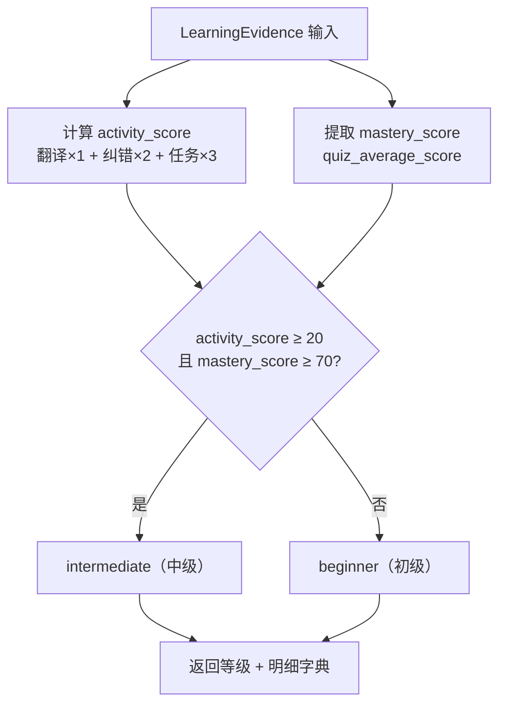
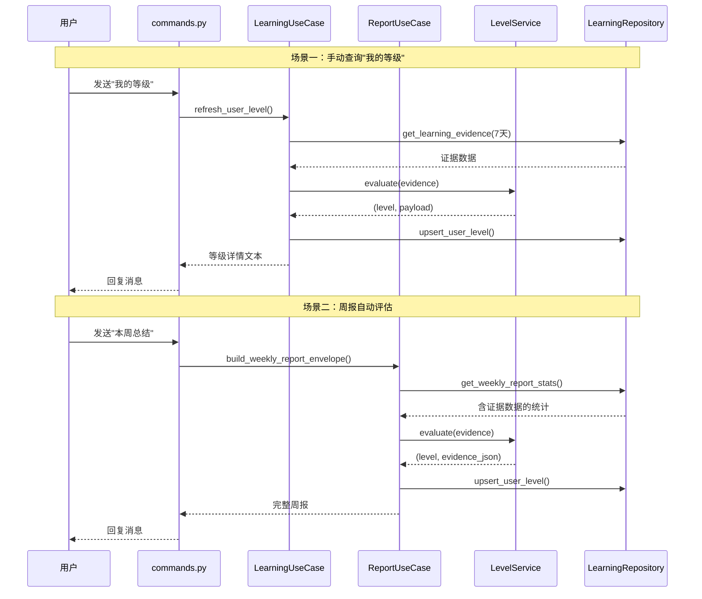

用户分级系统是机器人对学习者能力做出**自动评估**的核心领域服务。它将用户过去一段时间的学习行为量化为"活跃度"和"掌握度"两个维度，据此给出 `beginner`（初级）或 `intermediate`（中级）的等级判定。整个评估逻辑完全在领域层完成，不依赖任何数据库或外部 API——这是 Clean Architecture 中**领域服务无副作用**原则的典型体现。

Sources: [leveling.py](src/domain/services/leveling.py#L1-L41)

## 设计定位：领域服务中的纯函数

`LevelService` 位于 `src/domain/services/leveling.py`，它的职责非常单一：接收一份"学习证据"（`LearningEvidence`），返回一个等级标签和一份明细字典。它没有状态、没有副作用、不访问数据库。这种设计使得分级逻辑可以被**任何上层用例**复用，也可以被**单元测试**轻松验证——你只需要构造参数、调用方法、断言结果，无需 mock 任何外部依赖。

Sources: [leveling.py](src/domain/services/leveling.py#L14-L39)

## 学习证据：LearningEvidence 数据类

分级系统的输入是 `LearningEvidence`，一个用 `@dataclass(slots=True)` 定义的数据类，包含四项指标：

| 字段 | 类型 | 含义 |
|---|---|---|
| `translation_count` | `int` | 翻译交互次数（用户主动翻译中文得到的响应） |
| `correction_count` | `int` | 纠错交互次数（用户发送英文后得到的纠错反馈） |
| `task_completion_count` | `int` | 每日任务提交次数 |
| `quiz_average_score` | `float` | 周测平均分（满分 100） |

这四个字段由 `LearningRepository.get_learning_evidence()` 从数据库中聚合而来，默认统计**最近 7 天**的数据。具体来说，翻译和纠错次数来自 `InteractionResult` 表（按 `action_type` 区分），任务完成数来自 `TaskSubmission` 表，周测平均分来自 `QuizSession` 表中状态为 `"submitted"` 的记录。

Sources: [leveling.py](src/domain/services/leveling.py#L7-L12), [learning.py](src/infrastructure/db/repositories/learning.py#L632-L683)

## 评分算法：双维度加权判定

`LevelService.evaluate()` 方法的核心算法分为两步：

**第一步：计算活跃度评分（activity_score）**

```
activity_score = translation_count + correction_count × 2 + task_completion_count × 3
```

翻译是最低权重（×1），纠错权重翻倍（×2），任务完成权重最高（×3）。这个设计反映了一个学习理念：**主动输出（完成任务）比被动阅读（翻译）更有价值**。

**第二步：双条件晋级判定**

| 条件 | 阈值 | 说明 |
|---|---|---|
| `activity_score >= 20` | 活跃度达标 | 综合学习行为足够频繁 |
| `quiz_average_score >= 70` | 掌握度达标 | 测试成绩证明知识吸收 |

只有两个条件**同时满足**，用户才会被升级为 `intermediate`（中级），否则保持 `beginner`（初级）。这种"双门槛"设计避免了单维度偏差——仅靠刷量不考试，或者仅凭一次高分测试都不能晋级。



`evaluate()` 的返回值是一个元组 `(level, evidence_dict)`，其中 `evidence_dict` 包含 `activity_score`、`mastery_score` 以及三项原始计数，方便上层用例展示给用户。

Sources: [leveling.py](src/domain/services/leveling.py#L20-L39)

## 触发时机：用户手动与周报自动

等级评估在两个场景中被触发：

**1. 用户发送"我的等级"命令**（手动触发）

用户在群聊中发送"我的等级"时，`LearningUseCase.refresh_user_level()` 被调用。它会查询该用户的学习证据，调用 `LevelService.evaluate()` 计算等级，通过 `upsert_user_level()` 持久化到 `user_levels` 表，最后返回一条包含等级和各项指标的可读消息。

**2. 生成周报时自动评估**（自动触发）

`ReportUseCase.build_weekly_report_envelope()` 在构建周报的过程中，同样会调用 `LevelService.evaluate()` 来重新评估用户等级并更新数据库。这意味着**每周生成周报时，等级会自动刷新**，用户不需要手动查询。



Sources: [learning_usecases.py](src/application/learning_usecases.py#L185-L217), [report_usecases.py](src/application/report_usecases.py#L62-L74), [commands.py](src/plugins/commands.py#L91-L98)

## 数据持久化：UserLevel 表

等级评估结果持久化在 `user_levels` 表中，对应的 ORM 模型是 `UserLevel`：

| 字段 | 类型 | 说明 |
|---|---|---|
| `id` | `int` | 自增主键 |
| `user_id` | `int` | 外键 → `users.id` |
| `group_id` | `int` | 外键 → `groups.id` |
| `current_level` | `String(32)` | 当前等级，默认 `"beginner"` |
| `evaluated_at` | `DateTime` | 最近一次评估时间 |
| `evidence_json` | `JSON` | 评估时的明细数据 |

表上有一个唯一约束 `uq_user_levels_user_group`，确保每个用户在每个群里只有一条等级记录。`LearningRepository.upsert_user_level()` 的实现采用"先查后写"模式：如果记录不存在就插入，存在就更新 `current_level`、`evidence_json` 和 `evaluated_at`。

用户首次报名（`enroll`）时，会自动插入一条 `current_level="beginner"`、`evidence_json={"source": "enrollment_default"}` 的初始记录，确保每个学习者从一开始就有一个确定的等级。

Sources: [models.py](src/infrastructure/db/models.py#L199-L208), [learning.py](src/infrastructure/db/repositories/learning.py#L398-L428), [learning_usecases.py](src/application/learning_usecases.py#L55-L65)

## 依赖注入：容器中的单例实例

`LevelService` 在 `ServiceContainer.build_container()` 中被实例化一次，然后分别注入到 `LearningUseCase` 和 `ReportUseCase` 中。由于 `LevelService` 本身无状态，它作为单例是安全的——无论被多少用例共享，都不会产生并发问题。

```
level_service = LevelService()       # 无参构造，无状态
    ├── injected into LearningUseCase   # 用于"我的等级"命令
    └── injected into ReportUseCase     # 用于周报自动评估
```

Sources: [container.py](src/infrastructure/settings/container.py#L88-L134)

## 单元测试验证

`tests/test_leveling.py` 提供了一个典型测试用例：构造一个翻译 8 次、纠错 6 次、任务完成 4 次、周测平均分 80 的证据，验证 `activity_score`（= 8 + 12 + 12 = 32）≥ 20 且 `mastery_score`（= 80）≥ 70，断言结果等级为 `"intermediate"`。这个测试没有任何外部依赖，直接导入领域类即可运行。

Sources: [test_leveling.py](tests/test_leveling.py#L1-L17)

## 设计小结与扩展方向

当前系统采用了**两等级、双维度、纯函数**的极简设计，为首个发布版本服务。代码中注释 `Simple two-level placement logic for the first release` 也明确标注了这一点。如果未来需要扩展为多级（例如增加 `advanced`），只需修改 `LevelService.evaluate()` 中的判定分支和类常量——由于分级逻辑被隔离在一个纯函数中，这个变更不会波及任何上层用例或数据库模型（`current_level` 字段类型为 `String(32)`，天然支持任意标签）。

Sources: [leveling.py](src/domain/services/leveling.py#L15-L16)

## 延伸阅读

- **学习证据的数据来源**来自消息处理和任务提交流程：[@机器人 消息处理流程：语言检测、翻译与纠错](6-atji-qi-ren-xiao-xi-chu-li-liu-cheng-yu-yan-jian-ce-fan-yi-yu-jiu-cuo)
- **等级结果在周报中的展示**：[免登录签名学习页：任务、周测与周报](23-mian-deng-lu-qian-ming-xue-xi-ye-ren-wu-zhou-ce-yu-zhou-bao)
- **LevelService 的容器装配**：[手动依赖注入容器（ServiceContainer）](14-shou-dong-yi-lai-zhu-ru-rong-qi-servicecontainer)
- **数据库模型与 Repository 模式**：[SQLite 数据库模型与 Repository 数据访问](17-sqlite-shu-ju-ku-mo-xing-yu-repository-shu-ju-fang-wen)