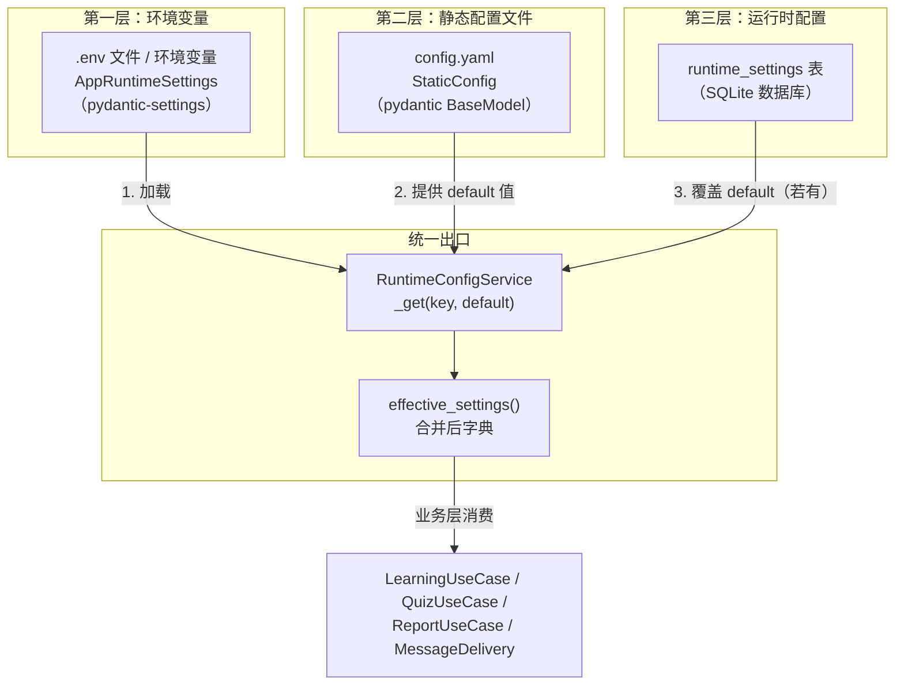
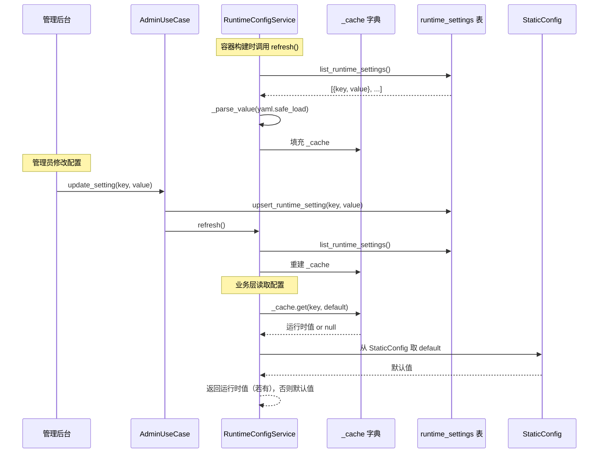

English Bot 的配置系统采用**双层架构**：底层是随代码仓库发布的**静态配置**（YAML 文件 + 环境变量），上层是存储在数据库中、可通过管理后台在线修改的**运行时配置**。运行时配置以静态配置的值为默认回退（fallback），二者通过 `RuntimeConfigService` 统一对外暴露为"生效配置"（Effective Settings），使业务层无需感知配置来源的复杂性。本文将拆解这个双层模型的数据模型、加载机制、覆盖优先级和运行时刷新流程。

Sources: [models.py](src/infrastructure/settings/models.py#L1-L108), [runtime.py](src/infrastructure/settings/runtime.py#L1-L99)

---

## 整体架构：三层配置叠加

配置从"最不可变"到"最易变"形成三级优先级链，运行时配置一旦写入数据库就覆盖对应的静态值，否则回退到 YAML 或代码中的默认值：



**核心设计原则**：环境变量只存放密钥与连接串等部署相关参数，YAML 存放业务可调参数的初始值，数据库运行时配置允许管理员在不重启进程的情况下动态调整业务行为。

Sources: [loader.py](src/infrastructure/settings/loader.py#L14-L32), [main.py](src/main.py#L18-L43)

---

## 第一层：运行时环境变量（AppRuntimeSettings）

`AppRuntimeSettings` 继承自 pydantic-settings 的 `BaseSettings`，自动从 `.env` 文件和系统环境变量中读取值。它负责所有**部署环境相关**的配置——密钥、API 凭证、数据库连接串、端口等。这些值通常不需要在运行时修改，且部分（如 `secret_key`、API key）属于敏感信息，不适合写入 YAML 或数据库。

| 字段 | 默认值 | 用途 |
|------|--------|------|
| `app_name` | `English Learning QQ Bot` | 应用标识 |
| `env` | `development` | 环境名称（development / production） |
| `host` / `port` | `0.0.0.0` / `8080` | 监听地址 |
| `secret_key` | `replace-me` | Session 加密与卡片链接签名密钥 |
| `access_token` | `""` | OneBot 协议访问令牌 |
| `database_url` | `sqlite+aiosqlite:///./data/english_bot.sqlite3` | 异步数据库连接串 |
| `config_path` | `./config.yaml` | 静态配置文件路径（可指向自定义位置） |
| `admin_username` / `admin_password` | `admin` / `admin123` | 管理后台初始凭据 |
| `tencent_translate_*` | 多字段 | 腾讯翻译 API 凭证与端点 |
| `llm_*` | 多字段 | OpenAI 兼容大模型 API 凭证 |

`SettingsConfigDict` 中 `extra="ignore"` 确保环境变量中的非预期字段不会引发校验错误——这在 Docker Compose 场景下尤为重要，`.env` 文件中可能包含 Caddy、NapCat 等其他服务的变量。

Sources: [models.py](src/infrastructure/settings/models.py#L10-L36), [deploy/.env.example](deploy/.env.example#L1-L22)

---

## 第二层：静态配置文件（StaticConfig）

静态配置由 `config.yaml` 文件承载，通过 `StaticConfig` 这个 Pydantic `BaseModel` 进行类型校验和默认值填充。它按**业务领域**分为六个独立子模型，每个子模型只包含可被运行时配置覆盖或仅作为常量引用的参数：

| 子模型 | YAML 键 | 管理的核心参数 | 可被运行时覆盖 |
|--------|---------|---------------|---------------|
| `BotSettings` | `bot` | `enabled_group_ids`, `admin_group_ids`, `daily_reminder_enabled` | ✅ |
| `SchedulerSettings` | `scheduler` | 五个 cron 表达式 | ✅ |
| `ContentSettings` | `content` | RSS URL、回退短文字数 | ❌ |
| `LearningSettings` | `learning` | 题数、分数、比例阈值 | ✅（部分） |
| `AdminUiSettings` | `admin` | 管理后台标题、HTTP 警告 | ❌ |
| `MessageSettings` | `message` | 渲染模式、卡片开关、链接过期时间 | ✅ |

每个子模型通过 `Field(default_factory=...)` 提供完整的默认值链——即使 `config.yaml` 文件不存在或某个键缺失，系统也能以合理的默认值启动。`ContentSettings` 和 `AdminUiSettings` 不提供运行时覆盖能力，因为 RSS 地址和管理后台标题不属于需要动态调整的范畴。

Sources: [models.py](src/infrastructure/settings/models.py#L38-L94), [config.yaml](config.yaml#L1-L43)

---

## 第三层：运行时数据库配置（RuntimeSetting）

`RuntimeSetting` 是 SQLite 数据库中的一张轻量表，结构极简：`key`（唯一索引）+ `value`（Text）+ `updated_at`。key 采用**点分命名空间**格式（如 `bot.enabled_group_ids`、`scheduler.daily_push_cron`），与 YAML 的层级结构一一对应，但存储为扁平字符串。value 统一以字符串形式存入，读取时由 `RuntimeConfigService._parse_value()` 通过 `yaml.safe_load()` 反序列化为原始 Python 类型（列表、布尔、整数等）。

```
runtime_settings 表
┌────┬───────────────────────────────────┬───────────────────────────┬─────────────────────┐
│ id │ key                               │ value                     │ updated_at          │
├────┼───────────────────────────────────┼───────────────────────────┼─────────────────────┤
│  1 │ bot.enabled_group_ids             │ ["204257012", "987654321"]│ 2025-01-15T10:30:00 │
│  2 │ scheduler.daily_push_cron         │ "0 9 * * *"               │ 2025-01-14T08:00:00 │
│  3 │ message.render_mode               │ "text"                    │ 2025-01-13T20:15:00 │
└────┴───────────────────────────────────┴───────────────────────────┴─────────────────────┘
```

**Upsert 语义**：`LearningRepository.upsert_runtime_setting()` 先按 key 查询，存在则更新 value 和 updated_at，不存在则插入新行。这种幂等写入模式确保管理后台可以反复提交同一配置项而不产生重复数据。

Sources: [models.py](src/infrastructure/settings/models.py#L231-L237), [learning.py](src/infrastructure/db/repositories/learning.py#L616-L630)

---

## 配置加载流程：从文件到 EffectiveSettings

`load_settings()` 是整个配置体系的入口函数，在 [main.py](src/main.py#L18) 中的模块顶层被调用一次。它的执行逻辑清晰分为三步：

1. **实例化 `AppRuntimeSettings`**：pydantic-settings 自动读取 `.env` 文件和环境变量，完成第一层配置加载。
2. **解析 `config_path`**：从 `AppRuntimeSettings.config_path` 获取 YAML 文件路径（支持相对路径 → 基于 `project_root` 转绝对路径），若文件不存在则以空字典 `{}` 继续加载——所有子模型均回退到代码默认值。
3. **组装 `EffectiveSettings`**：将 `runtime`（环境变量）、`static`（YAML 校验结果）以及 `project_root`、`template_dir`、`static_dir`、`data_dir` 等路径信息打包为一个不可变的 `dataclass(slots=True)` 实例。

`EffectiveSettings` 的 `data_dir` 在 `__post_init__` 中自动推导为 `project_root / "data"`，确保容器启动时只需创建目录而不需要额外配置。

Sources: [loader.py](src/infrastructure/settings/loader.py#L14-L32), [models.py](src/infrastructure/settings/models.py#L97-L108)

---

## RuntimeConfigService：双层合并引擎

`RuntimeConfigService` 是配置体系的核心枢纽，它持有 `EffectiveSettings`（包含两层静态配置）和 `LearningRepository`（访问运行时数据库），并通过内部 `_cache` 字典实现双层合并：



**`_get(key, default)` 的覆盖逻辑**极为简洁——仅一行：`self._cache.get(key, default)`。如果数据库中有对应 key，返回运行时值；否则返回从 `StaticConfig` 子模型属性取出的默认值。这里还有一个细节处理：当 `default` 是 `tuple` 类型时，自动转为 `list`，确保返回类型的一致性。

Sources: [runtime.py](src/infrastructure/settings/runtime.py#L88-L98)

---

## 可覆盖配置项一览

`RuntimeConfigService` 对外暴露了类型化的访问方法，每个方法内部都通过 `_get()` 实现了"运行时优先 → 静态回退"的覆盖逻辑。以下表格列出了所有可被管理后台动态修改的配置项及其静态默认来源：

| 访问方法 | 点分 key | 静态默认来源 | 类型 |
|----------|---------|-------------|------|
| `enabled_group_ids()` | `bot.enabled_group_ids` | `static.bot.enabled_group_ids` | `list[str]` |
| `admin_group_ids()` | `bot.admin_group_ids` | `static.bot.admin_group_ids` | `list[str]` |
| `daily_reminder_enabled()` | `bot.daily_reminder_enabled` | `static.bot.daily_reminder_enabled` | `bool` |
| `daily_review_insert_count()` | `learning.daily_review_insert_count` | `static.learning.daily_review_insert_count` | `int` |
| `weekly_quiz_question_count()` | `learning.weekly_quiz_question_count` | `static.learning.weekly_quiz_question_count` | `int` |
| `weekly_quiz_review_ratio()` | `learning.weekly_quiz_review_ratio` | `static.learning.weekly_quiz_review_ratio` | `float` |
| `render_mode()` | `message.render_mode` | `static.message.render_mode` | `str` |
| `enable_task_cards()` | `message.enable_task_cards` | `static.message.enable_task_cards` | `bool` |
| `public_base_url()` | `message.public_base_url` | `static.message.public_base_url` | `str` |
| `link_expire_minutes()` | `message.link_expire_minutes` | `static.message.link_expire_minutes` | `int` |
| `card_fallback_to_text()` | `message.card_fallback_to_text` | `static.message.card_fallback_to_text` | `bool` |
| `cron(key)` | `scheduler.*_cron` | `static.scheduler.*` | `str` |

`effective_settings()` 方法将上述所有配置项聚合成一个扁平字典返回，管理后台的设置页面同时展示数据库中的运行时值和最终生效值，方便管理员对比确认。

Sources: [runtime.py](src/infrastructure/settings/runtime.py#L24-L86)

---

## 运行时刷新的触发时机

运行时配置的刷新并非自动轮询，而是**显式触发**。系统在以下三个时机调用 `refresh()`：

| 时机 | 调用位置 | 说明 |
|------|---------|------|
| **容器构建** | `build_container()` | 应用启动时首次加载所有运行时配置到内存 |
| **管理后台保存** | `AdminUseCase.update_setting()` | 管理员在设置页提交修改后立即刷新 |
| **定时任务执行** | 每个 `*_job()` 函数开头 | 每个定时任务执行前先刷新配置，确保拿到最新值 |

管理后台保存配置后还会调用 `register_jobs()` 重新注册 APScheduler 任务，这使得 cron 表达式的修改可以**立即生效**而不需要重启进程——这是双层配置体系最核心的价值体现。

Sources: [container.py](src/infrastructure/settings/container.py#L85-L86), [admin_usecases.py](src/application/admin_usecases.py#L43-L45), [scheduler.py](src/plugins/scheduler.py#L57-L59)

---

## 容器集成与依赖注入

`EffectiveSettings` 在 `main.py` 顶层通过 `load_settings()` 创建，然后存入 `app.state.settings`。FastAPI 的请求处理链通过 `ensure_container(request.app.state.settings)` 懒初始化 `ServiceContainer`。容器构建时，`RuntimeConfigService` 接收 `EffectiveSettings` 和 `LearningRepository` 两个依赖，并立即执行 `refresh()` 从数据库加载运行时覆盖值。随后 `RuntimeConfigService` 被注入到 `LearningUseCase`、`QuizUseCase`、`ReportUseCase`、`AdminUseCase`、`MessageDeliveryService` 等所有需要动态配置的组件中。

这种设计意味着业务层只依赖 `RuntimeConfigService` 的类型化接口，完全不感知"配置来自文件还是数据库"——配置来源的复杂性被封装在基础设施层的这一个类中。

Sources: [main.py](src/main.py#L18-L54), [container.py](src/infrastructure/settings/container.py#L61-L99)

---

## 双层模型的设计取舍

| 维度 | 静态配置（YAML + 环境变量） | 运行时配置（数据库） |
|------|--------------------------|---------------------|
| **修改方式** | 编辑文件 + 重启进程 | 管理后台 Web 表单，即时生效 |
| **版本管理** | 跟随 Git 仓库 | 存储在 SQLite，不纳入版本控制 |
| **适合内容** | 密钥、连接串、部署参数、不可变常量 | 业务行为参数：群列表、cron、渲染模式 |
| **默认值** | 代码中硬编码（Pydantic default） | 回退到静态配置的值 |
| **数据安全** | 文件系统（需配合 .gitignore 保护 .env） | 数据库行（可通过数据库备份保护） |
| **多实例一致性** | 文件共享保证一致 | 各实例各自 refresh，存在短暂不一致窗口 |

**已知局限**：当前运行时配置的 `refresh()` 是全量重建 `_cache`，没有基于 key 的增量更新机制。在多实例部署场景下，一个实例修改配置后，其他实例直到下次执行定时任务或收到 HTTP 请求时才会感知变化。对于单实例部署的 QQ Bot 场景，这不构成问题。

Sources: [runtime.py](src/infrastructure/settings/runtime.py#L18-L22), [runtime.py](src/infrastructure/settings/runtime.py#L88-L98)

---

## 延伸阅读

- 配置体系创建的所有服务实例都通过 [手动依赖注入容器（ServiceContainer）](14-shou-dong-yi-lai-zhu-ru-rong-qi-servicecontainer) 进行组装和生命周期管理。
- 运行时配置的管理界面在 [FastAPI 管理后台：仪表盘、用户管理与运行时配置](22-fastapi-guan-li-hou-tai-yi-biao-pan-yong-hu-guan-li-yu-yun-xing-shi-pei-zhi) 中详细说明。
- 定时任务如何消费 cron 运行时配置参见 [APScheduler 定时任务注册与执行](20-apscheduler-ding-shi-ren-wu-zhu-ce-yu-zhi-xing)。
- 部署时的 `.env` 与 `config.yaml` 模板参见 [Docker 部署与 NapCat 对接](3-docker-bu-shu-yu-napcat-dui-jie)。