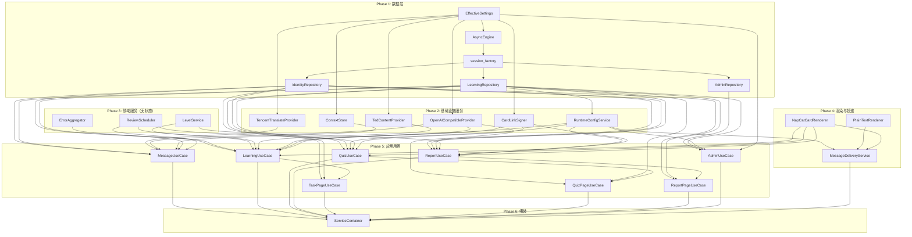

`ServiceContainer` 是整个 QQ 英语学习机器人的**编排中枢**——一个基于 `@dataclass(slots=True)` 的纯数据类，在应用启动时由 `build_container()` 函数以显式、自底向上的顺序将所有基础设施组件、领域服务与用例对象组装到一起。它不依赖任何 DI 框架、不使用反射或装饰器注册，而是通过构造函数参数的显式传递完成全部依赖关系的连接。这种设计选择在保持架构层次清晰的同时，将依赖图以纯代码的方式暴露在 `container.py` 一个文件中，使"对象从哪来、谁依赖谁"一目了然。

Sources: [container.py](src/infrastructure/settings/container.py#L1-L56)

## 容器结构：24 个字段的分层视图

`ServiceContainer` 的 24 个字段可以按 Clean Architecture 的四个层次分为四组，每一组都只在 `build_container()` 中实例化一次：

| 层次 | 字段 | 职责 |
|------|------|------|
| **基础设施 - 数据** | `engine`, `session_factory` | SQLAlchemy 异步引擎与会话工厂 |
| **基础设施 - 数据** | `identity_repo`, `learning_repo`, `admin_repo` | 三个 Repository 数据访问对象 |
| **基础设施 - 外部服务** | `translate_provider`, `correction_provider`, `content_provider` | 腾讯翻译、OpenAI 兼容大模型、TED 内容 |
| **基础设施 - 配置与缓存** | `runtime_config`, `context_store`, `card_link_signer` | 运行时配置服务、LRU 上下文缓存、卡片签名 |
| **基础设施 - 消息渲染** | `plain_text_renderer`, `napcat_card_renderer`, `message_delivery_service` | 纯文本渲染器、卡片渲染器、消息投递服务 |
| **领域服务** | （内嵌于 UseCase 构造中） | `LevelService`, `ErrorAggregator`, `ReviewScheduler` |
| **应用用例** | `message_usecase`, `learning_usecase`, `quiz_usecase`, `report_usecase` | 四大业务用例 |
| **应用用例 - 页面** | `task_page_usecase`, `quiz_page_usecase`, `report_page_usecase` | 三个学习页用例 |
| **应用用例 - 管理** | `admin_usecase` | 管理后台用例 |
| **配置** | `settings` | `EffectiveSettings` 全局配置对象 |

其中 `LevelService`、`ErrorAggregator`、`ReviewScheduler` 三个领域服务虽然不以独立字段存储在容器上，但它们在 `build_container()` 中被实例化后直接注入到用例的构造函数里——这种"用完即忘"的模式表明它们是无状态的单例，不需要在容器层级被外部直接访问。

Sources: [container.py](src/infrastructure/settings/container.py#L31-L56), [container.py](src/infrastructure/settings/container.py#L61-L160)

## 构建流程：自底向上的依赖组装

`build_container()` 函数是整个容器的心脏，其执行过程严格遵循依赖图的拓扑排序——先创建被依赖的底层对象，再将它们向上传递。以下 Mermaid 图展示了完整的构建依赖链：



构建过程中有两个值得关注的**初始化副作用**：第一，`await init_db(engine)` 在创建引擎后立即执行数据库 schema 的 `create_all`，确保所有表结构就绪；第二，`await admin_usecase.bootstrap_admin()` 在组装完成后执行管理员账号的 upsert 操作。这两个 `await` 是 `build_container` 必须是 `async` 函数的根本原因。

Sources: [container.py](src/infrastructure/settings/container.py#L61-L187), [session.py](src/infrastructure/db/session.py#L18-L20), [admin_usecases.py](src/application/admin_usecases.py#L23-L27)

## 单例管理与访问模式

容器通过模块级变量 `_container: ServiceContainer | None = None` 实现全局单例语义，并暴露四个不同语义的访问函数：

| 函数 | 签名 | 场景 | 是否可延迟初始化 |
|------|------|------|:---:|
| `build_container` | `async (settings) → ServiceContainer` | 首次构建，内部使用 | — |
| `ensure_container` | `async (settings) → ServiceContainer` | 应用启动、管理后台 | ✗ 必须传 settings |
| `get_or_init_container` | `async (settings=None) → ServiceContainer` | 插件消息处理、定时任务 | ✓ 可选 settings |
| `get_container` | `() → ServiceContainer` | 定时任务注册（同步） | ✗ 必须已初始化 |
| `set_container` | `(container) → None` | 测试替换 | — |

`ensure_container` 与 `get_or_init_container` 的关键区别在于是否接受 `_container is not None` 时的**快速路径**：两者都检查单例是否已存在，但 `get_or_init_container` 额外允许 `settings=None`，此时会回退到 `load_settings()` 重新加载配置——这让 NoneBot 插件可以在不持有 `settings` 引用的场景下按需获取容器。

Sources: [container.py](src/infrastructure/settings/container.py#L58-L211)

### 三种消费场景的调用路径

**场景一：应用启动**。在 [main.py](src/main.py#L50-L55) 的 `on_startup` 事件中，`ensure_container(settings)` 被调用。由于 `_container` 初始为 `None`，它触发 `build_container` 执行完整构建。这是唯一的"首次构建入口"。

**场景二：NoneBot 插件**。`at_message` 和 `commands` 插件在每条消息到来时调用 `await get_or_init_container()`。正常情况下 `_container` 已在启动时初始化，直接返回单例；若因某种原因未初始化（如测试环境），它会自动触发 `load_settings()` + `build_container` 的完整链路。

**场景三：定时任务**。在 [scheduler.py](src/plugins/scheduler.py#L16-L17) 中，`register_jobs()` 使用同步的 `get_container()` 获取容器来读取 cron 配置——因为注册发生在 `on_startup` 之后，容器必定已存在。而各个异步 job 函数（如 `daily_push_job`）则使用 `get_or_init_container()` 以获得更灵活的初始化保证。

Sources: [main.py](src/main.py#L50-L55), [commands.py](src/plugins/commands.py#L9), [at_message.py](src/plugins/at_message.py#L9), [scheduler.py](src/plugins/scheduler.py#L13), [routes.py](src/admin/routes.py#L15)

## 容器消费模式：属性直访

`ServiceContainer` 作为 dataclass，其所有字段都是公开的实例属性。消费端直接通过 `container.xxx` 访问所需的服务，无需经过中间层或接口适配。以命令处理为例：

```python
# src/plugins/commands.py 中的典型消费模式
container = await get_or_init_container()

# 读取运行时配置
enabled_group_ids = container.runtime_config.enabled_group_ids()

# 调用业务用例
return await container.learning_usecase.enroll(...)

# 使用消息投递服务
await container.message_delivery_service.reply_group_envelope(...)
```

这种直访模式意味着容器承担了**服务定位器（Service Locator）**的双重角色——既是依赖的组装点，也是运行时的查询入口。在当前项目规模下（24 个字段、7 个用例），这种模式的可读性和可维护性是优秀的：任何调用点引用了哪些服务，只需看 `container.` 后面的属性名即可确定。

Sources: [commands.py](src/plugins/commands.py#L37-L178), [at_message.py](src/plugins/at_message.py#L18-L42), [scheduler.py](src/plugins/scheduler.py#L57-L77)

## 设计决策分析：为什么是手动 DI

在 Python 生态中，常见的依赖注入方案包括 `dependency-injector`、FastAPI 的 `Depends()`、以及 nonebot 自带的依赖注入系统。本项目选择纯手动 DI 的理由可以从以下三个维度理解：

**可审计性**。`build_container` 的 160 行代码就是完整的依赖图——从 `settings` 开始，每个对象从哪来、传给了谁，全部以声明式的顺序排列。不存在反射扫描、装饰器注册或 XML/YAML 配置文件带来的隐式行为。当需要理解"某个 UseCase 为什么收到了错误的 Provider"时，只需查看 `build_container` 中对应构造调用的参数即可。

**零框架耦合**。容器本身是一个纯 dataclass，不继承任何框架基类，不依赖任何第三方 DI 库。这意味着测试时可以直接构造 `ServiceContainer` 实例并替换其中的任意字段，而无需模拟框架特定的容器行为。

**启动时全量验证**。由于所有对象在 `build_container` 的执行过程中同步创建（而非懒加载），任何依赖缺失、类型不匹配或配置错误都会在应用启动时立即暴露为 `TypeError` 或 `ImportError`，而非在用户首次触发某个命令时才崩溃。

Sources: [container.py](src/infrastructure/settings/container.py#L61-L187)

## 容器与双层配置体系的协作

`ServiceContainer` 是[双层配置体系：运行时配置与静态配置](13-shuang-ceng-pei-zhi-ti-xi-yun-xing-shi-pei-zhi-yu-jing-tai-pei-zhi)的最终消费端。`EffectiveSettings` 既是容器的第一个字段，也是贯穿整个依赖链的源头：

```
EffectiveSettings
├── runtime (AppRuntimeSettings)  → 数据库 URL、API 密钥 → 创建 engine、providers
├── static (StaticConfig)         → 积分规则、内容源、TTL → 传入 UseCase 构造参数
├── project_root                  → 模板目录、静态文件目录
└── data_dir                      → SQLite 文件、备份目录
```

值得注意的是 `RuntimeConfigService` 的双重身份：它既是一个被容器持有的基础设施服务（供 UseCase 调用），又在 `build_container` 中执行 `await runtime_config.refresh()` 来从数据库加载运行时覆盖配置。这使得管理员通过后台修改的配置能在应用启动时立即生效，而不需要重启服务。

Sources: [container.py](src/infrastructure/settings/container.py#L85-L86), [runtime.py](src/infrastructure/settings/runtime.py#L18-L22), [models.py](src/infrastructure/settings/models.py#L97-L108)

## 与测试体系的关系

当前测试套件不直接使用 `ServiceContainer`——各测试文件独立构造所需的服务对象（通常是 Mock 版本），直接实例化目标 UseCase 或 Domain Service。这是手动 DI 的天然优势：因为 UseCase 的构造函数只要求具体的依赖接口（如 `IdentityRepository`、`OpenAICompatibleProvider`），测试可以直接传入 Mock 实现，完全绕过容器。

如果未来需要端到端集成测试，可以通过 `set_container()` 将 Mock 容器注入到全局单例中，使 nonebot 插件在测试环境下自动获取到 Mock 版本的服务。

Sources: [container.py](src/infrastructure/settings/container.py#L203-L205)

## 延伸阅读

- [双层配置体系：运行时配置与静态配置](13-shuang-ceng-pei-zhi-ti-xi-yun-xing-shi-pei-zhi-yu-jing-tai-pei-zhi)——理解 `EffectiveSettings` 如何被加载并传入容器
- [Provider 模式：腾讯翻译与 OpenAI 兼容大模型集成](15-provider-mo-shi-teng-xun-fan-yi-yu-openai-jian-rong-da-mo-xing-ji-cheng)——容器中三个 Provider 的具体实现
- [SQLite 数据库模型与 Repository 数据访问](17-sqlite-shu-ju-ku-mo-xing-yu-repository-shu-ju-fang-wen)——容器中 `engine` 和三个 Repository 的底层机制
- [测试体系：pytest 异步测试与 Provider Mock](24-ce-shi-ti-xi-pytest-yi-bu-ce-shi-yu-provider-mock)——不依赖容器的独立测试模式
- [扩展指南：添加新命令与新 Provider](25-kuo-zhan-zhi-nan-tian-jia-xin-ming-ling-yu-xin-provider)——新增组件后如何更新容器注册