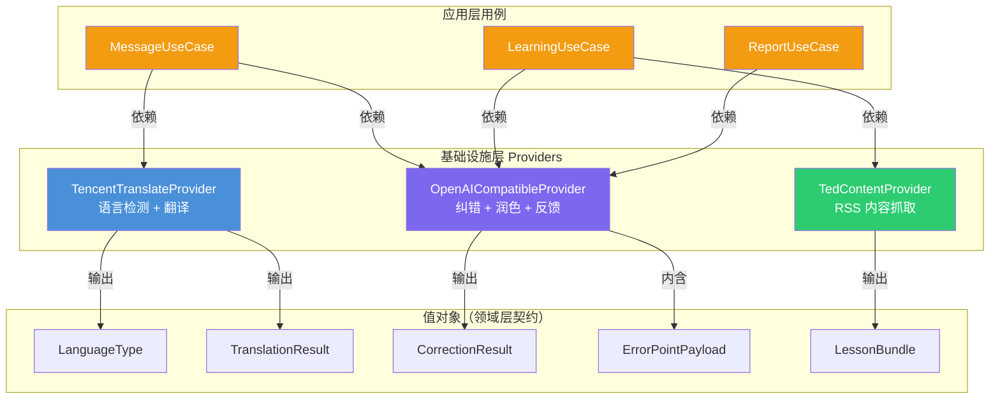
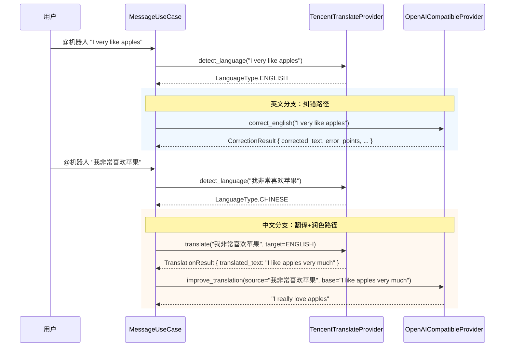

本页深入剖析项目中基础设施层的 **Provider 抽象设计**——三个外部服务适配器（腾讯翻译、OpenAI 兼容大模型、TED RSS 内容源）如何通过构造器注入接入系统，以及它们在用例层被编排协作的核心数据流。理解这一层，是掌握整个机器人"感知→思考→响应"链路的关键前置知识。

Sources: [__init__.py](src/infrastructure/providers/__init__.py#L1-L2), [container.py](src/infrastructure/settings/container.py#L1-L28)

---

## Provider 全景：三个外部服务适配器

项目采用 **无抽象基类、直接依赖具体类** 的务实设计策略。三个 Provider 并非继承自某个通用接口，而是各自定义与业务语义紧密贴合的方法签名，由 [ServiceContainer](手动依赖注入容器（ServiceContainer）) 在启动阶段统一实例化并注入到各用例中。这一选择避免了过度抽象带来的间接层开销，同时通过构造器注入保持了完全的可测试性。



各 Provider 的职责边界与产出物对比：

| Provider | 核心能力 | 产出值对象 | 消费用例 | 外部依赖 |
|---|---|---|---|---|
| `TencentTranslateProvider` | 语言检测、中英互译 | `LanguageType`、`TranslationResult` | `MessageUseCase` | 腾讯云 TMT SDK |
| `OpenAICompatibleProvider` | 英文纠错、翻译润色、文本反馈 | `CorrectionResult`（含 `ErrorPointPayload`）、`str` | `MessageUseCase`、`LearningUseCase`、`ReportUseCase` | OpenAI Chat Completions API |
| `TedContentProvider` | RSS 抓取、课程组装 | `LessonBundle` | `LearningUseCase` | feedparser + TED RSS |

Sources: [translate_tencent.py](src/infrastructure/providers/translate_tencent.py#L12-L13), [llm_openai.py](src/infrastructure/providers/llm_openai.py#L12-L13), [content_ted.py](src/infrastructure/providers/content_ted.py#L12-L13)

---

## TencentTranslateProvider：语言检测与腾讯云翻译

`TencentTranslateProvider` 是消息处理链路的 **第一道关卡**，负责判断用户输入的语言类型并执行翻译。它封装了腾讯云文本翻译（TMT）API 的调用细节，对外暴露两个简洁的异步方法。

**语言检测**采用基于正则的启发式策略——检测字符串中是否包含 CJK 统一表意文字（`\u4e00-\u9fff`）或拉丁字母，将结果映射为 `LanguageType` 枚举值。这一方案简单高效，无需额外 API 调用，适合机器人场景下中英文二元判定的需求。

**翻译流程**的核心实现值得关注：由于腾讯云 SDK 的 `TmtClient` 是同步阻塞的，Provider 使用 `asyncio.to_thread` 将同步调用隔离到线程池，避免阻塞事件循环。同时，通过 `tenacity` 装饰器配置了 **最多 3 次重试、每次间隔 1 秒** 的容错策略。语言代码归一化方法 `_normalize_language` 将领域枚举 `LanguageType` 映射为腾讯 API 要求的 `"zh"`/`"en"`/`"auto"` 字符串。

```
# 关键方法签名
async def detect_language(text: str) -> LanguageType
async def translate(text, *, source_lang, target_lang) -> TranslationResult
```

Sources: [translate_tencent.py](src/infrastructure/providers/translate_tencent.py#L28-L106)

### 内置 Mock 降级机制

当 `secret_id` 或 `secret_key` 为空字符串时，`translate` 方法不发起任何网络请求，而是返回带有 `[mock:{target_lang}]` 前缀的占位翻译结果，同时将 `provider` 字段标记为 `"tencent-mock"`。这一设计使得 **零配置即可启动开发调试**——不需要真实的腾讯云密钥，整个消息处理链路就能端到端运行。

Sources: [translate_tencent.py](src/infrastructure/providers/translate_tencent.py#L40-L48)

---

## OpenAICompatibleProvider：纠错、润色与文本反馈

`OpenAICompatibleProvider` 是系统中 **功能最丰富、被依赖最多** 的 Provider。它直接通过 `httpx.AsyncClient` 调用 OpenAI Chat Completions 兼容接口（不依赖官方 SDK），因此可以无缝对接任何兼容该协议的服务端——OpenAI、DeepSeek、Ollama 本地模型等。

该 Provider 提供三个面向业务的异步方法，各自对应不同的 prompt 工程策略：

| 方法 | 功能 | 温度参数 | 返回类型 | 消费场景 |
|---|---|---|---|---|
| `correct_english` | 英文纠错 + 错误点提取 | 0.2（确定性优先） | `CorrectionResult` | 英文消息纠错 |
| `improve_translation` | 基础翻译润色优化 | 0.3 | `str` | 中文消息翻译增强 |
| `generate_feedback` | 通用文本生成 | 0.5（适度创造性） | `str` | 任务反馈、周报鼓励语 |

**`correct_english`** 是最复杂的方法。它通过精心设计的 system prompt 要求模型严格返回 JSON，包含纠错后文本、中文翻译、自然表达建议、整体说明，以及结构化的错误点列表（含 `error_type`、`source_fragment`、`correct_fragment`、`explanation` 四个字段）。底层通过 `_chat_json` 方法发送请求，再用 `_extract_json` 清理可能包裹在 Markdown 代码块中的响应内容，最终解析为 `CorrectionResult` 值对象。重试策略为 **最多 2 次、间隔 1 秒**。

Sources: [llm_openai.py](src/infrastructure/providers/llm_openai.py#L19-L141)

### OpenAI 兼容协议的 URL 构建

`_chat_completions_url` 方法展现了灵活的 URL 处理逻辑：如果 `base_url` 已经以 `/chat/completions` 结尾则直接使用，否则自动拼接。这意味着用户可以在 `LLM_BASE_URL` 中填入 `https://api.openai.com/v1` 或 `https://api.openai.com/v1/chat/completions`，两种写法都能正确工作。

Sources: [llm_openai.py](src/infrastructure/providers/llm_openai.py#L131-L134)

### Mock 降级：三方法各有兜底

与腾讯翻译类似，当 `api_key`、`base_url`、`model` 任一为空时，三个方法分别返回合理的 mock 数据：`correct_english` 返回原文加 mock 标记的 `CorrectionResult`；`improve_translation` 原样返回 `base_translation`；`generate_feedback` 返回固定的鼓励语句 `"完成得不错，继续保持。"`。这使得 **无需任何大模型配置，机器人的全部命令都能响应**——只是返回的是占位内容。

Sources: [llm_openai.py](src/infrastructure/providers/llm_openai.py#L21-L30), [llm_openai.py](src/infrastructure/providers/llm_openai.py#L85-L86), [llm_openai.py](src/infrastructure/providers/llm_openai.py#L103-L104)

---

## 双 Provider 协作：消息处理的数据流

Provider 的真正威力体现在用例层的编排中。以 `MessageUseCase.handle_at_message` 为例，当用户 @机器人 发送消息时，两个 Provider 形成 **检测→翻译→纠错/润色** 的流水线协作：



这一编排逻辑清晰体现了 **Provider 之间没有直接依赖**——`MessageUseCase` 作为编排者，协调两个 Provider 的调用顺序和数据流向。中文分支特别值得注意：先由腾讯翻译提供基础译文，再由大模型进行自然度润色，这种 **两阶段翻译** 策略兼顾了翻译准确性和表达自然度。

Sources: [message_usecases.py](src/application/message_usecases.py#L45-L96)

---

## 配置注入：从环境变量到 Provider 实例

Provider 的所有外部依赖（密钥、端点、模型名）均通过 `AppRuntimeSettings` 从环境变量读取，在 `build_container` 中完成实例化。这一链路构成了 [双层配置体系：运行时配置与静态配置](13-shuang-ceng-pei-zhi-ti-xi-yun-xing-shi-pei-zhi-yu-jing-tai-pei-zhi) 的运行时侧。

| Provider | 配置来源 | 环境变量 |
|---|---|---|
| `TencentTranslateProvider` | `AppRuntimeSettings` | `TENCENT_TRANSLATE_SECRET_ID`、`TENCENT_TRANSLATE_SECRET_KEY`、`TENCENT_TRANSLATE_REGION`、`TENCENT_TRANSLATE_ENDPOINT` |
| `OpenAICompatibleProvider` | `AppRuntimeSettings` | `LLM_API_KEY`、`LLM_BASE_URL`、`LLM_MODEL` |
| `TedContentProvider` | `StaticConfig.content` | `config.yaml` 中的 `content.ted_rss_urls`、`content.fallback_lesson_word_count` |

`build_container` 中的实例化代码采用了 **关键字-only 参数** 的构造方式（`*, api_key=..., base_url=...`），这与 Provider 构造器的 `*` 强制关键字参数设计完全匹配，确保了配置项不会因为参数顺序错误而被静默错传。

Sources: [container.py](src/infrastructure/settings/container.py#L70-L84), [models.py](src/infrastructure/settings/models.py#L28-L35)

---

## 领域值对象：Provider 与业务层的契约

Provider 的输出全部使用领域层的 `dataclass(slots=True)` 值对象，这些值对象定义在 [领域实体与值对象设计](9-ling-yu-shi-ti-yu-zhi-dui-xiang-she-ji) 中，这里聚焦与 Provider 直接相关的三个核心类型：

**`LanguageType`** 是一个 `str` 枚举（`ENGLISH="en"`、`CHINESE="zh"`、`UNKNOWN="unknown"`），作为语言检测的分类输出。由于继承了 `str`，它可以直接参与字符串比较和序列化。

**`TranslationResult`** 封装翻译结果，包含原文、译文、源语言、目标语言和 provider 标识。其中 `provider` 字段用于追溯结果来源（`"tencent"` 或 `"tencent-mock"`），在交互记录中作为审计信息持久化。

**`CorrectionResult`** 是最复杂的值对象，包含纠错后文本、中文翻译、自然表达建议、整体说明、provider 标识，以及一个 `ErrorPointPayload` 列表。每个 `ErrorPointPayload` 描述一个具体错误点（错误类型、原文片段、纠正片段、解释），这些错误点会被 [错误点聚合（ErrorAggregator）与去重签名](10-cuo-wu-dian-ju-he-erroraggregator-yu-qu-zhong-qian-ming) 进一步处理并调度复习。

Sources: [learning.py](src/domain/value_objects/learning.py#L8-L39)

---

## 测试策略：零配置 Mock 验证

Provider 的内置 mock 降级机制直接支撑了项目的测试策略。`test_provider_mocks.py` 展示了最核心的测试模式：**无需任何外部依赖，仅凭空字符串配置即可验证 Provider 的完整行为契约**。这种设计使得单元测试不需要 mock 框架介入——Provider 本身就是自己的 mock。

`TencentTranslateProvider` 的测试验证了空凭证时 `detect_language` 仍能正确识别中文，`translate` 返回以 `[mock:en]` 开头的占位文本且 `provider` 字段为 `"tencent-mock"`。`OpenAICompatibleProvider` 的测试则验证了空配置下 `correct_english` 和 `generate_feedback` 都能返回有意义的内容，且 `provider` 字段标记为 `"openai-compatible-mock"`。

这一测试策略在 [测试体系：pytest 异步测试与 Provider Mock](24-ce-shi-ti-xi-pytest-yi-bu-ce-shi-yu-provider-mock) 中有更详细的讨论。

Sources: [test_provider_mocks.py](tests/test_provider_mocks.py#L1-L40)

---

## 设计总结与扩展方向

Provider 层的设计遵循了三个核心原则：

1. **务实的不抽象**：没有引入 Protocol 或 ABC，直接在用例中依赖具体类。在当前三 Provider 规模下，这避免了不必要的间接层。若未来需要支持多翻译引擎切换，可在此基础上升抽出接口——这在 [扩展指南：添加新命令与新 Provider](25-kuo-zhan-zhi-nan-tian-jia-xin-ming-ling-yu-xin-provider) 中有具体指引。

2. **自包含的降级能力**：每个 Provider 内置 mock 逻辑，通过空配置自动激活，使开发者在无外部服务的环境下也能运行完整链路。`provider` 字段的设计让调用方可以区分真实结果和 mock 结果。

3. **异步优先 + 阻塞隔离**：所有对外方法均为 `async`，对同步 SDK（腾讯云）使用 `asyncio.to_thread` 桥接，确保整个消息处理流水线在单一事件循环上高效运行。