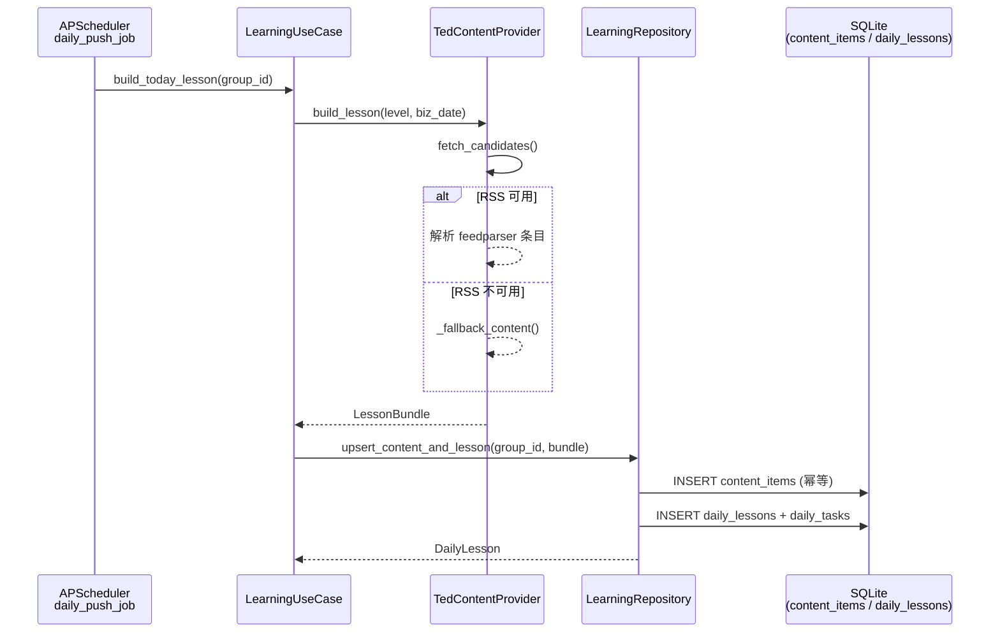
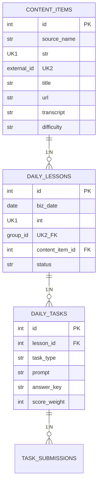

**TedContentProvider** 是本系统「每日学习任务」的内容引擎——它从 TED Talks 的公开 RSS Feed 中抓取英文短文素材，经摘要裁剪后封装为带任务清单的 **LessonBundle**；当网络不通或 RSS 源无数据时，自动回退到一段内置的硬编码短文，确保每天的学习任务始终可用。本文将从配置入口、数据流、抓取逻辑、回退机制和持久化链路五个层面展开分析。

Sources: [content_ted.py](src/infrastructure/providers/content_ted.py#L1-L82)

## 配置入口：ContentSettings

内容源的声明式配置集中在 **ContentSettings** Pydantic 模型中，作为 `StaticConfig` 的一个子节点，通过 `config.yaml` 一次性加载并注入到 [手动依赖注入容器（ServiceContainer）](14-shou-dong-yi-lai-zhu-ru-rong-qi-servicecontainer)。三个关键字段及其作用如下：

| 字段 | 类型 | 默认值 | 作用 |
|------|------|--------|------|
| `default_source` | `str` | `"ted"` | 内容源标识，当前仅支持 ted，预留多源扩展 |
| `ted_rss_urls` | `list[str]` | `["…/tedtalks_audio", "…/TEDTalks_video"]` | 待抓取的 RSS Feed 地址列表 |
| `fallback_lesson_word_count` | `int` | `180` | 内置回退短文按字符截断的上限（约 180 × 8 ≈ 1440 字符） |

对应的 YAML 片段：

```yaml
content:
  default_source: ted
  ted_rss_urls:
    - "https://feeds.feedburner.com/tedtalks_audio"
    - "https://feeds.feedburner.com/TEDTalks_video"
  fallback_lesson_word_count: 180
```

在容器构建阶段，`build_container()` 读取这些配置值并直接传入 `TedContentProvider` 构造函数，形成「配置 → Provider 实例 → UseCase」的完整注入链路。

Sources: [models.py](src/infrastructure/settings/models.py#L53-L61), [config.yaml](config.yaml#L16-L21), [container.py](src/infrastructure/settings/container.py#L81-L84)

## 整体数据流

内容从 RSS 源到最终持久化，经过四个层级。下方的 Mermaid 序列图展示了定时推送场景下的完整调用路径。理解此图前需知晓两个前提概念：**TedContentProvider** 负责外网抓取与回退逻辑，**LearningRepository** 负责将领域对象写入 SQLite 数据库。



**关键设计要点**：`fetch_candidates()` 和 `build_lesson()` 都是 `async` 方法，但底层 `feedparser.parse()` 是同步调用。这意味着在事件循环中，RSS 解析会短暂阻塞当前协程。对于本项目的使用规模（每个群每天一次调用），这种简化是合理的；若未来需要高并发抓取，可考虑将 `feedparser.parse` 包装进 `asyncio.to_thread`。

Sources: [content_ted.py](src/infrastructure/providers/content_ted.py#L17-L67), [scheduler.py](src/plugins/scheduler.py#L57-L77), [learning_usecases.py](src/application/learning_usecases.py#L67-L72)

## RSS 抓取：fetch_candidates 与 feedparser

`fetch_candidates()` 是内容获取的第一阶段——它遍历配置中的所有 RSS URL，逐个调用 `feedparser.parse()` 提取条目，并将前 5 条转换为标准化的候选字典。核心处理步骤如下：

1. **HTML 标签清洗**：RSS `summary` 字段通常包含 `<p>` 标签，通过 `replace("<p>", "").replace("</p>", " ")` 进行简易清理。
2. **唯一性签名**：使用 `md5(link + title)` 生成 `external_id`，确保同一篇 TED 演讲在不同日期被抓取后不会被重复写入 `content_items` 表（该表有 `(source_name, external_id)` 的联合唯一约束）。
3. **长度截断**：通过 `textwrap.shorten(summary, width=1200, placeholder="...")` 将摘要限制在 1200 字符内，避免过长的 transcript 影响消息渲染和 LLM 调用。

每个候选字典的结构为：

| 字段 | 说明 | 示例 |
|------|------|------|
| `source_name` | 固定为 `"ted"` | `"ted"` |
| `external_id` | MD5 签名 | `"a1b2c3d4..."` |
| `title` | TED 演讲标题 | `"How to learn a language"` |
| `url` | 原始链接 | `"https://www.ted.com/talks/..."` |
| `transcript` | 清洗后的摘要（≤1200 字符） | `"In this talk, the speaker..."` |

Sources: [content_ted.py](src/infrastructure/providers/content_ted.py#L17-L32)

## 课堂构建：build_lesson 与三段式任务

`build_lesson()` 是第二阶段——它从候选列表中取出第一篇文章，生成一份完整的 **LessonBundle**，包含学习材料元信息和三个梯度递进的 **LessonTask**：

| 任务类型 | 提示模板 | 分值权重 | 认知层级 |
|----------|----------|----------|----------|
| `vocabulary` | 列出 3 个重要词/短语并写中文意思 | 30 | 记忆/理解 |
| `reading` | 用中文总结核心观点（≤80 字） | 30 | 分析/概括 |
| `output` | 写 2 句英文表达或改写为口语表达 | 40 | 创造/应用`

这种设计遵循 **Bloom 认知层级** 的递进原则：从低阶记忆到高阶创造，权重分配也倾向于产出型任务（40%），鼓励用户主动使用英语而非被动理解。

任务模板中 `answer_key` 始终为 `None`——这是因为任务评分不依赖标准答案，而是在用户提交时由 [OpenAI 兼容大模型 Provider](15-provider-mo-shi-teng-xun-fan-yi-yu-openai-jian-rong-da-mo-xing-ji-cheng) 生成反馈，同时按 `len(content) // 6` 的简式规则计算基础分数。

Sources: [content_ted.py](src/infrastructure/providers/content_ted.py#L34-L67), [learning.py](src/domain/value_objects/learning.py#L43-L59)

## 内置回退：_fallback_content

当 `candidates` 为空（即所有 RSS 源均无返回）或抓取到的 `transcript` 为空字符串时，系统自动激活 `_fallback_content()` 方法。这是一种**零依赖的本地保障策略**，确保即使外网完全不可达，每日任务仍能正常生成。

回退内容是一段硬编码的英文短文：

```
Learning English in small steps is often more effective than studying a huge amount at once.
A daily habit can help learners remember vocabulary, notice grammar, and gain confidence.
```

回退内容与正常抓取内容的区分通过 `source_name` 字段实现——正常为 `"ted"`，回退为 `"ted-fallback"`。这使得后续统计分析（例如管理员查看内容来源分布）可以清晰区分真实抓取与本地回退。此外，`external_id` 固定为 `"fallback-daily-learning"`，结合 `content_items` 表的唯一约束，确保回退内容在数据库中只存一条记录。

`fallback_word_count` 参数（默认 180）控制 transcript 的截断上限。由于 `transcript[:fallback_word_count * 8]` 使用字符切片而非单词切片，在极端情况下可能在单词中间截断，但对于内置固定文本而言这不是问题。

Sources: [content_ted.py](src/infrastructure/providers/content_ted.py#L34-L38), [content_ted.py](src/infrastructure/providers/content_ted.py#L69-L80)

## 持久化链路：upsert_content_and_lesson

`LessonBundle` 生成后，通过 `LearningUseCase.build_today_lesson()` 调用 `LearningRepository.upsert_content_and_lesson()` 进行持久化。该方法采用**幂等设计**，核心逻辑分两步：

**第一步：ContentItem 幂等写入**。以 `(source_name, external_id)` 为联合唯一键查询，若已存在则复用现有记录（意味着同一篇 TED 文章不会重复存储），否则创建新行。这保证多篇课程可以复用同一个 ContentItem。

**第二步：DailyLesson 按日期+群幂等写入**。以 `(biz_date, group_id)` 为唯一键——每个群每天只生成一节课。若当天已有记录则跳过（不重复创建任务），否则新建 `DailyLesson` 并批量插入 3 条 `DailyTask`。



这种两级幂等设计使得 [APScheduler 定时任务注册与执行](20-apscheduler-ding-shi-ren-wu-zhu-ce-yu-zhi-xing) 的 `daily_push_job` 可以安全地重试——即使任务锁机制失效导致重复执行，数据库层面也不会产生重复课程。

Sources: [learning.py (repo)](src/infrastructure/db/repositories/learning.py#L209-L256), [models.py](src/infrastructure/db/models.py#L103-L137), [learning_usecases.py](src/application/learning_usecases.py#L67-L72)

## 调用场景：定时推送与手动触发

TedContentProvider 在两个场景下被调用：

**定时推送**：`daily_push_job` 在每天早上（默认 08:00）触发，遍历所有启用的群，调用 `build_today_lesson()` 生成课程并推送纯文本摘要到群聊。此时 `_ensure_today_task_detail()` 检测到当天无课程，会自动调用 Provider 获取新内容。

**手动触发**：用户在群内发送「今日任务」命令时，`_handle_today_task()` 通过 `get_today_task_envelope()` 获取任务。若当天课程已由定时推送创建，则直接复用；若未推送（例如定时任务尚未执行），则按需创建。两种路径最终都指向同一个 `build_lesson()` 方法，保证内容来源一致。

Sources: [scheduler.py](src/plugins/scheduler.py#L57-L77), [commands.py](src/plugins/commands.py#L52-L59), [learning_usecases.py](src/application/learning_usecases.py#L219-L233)

## 设计权衡与扩展考量

**当前设计的取舍**：`fetch_candidates()` 始终取每个 RSS 源的前 5 条中的**第 1 条**作为当天课程（`candidates[0]`），这意味着短期内多天的课程内容可能重复（因为 TED RSS 更新频率远低于每天一次）。这是一种有意的简化——优先保证内容质量（TED 演讲水准一致）和系统稳定性（无复杂的选择算法），而非追求每天内容的新鲜感。

**扩展方向**：`ContentSettings.default_source` 字段预留了多源扩展的可能性。当前仅实现 `"ted"` 对应的 `TedContentProvider`，未来可引入新的 Provider（例如 BBC Learning English、VOA 等），通过工厂模式根据 `default_source` 值选择对应的 Provider 实例。这属于 [扩展指南：添加新命令与新 Provider](25-kuo-zhan-zhi-nan-tian-jia-xin-ming-ling-yu-xin-provider) 讨论的范畴。