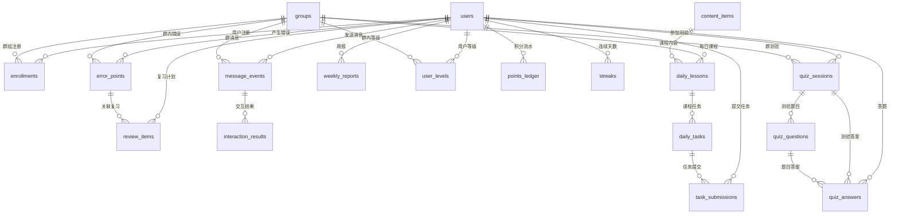
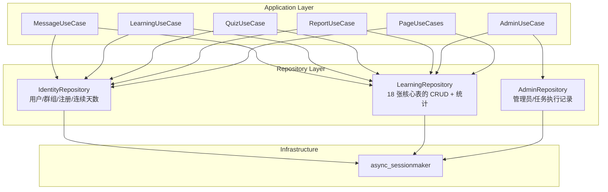

本项目采用 **SQLAlchemy 2.0 声明式映射 + aiosqlite 异步驱动** 构建 SQLite 持久化层，并通过三个 Repository 类（`IdentityRepository`、`LearningRepository`、`AdminRepository`）对外暴露面向业务的数据访问接口。整个数据库层位于基础设施层的 `src/infrastructure/db/` 包中，遵循 Clean Architecture 原则——上层 Application/Domain 只依赖 Repository 的方法签名，不直接操作 ORM 模型。本文将系统性地解析 ORM 基类与 Mixin、18 张数据表的建模设计、Repository 中普遍使用的 upsert 模式、以及会话管理与 Alembic 迁移机制。

Sources: [models.py](src/infrastructure/db/models.py#L1-L260), [base.py](src/infrastructure/db/base.py#L1-L35), [session.py](src/infrastructure/db/session.py#L1-L22)

## ORM 基类与时间戳混入（TimestampMixin）

所有 ORM 模型均继承自 `Base`（`DeclarativeBase` 子类），并通过 `MetaData` 注入统一的命名约定（`NAMING_CONVENTION`），使索引、唯一约束、外键等数据库对象自动生成规范的前缀名称——例如索引自动命名为 `ix_<列名>`，唯一约束为 `uq_<表名>_<列名>`。这一约定消除了手工命名约束的歧义，也为 Alembic 自动生成迁移脚本提供了稳定的一致性。

**`TimestampMixin`** 为混入类（Mixin），为模型注入 `created_at` 和 `updated_at` 两个时区感知的 `DateTime` 字段。`created_at` 同时设置了 Python 端默认值和数据库端 `server_default=func.now()`，`updated_at` 额外设置了 `onupdate` 回调，使每次 `session.commit()` 时自动刷新为当前 UTC 时间。18 张数据表中，有 14 张混入了 `TimestampMixin`，仅 `MessageEvent`、`InteractionResult`、`RuntimeSetting` 三个只追加/低频更新的表省略了该混入，改用单一 `created_at` 字段或仅 `updated_at` 字段。

Sources: [base.py](src/infrastructure/db/base.py#L1-L35)

## 18 张数据表：按业务域分组概览

下表按业务功能域对全部 18 张数据表进行分组，列出核心字段与约束特征。

| 业务域 | 表名 | 核心字段 | 约束特征 | 混入 |
|--------|------|----------|----------|------|
| **用户与群组** | `users` | `qq_user_id`, `nickname`, `joined_at`, `last_active_at` | `qq_user_id` UNIQUE + INDEX | ✅ |
| | `groups` | `qq_group_id`, `name`, `enabled` | `qq_group_id` UNIQUE + INDEX | ✅ |
| | `enrollments` | `user_id`, `group_id`, `status`, `enrolled_at` | 联合唯一 `(user_id, group_id)` | ✅ |
| | `admin_users` | `username`, `password_hash`, `status` | `username` UNIQUE + INDEX | ✅ |
| | `streaks` | `user_id`, `current_days`, `max_days`, `last_activity_date` | `user_id` UNIQUE | ✅ |
| | `user_levels` | `user_id`, `group_id`, `current_level`, `evidence_json` | 联合唯一 `(user_id, group_id)` | ✅ |
| **消息交互** | `message_events` | `raw_event_id`, `group_id`, `user_id`, `message_text`, `event_type` | `raw_event_id` INDEX | ❌ |
| | `interaction_results` | `event_id`, `action_type`, `provider`, `reply_text`, `success` | — | ❌ |
| **错误与复习** | `error_points` | `user_id`, `group_id`, `error_type`, `source_fragment`, `correct_fragment`, `frequency` | 五字段联合唯一签名 | ✅ |
| | `review_items` | `user_id`, `error_point_id`, `interval_days`, `next_review_at`, `correct_streak`, `status` | — | ✅ |
| **课程与任务** | `content_items` | `source_name`, `external_id`, `title`, `url`, `transcript` | 联合唯一 `(source_name, external_id)` | ✅ |
| | `daily_lessons` | `biz_date`, `group_id`, `content_item_id`, `status` | 联合唯一 `(biz_date, group_id)` | ✅ |
| | `daily_tasks` | `lesson_id`, `task_type`, `prompt`, `answer_key`, `score_weight` | — | ✅ |
| | `task_submissions` | `task_id`, `user_id`, `submission_text`, `score`, `feedback` | 联合唯一 `(task_id, user_id)` | ✅ |
| **测验与报告** | `quiz_sessions` | `biz_week`, `group_id`, `user_id`, `total_score`, `status` | 联合唯一 `(biz_week, group_id, user_id)` | ✅ |
| | `quiz_questions` | `session_id`, `stem`, `options`(JSON), `answer_key`, `explanation` | — | ✅ |
| | `quiz_answers` | `session_id`, `question_id`, `user_answer`, `is_correct`, `score` | 联合唯一 `(session_id, question_id)` | ✅ |
| | `weekly_reports` | `biz_week`, `user_id`, `report_json`(JSON), `summary_text` | 联合唯一 `(biz_week, user_id)` | ✅ |
| **运营** | `points_ledger` | `user_id`, `points`, `reason` | — | ✅ |
| | `runtime_settings` | `key`, `value`, `updated_at` | `key` UNIQUE + INDEX | ❌ |
| | `job_runs` | `job_name`, `biz_key`, `status`, `started_at`, `finished_at` | 联合唯一 `(job_name, biz_key)` | ✅ |

Sources: [models.py](src/infrastructure/db/models.py#L1-L260)

## 表间关系与核心实体关系图

下面的 Mermaid 图展示了主要表之间的外键引用关系。图中箭头方向表示"被引用 → 引用方"（即外键所在表），用粗体标注的是具有联合唯一约束的关键关联表。

> **前置说明**：此图为概念级 ER 关系图，使用实线箭头表示 SQLAlchemy `ForeignKey` 引用。每个节点代表一张数据表，边的标签说明引用目的。

Sources: [models.py](src/infrastructure/db/models.py#L1-L260)

## 会话管理：异步引擎与 SessionFactory

数据库连接通过三个纯函数管理，定义在 `session.py` 中。`create_engine()` 接收 `sqlite+aiosqlite:///` 协议的数据库 URL，创建异步引擎实例。`create_session_factory()` 基于引擎创建 `async_sessionmaker`，关键配置为 `expire_on_commit=False`——这意味着 commit 之后已加载的 ORM 对象属性不会过期，可以在 session 关闭后继续访问。`init_db()` 在引擎的连接上下文中调用 `Base.metadata.create_all()`，确保所有表已创建。

三个 Repository 均通过构造函数注入同一个 `async_sessionmaker` 实例。每个 Repository 方法内部通过 `async with self._session_factory() as session` 获取短生命周期的 `AsyncSession`，方法结束时 session 自动关闭。这种**"每方法一个 session"**模式使每个业务操作拥有独立的事务边界，避免了跨方法的事务泄漏。

Sources: [session.py](src/infrastructure/db/session.py#L1-L22), [container.py](src/infrastructure/settings/container.py#L63-L69)

## Repository 分层与职责划分

三个 Repository 按业务职责严格分离，形成清晰的数据访问边界：

| Repository | 文件 | 操作表范围 | 核心方法数 | 典型职责 |
|------------|------|-----------|-----------|---------|
| **IdentityRepository** | `identity.py` | `users`, `groups`, `enrollments`, `streaks` | 7 | 用户/群组的 ensure-or-create、注册验证、活跃用户列表 |
| **LearningRepository** | `learning.py` | 其余 14 张表 | 27 | 错误点 upsert、课程发布、任务提交、测验流程、周报统计、运行时配置、任务锁 |
| **AdminRepository** | `admin.py` | `admin_users`, `job_runs`, `users`(只读) | 4 | 管理员引导创建、用户列表、最近任务记录 |

Sources: [identity.py](src/infrastructure/db/repositories/identity.py#L1-L101), [learning.py](src/infrastructure/db/repositories/learning.py#L1-L801), [admin.py](src/infrastructure/db/repositories/admin.py#L1-L41)

## ensure / upsert 模式详解

整个 Repository 层最核心的数据操作模式是 **ensure / upsert**——先查询是否存在，存在则更新，不存在则插入。这一模式贯穿用户注册、错误点聚合、课程发布、任务提交、测验会话、周报保存、运行时配置、任务锁等几乎所有写入操作。

以 `IdentityRepository.ensure_user()` 为例，其流程为：

1. 按 `qq_user_id` 查询 `users` 表
2. 若不存在 → 创建新 `User` 对象（含 `joined_at` 和 `last_active_at`），`session.add()` + `commit` + `refresh`
3. 若已存在 → 更新 `nickname`（仅在非空时）和 `last_active_at`，直接 `commit`

`LearningRepository.upsert_error_points()` 则更进一步：在单个 session 中批量处理多个 `ErrorPointPayload`，对每个 payload 逐一查询五字段联合唯一键（`user_id` + `group_id` + `error_type` + `source_fragment` + `correct_fragment`）。命中时递增 `frequency` 并更新 `explanation` 和 `last_seen_at`；未命中则创建新记录。所有操作在同一事务内完成，最后统一 `commit` + 批量 `refresh`。

这种模式的**核心优势**是幂等性——同一个业务事件被重复处理不会产生重复数据。代价是每次写入需要一次先读查询，对于 SQLite 单文件数据库的场景下这是完全可接受的。

Sources: [identity.py](src/infrastructure/db/repositories/identity.py#L36-L54), [learning.py](src/infrastructure/db/repositories/learning.py#L129-L170)

## 联合唯一约束：去重的基石

`models.py` 中定义了 9 个联合唯一约束（`UniqueConstraint`），它们是实现 ensure/upsert 模式的数据层保障。每个约束的字段组合精确对应业务语义上的"天然键"：

| 约束名 | 表 | 字段组合 | 业务含义 |
|--------|-----|---------|---------|
| `uq_enrollments_user_group` | `enrollments` | `(user_id, group_id)` | 一个用户在一个群里只有一条注册记录 |
| `uq_error_points_signature` | `error_points` | `(user_id, group_id, error_type, source_fragment, correct_fragment)` | 相同错误签名只保留一条 |
| `uq_content_source_external` | `content_items` | `(source_name, external_id)` | 同一来源的同一外部内容不重复入库 |
| `uq_daily_lessons_biz_date_group` | `daily_lessons` | `(biz_date, group_id)` | 每个群每天只发布一节课 |
| `uq_task_submissions_task_user` | `task_submissions` | `(task_id, user_id)` | 每个用户对每个任务只有一次提交 |
| `uq_quiz_sessions_week_group_user` | `quiz_sessions` | `(biz_week, group_id, user_id)` | 每周每群每用户只有一个测验会话 |
| `uq_quiz_answers_session_question` | `quiz_answers` | `(session_id, question_id)` | 每道题只答一次 |
| `uq_weekly_reports_week_user` | `weekly_reports` | `(biz_week, user_id)` | 每周每用户一份报告 |
| `uq_job_runs_job_key` | `job_runs` | `(job_name, biz_key)` | 同一任务的同一业务键只执行一次 |

Sources: [models.py](src/infrastructure/db/models.py#L30-L259)

## LearningRepository 核心方法分组

`LearningRepository` 是三个 Repository 中最庞大的（约 800 行，27 个异步方法），可按功能域划分为六个组：

### 消息与交互记录

`create_message_event()` 和 `create_interaction_result()` 负责记录用户消息和机器人的回复结果。`get_message_event_by_raw_event_id()` 用于去重检测——在消息处理的早期阶段通过 QQ 原始事件 ID 判断是否已处理过该消息。

Sources: [learning.py](src/infrastructure/db/repositories/learning.py#L36-L84)

### 错误点与复习

`upsert_error_points()` 实现错误点的聚合与频率累加，`ensure_review_items()` 为每个错误点创建或更新间隔复习计划。`get_due_review_items()` 按 `next_review_at` 筛选到期的复习项，`update_review_item()` 用通用的 `**kwargs` 模式动态更新复习项字段。

Sources: [learning.py](src/infrastructure/db/repositories/learning.py#L129-L374)

### 课程与任务

`upsert_content_and_lesson()` 是一个复合操作：在单个事务中先确保 `ContentItem` 存在，再确保 `DailyLesson` 存在，最后批量创建 `DailyTask`。`get_today_tasks()`、`get_today_lesson_detail()` 提供课程数据的只读查询。`submit_task()` 实现任务提交的 upsert 逻辑，`get_task_submissions_for_user()` 以字典形式返回用户对一批任务的提交记录。

Sources: [learning.py](src/infrastructure/db/repositories/learning.py#L209-L352)

### 测验流程

`create_quiz_session()` → `add_quiz_questions()` → `get_quiz_questions()` → `save_quiz_answers()` 构成完整的测验生命周期。`save_quiz_answers()` 在一个事务中批量 upsert 所有答案，并更新会话的 `total_score` 和 `status` 为 `"submitted"`。

Sources: [learning.py](src/infrastructure/db/repositories/learning.py#L430-L532)

### 统计与报告

`get_learning_evidence()` 通过 `InteractionResult` JOIN `MessageEvent` 统计用户近 N 天的翻译次数、纠错次数、任务完成数和测验均分。`get_weekly_report_stats()` 在此基础上聚合学习天数、任务完成率、薄弱知识点（按 `error_type` 分组取 TOP3 频率最高的错误类型）、积分和连续天数等指标。`save_weekly_report()` 和 `get_weekly_report()` 负责周报的持久化与读取。

Sources: [learning.py](src/infrastructure/db/repositories/learning.py#L593-L787)

### 运营支持

`acquire_job_lock()` / `finish_job_lock()` 基于 `job_runs` 表实现简易的分布式任务锁——`acquire_job_lock()` 检查指定 `(job_name, biz_key)` 是否存在且状态为 `running` 或 `success`，若已存在则返回 `False` 表示加锁失败。`list_runtime_settings()` / `upsert_runtime_setting()` 为运行时配置提供 KV 存储的 CRUD。`get_dashboard_metrics()` 一次查询返回 8 项全局指标用于管理后台仪表盘。

Sources: [learning.py](src/infrastructure/db/repositories/learning.py#L565-L614), [learning.py](src/infrastructure/db/repositories/learning.py#L616-L630)

## 数据库初始化与 Alembic 迁移

项目提供了两种建表路径。**快速路径**是应用启动时 `init_db()` 调用 `Base.metadata.create_all()` 自动创建所有表——适合开发和首次部署。**正式迁移路径**基于 Alembic，`alembic/env.py` 导入 `Base.metadata` 作为 `target_metadata`，`alembic.ini` 中配置了与 `AppRuntimeSettings.database_url` 相同的默认连接字符串 `sqlite+aiosqlite:///./data/english_bot.sqlite3`。

首个迁移脚本 `0001_initial.py` 采用 `Base.metadata.create_all(bind=bind)` 而非手写 DDL，这意味着迁移内容直接由 ORM 模型定义驱动。后续新增表或字段时，可使用 `alembic revision --autogenerate` 基于模型差异生成迁移脚本。数据库文件默认存放在 `./data/english_bot.sqlite3`，路径由环境变量 `DATABASE_URL` 或 `.env` 文件控制。

Sources: [session.py](src/infrastructure/db/session.py#L18-L21), [0001_initial.py](alembic/versions/0001_initial.py#L1-L30), [alembic.ini](alembic.ini#L1-L4), [models.py](src/infrastructure/settings/models.py#L23-L23)

## ServiceContainer 中的组装方式

在 [手动依赖注入容器（ServiceContainer）](14-shou-dong-yi-lai-zhu-ru-rong-qi-servicecontainer) 的 `build_container()` 函数中，数据库层的组装顺序为：

1. `create_engine(settings.runtime.database_url)` → 创建异步引擎
2. `create_session_factory(engine)` → 创建会话工厂
3. `await init_db(engine)` → 确保表已创建
4. 用同一个 `session_factory` 实例化三个 Repository
5. 将三个 Repository 注入到各个 UseCase 构造函数中

这种"单一 session_factory 共享"设计意味着所有 Repository 共享同一个连接池（对于 SQLite 而言是同一个文件连接），但每个方法调用通过 `async with self._session_factory() as session` 获得独立的 session 和事务。

Sources: [container.py](src/infrastructure/settings/container.py#L61-L69)

## 测试策略

`tests/test_learning_repository.py` 展示了 Repository 层的集成测试方式。测试使用 pytest 的 `tmp_path` fixture 创建临时 SQLite 文件，通过 `create_engine` → `create_session_factory` → `init_db` 搭建完整数据库环境，然后按业务流程依次调用 `IdentityRepository` 和 `LearningRepository` 的方法，最终对统计结果进行断言。这种测试策略在 `LearningRepository` 上直接操作，验证了从数据写入到统计查询的端到端正确性，且每个测试用例独立使用临时数据库文件，互不干扰。

Sources: [test_learning_repository.py](tests/test_learning_repository.py#L1-L145)

## 设计决策总结

| 设计决策 | 选择 | 理由 |
|---------|------|------|
| 数据库引擎 | SQLite + aiosqlite | 单机部署、零运维、文件级备份 |
| ORM 框架 | SQLAlchemy 2.0 声明式映射 + `Mapped[]` 类型注解 | 编译期类型安全、与 mypy 兼容 |
| 异步策略 | `AsyncSession` + `async_sessionmaker` | 全链路异步，不阻塞事件循环 |
| 数据访问模式 | Repository 模式，每方法独立 session | 事务边界清晰、自动资源回收 |
| 去重策略 | 联合唯一约束 + 应用层 ensure/upsert | 幂等写入、防止重复数据 |
| 迁移工具 | Alembic + autogenerate | 可追踪的 schema 演进 |
| 时间处理 | 全部使用 `DateTime(timezone=True)` + UTC | 避免时区歧义 |

Sources: [base.py](src/infrastructure/db/base.py#L1-L35), [session.py](src/infrastructure/db/session.py#L1-L22)

## 延伸阅读

- [领域实体与值对象设计](9-ling-yu-shi-ti-yu-zhi-dui-xiang-she-ji)——了解 ORM 模型之上的领域实体（`dataclass`）和值对象层
- [错误点聚合（ErrorAggregator）与去重签名](10-cuo-wu-dian-ju-he-erroraggregator-yu-qu-zhong-qian-ming)——`upsert_error_points()` 背后的错误签名计算逻辑
- [间隔复习调度（ReviewScheduler）与倍增策略](11-jian-ge-fu-xi-diao-du-reviewscheduler-yu-bei-zeng-ce-lve)——`ensure_review_items()` 中 `interval_days` 和 `next_review_at` 的计算规则
- [手动依赖注入容器（ServiceContainer）](14-shou-dong-yi-lai-zhu-ru-rong-qi-servicecontainer)——数据库层在整体容器中的组装位置
- [双层配置体系：运行时配置与静态配置](13-shuang-ceng-pei-zhi-ti-xi-yun-xing-shi-pei-zhi-yu-jing-tai-pei-zhi)——`runtime_settings` 表支撑的运行时配置热更新机制
- [分布式任务锁与幂等保护](21-fen-bu-shi-ren-wu-suo-yu-mi-deng-bao-hu)——`acquire_job_lock()` / `finish_job_lock()` 的完整锁机制分析