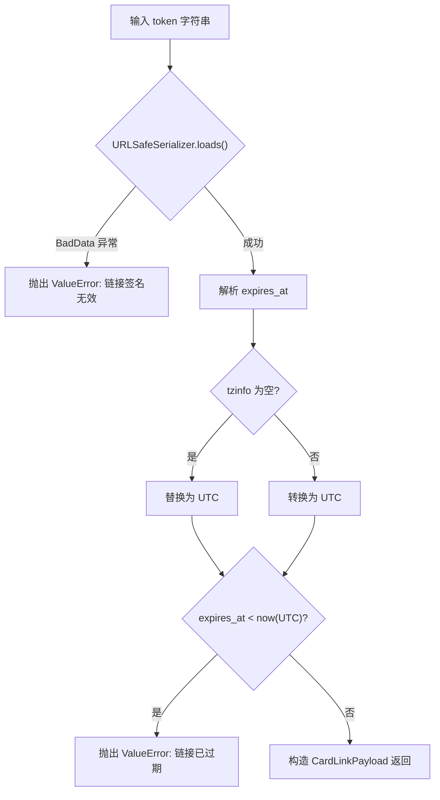
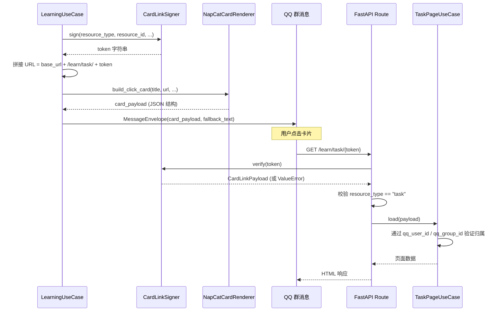

**CardLinkSigner** 是本系统的免登录学习页安全守门人。它基于 `itsdangerous` 库的 `URLSafeSerializer`，将资源类型、资源 ID、用户身份、群组归属和过期时间打包为一个**不可篡改、可验证**的 URL token，嵌入到 NapCat 卡片消息中，让 QQ 群用户通过一次点击即可安全访问任务页、周测页和周报页，无需任何登录流程。整个机制覆盖了**签名生成 → URL 组装 → 卡片投递 → 页面验证 → 业务授权**的完整链路。

Sources: [card_links.py](src/infrastructure/auth/card_links.py#L1-L55), [messaging.py](src/domain/value_objects/messaging.py#L20-L27)

## 设计动机与安全模型

在一个 QQ 群机器人场景下，用户无法通过传统 OAuth 或 Session 方式登录 Web 页面。系统的解法是：**用签名 token 代替登录态**。每次群内推送学习内容时，机器人为该用户实时生成一条包含签名 token 的链接，嵌入 NapCat 卡片的 `jumpUrl` 字段。用户点击卡片后，FastAPI 后端从 URL 路径中提取 token 进行验证——只有**签名合法且未过期**的请求才能访问对应的 Web 页面。

这套方案的安全属性如下：

| 安全属性 | 实现机制 | 说明 |
|---------|---------|------|
| **不可篡改** | `URLSafeSerializer` + HMAC 签名 | 任何字段的修改都会导致签名校验失败 |
| **不可伪造** | 服务端 `secret_key` + 独立 salt | 攻击者无法自行生成有效 token |
| **有时效性** | `expires_at` 时间戳内嵌于 payload | 超时后链接自动失效 |
| **身份绑定** | `qq_user_id` + `qq_group_id` | token 仅对特定用户在特定群组中有效 |
| **类型隔离** | `resource_type` 校验 | task token 无法访问 quiz 页面，反之亦然 |

这种"签名即凭证"的模式属于**无状态认证**——后端无需存储 session，也不依赖数据库来验证 token 合法性，所有验证信息都自包含在 token 中。

Sources: [card_links.py](src/infrastructure/auth/card_links.py#L6-L13), [models.py](src/infrastructure/settings/models.py#L21-L21)

## 核心数据结构：CardLinkPayload

签名和验证操作都围绕领域值对象 `CardLinkPayload` 展开，它是一个不可变的 `@dataclass(slots=True)` 结构，承载了 token 中的全部业务语义：

```python
@dataclass(slots=True)
class CardLinkPayload:
    resource_type: str   # 资源类型："task" | "quiz" | "report"
    resource_id: str     # 资源 ID：lesson_id / session_id / week_key
    qq_user_id: str      # 目标用户的 QQ 号
    qq_group_id: str     # 目标群组的 QQ 群号
    expires_at: datetime # 过期时间（UTC）
```

该值对象定义在领域层（`src.domain.value_objects.messaging`），与 `MessageEnvelope` 并列，体现了**签名契约属于领域概念**的设计意图——它描述的是"一个学习资源链接对谁、在什么范围内、什么时候有效"这一业务规则，而非纯粹的技术实现。

Sources: [messaging.py](src/domain/value_objects/messaging.py#L20-L27)

## 签名生成流程（sign）

`CardLinkSigner.__init__` 接收一个 `secret_key` 字符串，构造一个带有 `salt="english-bot-card-links"` 的 `URLSafeSerializer` 实例。salt 的作用是将签名空间与其他使用同一 secret_key 的场景（如有）隔离开来，确保跨场景的签名不会意外互通。

`sign` 方法的工作流程如下：

1. 构造 `CardLinkPayload` dataclass 实例，将传入的 `expires_at` 转换为 UTC 时区
2. 通过 `dataclasses.asdict()` 将其转为字典
3. 将 `expires_at` 字段从 `datetime` 序列化为 ISO 8601 字符串
4. 调用 `URLSafeSerializer.dumps()` 生成签名 token（一个 URL-safe 的字符串）

关键细节：`expires_at.astimezone(UTC)` 确保无论调用方传入什么时区的 `datetime`，payload 中存储的一律是 UTC 时间，消除了时区歧义。

Sources: [card_links.py](src/infrastructure/auth/card_links.py#L11-L33)

## 签名验证流程（verify）

`verify` 方法执行**两阶段验证**——签名完整性校验 + 过期时间检查：



第一阶段捕获 `itsdangerous.BadData` 异常并转换为业务友好的 `ValueError("链接签名无效。")`，覆盖了 token 被篡改、格式错误、使用了错误 secret_key 等所有异常场景。第二阶段进行严格的时间比较，且对可能缺少时区信息的 `expires_at` 做了防御性处理——如果 `fromisoformat` 解析出的 `datetime` 没有 `tzinfo`（某些 ISO 格式字符串不含时区后缀），则显式标记为 UTC。

验证通过后，所有 payload 字段都被强制转换为 `str` 类型再传入 `CardLinkPayload` 构造函数，这是一种**类型净化**策略——防止反序列化过程中 `int`/`float` 类型意外渗透到下游业务逻辑。

Sources: [card_links.py](src/infrastructure/auth/card_links.py#L35-L54)

## URL 组装：从 token 到可点击链接

签名生成后，各个 UseCase 负责将其组装为完整的 URL。三个业务场景各自实现了 `_build_card_link` 私有方法，逻辑结构一致：

| 步骤 | 代码位置 | 说明 |
|-----|---------|------|
| 获取 base_url | `RuntimeConfigService.public_base_url()` | 从运行时配置读取，支持管理后台覆盖 |
| 计算 expires_at | `now(UTC) + timedelta(minutes=...)` | 过期时长由 `message.link_expire_minutes` 控制，默认 60 分钟 |
| 签名 | `card_link_signer.sign(...)` | 生成 token |
| 组装 URL | `f"{base_url}/learn/{type}/{token}"` | 拼接完整路径 |

三种资源类型对应的 URL 路径模式：

| 资源类型 | URL 模式 | UseCase | resource_id 含义 |
|---------|---------|---------|-----------------|
| `task` | `/learn/task/{token}` | `LearningUseCase` | 课时 ID（lesson.id） |
| `quiz` | `/learn/quiz/{token}` | `QuizUseCase` | 测试会话 ID（session.id） |
| `report` | `/learn/report/{token}` | `ReportUseCase` | 周标识（如 `2025-W26`） |

值得注意的是，如果 `public_base_url` 为空（未配置），`_build_card_link` 返回 `None`，UseCase 会**降级为纯文本消息**——在 `fallback_text` 中直接拼出 URL（此时 URL 为空则完全省略卡片），确保即使没有配置 Web 服务地址，机器人仍能以纯文本方式正常工作。

Sources: [learning_usecases.py](src/application/learning_usecases.py#L235-L256), [report_usecases.py](src/application/report_usecases.py#L164-L184), [quiz_usecases.py](src/application/quiz_usecases.py#L185-L305), [runtime.py](src/infrastructure/settings/runtime.py#L52-L53), [models.py](src/infrastructure/settings/models.py#L80-L86)

## 端到端调用链路

下面的时序图展示了一个完整的卡片链接生命周期——从 UseCase 签名生成到 FastAPI 路由验证，再到 PageUseCase 的业务授权：



Sources: [routes.py](src/admin/routes.py#L48-L52), [routes.py](src/admin/routes.py#L408-L425), [page_usecases.py](src/application/page_usecases.py#L35-L60)

## 请求验证层：_load_card_payload 辅助函数

FastAPI 路由层通过 `_load_card_payload` 辅助函数统一处理 token 验证和资源类型校验：

```python
async def _load_card_payload(container, token: str, expected_type: str):
    payload = container.card_link_signer.verify(token)
    if payload.resource_type != expected_type:
        raise ValueError("链接类型不匹配，请回到群里重新获取。")
    return payload
```

这个函数执行两重校验：第一重是 `CardLinkSigner.verify()` 自身的签名 + 过期验证；第二重是 `resource_type` 匹配检查，防止用户拿 task 类型的 token 访问 quiz 页面。路由层的错误处理统一捕获所有 `Exception`，返回 `learn_error.html` 模板页和 HTTP 400 状态码，给用户展示友好的中文错误提示。

三个路由端点均遵循相同模式：

| 路由 | HTTP 方法 | expected_type | 业务操作 |
|-----|----------|---------------|---------|
| `/learn/task/{token}` | GET / POST | `"task"` | 加载任务页 / 提交任务 |
| `/learn/quiz/{token}` | GET / POST | `"quiz"` | 加载周测页 / 提交答案 |
| `/learn/report/{token}` | GET | `"report"` | 加载周报页 |

Sources: [routes.py](src/admin/routes.py#L48-L52), [routes.py](src/admin/routes.py#L408-L425), [routes.py](src/admin/routes.py#L453-L470), [routes.py](src/admin/routes.py#L502-L519)

## 依赖注入与配置

`CardLinkSigner` 在 [ServiceContainer](src/infrastructure/settings/container.py#L44) 中作为单例被注入，实例化时使用 `AppRuntimeSettings.secret_key` 作为签名密钥。这个密钥同时用于管理后台的 session 加密等场景，但 CardLinkSigner 通过独立的 `salt="english-bot-card-links"` 实现了签名空间的逻辑隔离。

过期时长通过双层配置体系管理：静态默认值定义在 `MessageSettings.link_expire_minutes`（默认 60 分钟），运行时可通过管理后台的 `message.link_expire_minutes` 键覆盖，由 `RuntimeConfigService.link_expire_minutes()` 方法统一读取。这意味着**无需重启服务即可调整链接有效期**。

Sources: [container.py](src/infrastructure/settings/container.py#L44-L44), [container.py](src/infrastructure/settings/container.py#L91-L91), [runtime.py](src/infrastructure/settings/runtime.py#L52-L53), [models.py](src/infrastructure/settings/models.py#L84-L84)

## 测试验证

测试文件 `tests/test_card_links.py` 覆盖了两个核心场景：

- **正向往返测试**（`test_card_link_signer_roundtrip`）：签名后立即验证，断言所有 `CardLinkPayload` 字段完整一致
- **过期拒绝测试**（`test_card_link_signer_rejects_expired_token`）：签名时将 `expires_at` 设为过去时间，断言 `verify` 抛出匹配"已过期"的 `ValueError`

这两个测试用例精确定位了 CardLinkSigner 的核心契约：**签名完整性**和**时效性保证**。由于使用固定的 `"secret-key"` 作为测试密钥，测试完全不依赖外部配置，可以独立、快速地运行。

Sources: [test_card_links.py](tests/test_card_links.py#L1-L38)

## 设计权衡与注意事项

**选择 `URLSafeSerializer` 而非 `TimestampSigner` 或 JWT**：`URLSafeSerializer` 基于 HMAC 对整个 payload 签名，且输出紧凑、URL-safe。虽然 `TimestampSigner` 内建了时间戳验证，但它不便于嵌入自定义的 `expires_at` 逻辑（需要精确控制过期时间点而非相对时长）。JWT 则过于重量级，且在 QQ 群卡片场景下 payload 大小有限，`URLSafeSerializer` 的紧凑输出更适合。

**token 无法主动吊销**：这是无状态认证的固有局限。一旦 token 生成，在 `expires_at` 之前始终有效。在当前场景下这是可接受的——链接默认 60 分钟过期，且绑定了特定用户和群组。如果未来需要即时吊销能力，可以考虑引入 token 黑名单（需借助 [LRU 上下文缓存（ContextStore）](19-lru-shang-xia-wen-huan-cun-contextstore) 或数据库），但会增加有状态复杂度。

**降级策略的一致性**：当 `public_base_url` 未配置或为空时，系统自动降级为纯文本消息而非报错。这种**优雅降级**设计确保了即使在部署初期未配置 Web 服务的情况下，机器人核心功能（推送学习内容）仍能正常运作。