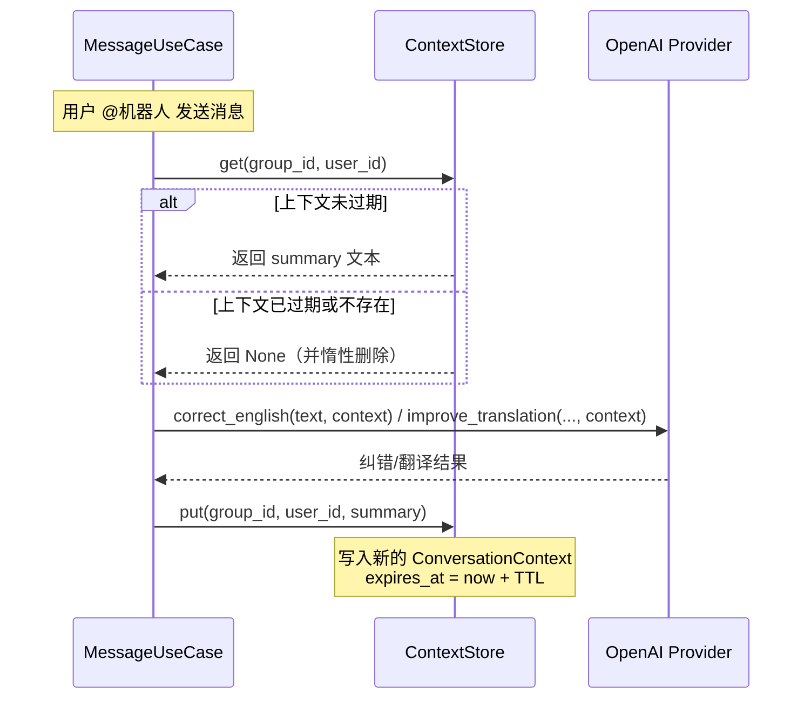

当用户在 QQ 群里 @机器人进行英语学习时，机器人的纠错和翻译质量高度依赖于**上下文信息**——如果机器人在纠正你第二句话时还记得你第一句话说了什么，就能给出更连贯、更精准的建议。`ContextStore` 就是这样一个轻量级的内存缓存组件，它为每个群聊中的每个用户维护一段最近对话摘要，并在配置的 TTL（Time-To-Live）过期后自动失效。整个实现不到 40 行代码，却为 LLM 的纠错和翻译 prompt 注入了关键的上下文信息。

Sources: [context_store.py](src/infrastructure/cache/context_store.py#L1-L37), [message_usecases.py](src/application/message_usecases.py#L45-L96)

## 核心数据结构

ContextStore 的设计极其精简，只包含两个核心类：

| 类名 | 用途 | 关键字段 |
|------|------|----------|
| `ConversationContext` | 单条上下文记录的数据容器 | `summary`（对话摘要文本）、`expires_at`（过期时间戳） |
| `ContextStore` | 上下文存储管理器 | `_store`（字典存储）、`_ttl_minutes`（过期分钟数） |

`ConversationContext` 是一个使用 `@dataclass(slots=True)` 修饰的轻量数据类，`slots=True` 能减少内存开销并禁止动态属性添加——这对于一个可能频繁创建/销毁的缓存条目来说是合理的微优化。`ContextStore` 内部使用一个扁平的 `dict[str, ConversationContext]` 作为存储容器，通过复合键 `"{group_id}:{user_id}"` 来隔离不同群聊中不同用户的上下文。

Sources: [context_store.py](src/infrastructure/cache/context_store.py#L7-L19)

## 键的构建与隔离策略

```python
def _build_key(self, group_id: str, user_id: str) -> str:
    return f"{group_id}:{user_id}"
```

键的格式采用冒号分隔的二维复合键，**第一维是群 ID，第二维是用户 ID**。这意味着：

- 同一用户在不同群里拥有**独立的上下文**（不同群的学习话题可能完全不同）
- 同一群里不同用户之间**互不干扰**
- 上下文的生命周期完全由 TTL 控制，不依赖群或用户的数据库 ID，而是直接使用 QQ 原始标识符

这种设计避免了数据库查询的开销，但也意味着**机器人重启后所有上下文会丢失**——对于一个辅助性的对话缓存来说，这是完全可接受的权衡。

Sources: [context_store.py](src/infrastructure/cache/context_store.py#L18-L19)

## 读写流程与惰性过期

以下是 ContextStore 在一次消息处理中的完整生命周期：



**`get()` 方法**实现了**惰性过期**（lazy expiration）策略：当读取时发现条目已过期，立即从字典中移除并返回 `None`。这意味着不需要一个后台线程来定期清理过期条目——清理动作自然地融入了每次读取操作中。

Sources: [context_store.py](src/infrastructure/cache/context_store.py#L21-L28), [message_usecases.py](src/application/message_usecases.py#L57-L94)

**`put()` 方法**则简单地创建一个新的 `ConversationContext`，将 `expires_at` 设为当前时间加上 TTL 分钟数，然后写入字典覆盖旧值。

Sources: [context_store.py](src/infrastructure/cache/context_store.py#L30-L35)

## 上下文内容的构造

存入缓存的 `summary` 并非原始消息文本，而是由 `MessageUseCase` 在每次处理完消息后精心构造的**结构化摘要**：

```python
summary=f"最近一句：{ctx.message_text}\n最近回复：{reply[:120]}",
```

这条摘要包含两部分信息：**用户发送的原始消息**和**机器人的回复（截取前 120 字符）**。截取回复长度是为了避免上下文无限膨胀——对于 LLM 来说，120 个字符已经足够理解上一轮对话的核心内容。

Sources: [message_usecases.py](src/application/message_usecases.py#L91-L95)

## 上下文如何被 LLM 消费

缓存中的上下文会传入 OpenAI 兼容大模型 Provider 的两个关键方法，直接影响 LLM 的输出质量：

| LLM 方法 | 上下文用途 | Prompt 中的表现 |
|----------|-----------|----------------|
| `correct_english(text, context)` | 纠错英文时参考上一轮对话 | `"上下文：{context or '无'}\n待纠错英文：{text}"` |
| `improve_translation(..., context)` | 优化翻译时参考上一轮对话 | `"上下文：{context or '无'}"` |

当 `context` 为 `None`（即首次对话或缓存已过期）时，Prompt 中会显示"无"，LLM 在无上下文的情况下独立处理当前消息。

Sources: [llm_openai.py](src/infrastructure/providers/llm_openai.py#L20-L52), [llm_openai.py](src/infrastructure/providers/llm_openai.py#L78-L96)

## 配置与依赖注入

`ContextStore` 的 TTL 通过静态配置文件控制，不区分群组或用户，全局统一：

```yaml
# config.yaml
bot:
  context_ttl_minutes: 15  # 默认 15 分钟
```

在 [手动依赖注入容器（ServiceContainer）](14-shou-dong-yi-lai-zhu-ru-rong-qi-servicecontainer) 中，`ContextStore` 作为**单例**被创建并注入到 `MessageUseCase`：

```python
# ServiceContainer 构建过程中
context_store = ContextStore(ttl_minutes=settings.static.bot.context_ttl_minutes)
# 注入到 MessageUseCase
message_usecase = MessageUseCase(..., context_store=context_store, ...)
```

由于 `ContextStore` 是纯内存字典实现、无 I/O 依赖，它被直接持有在 `ServiceContainer` 中，不需要异步初始化或连接池管理。整个应用生命周期中只有一个 `ContextStore` 实例，所有群聊共享同一个字典存储。

Sources: [models.py](src/infrastructure/settings/models.py#L38-L42), [container.py](src/infrastructure/settings/container.py#L87-L108), [config.yaml](config.yaml#L1-L7)

## 设计权衡与局限性

| 特性 | 当前实现 | 说明 |
|------|---------|------|
| 存储介质 | 纯内存字典 | 重启即丢失，适合辅助性缓存 |
| 过期策略 | TTL + 惰性删除 | 无后台清理，已过期但未被访问的条目会暂留内存 |
| 容量控制 | **无上限** | 字典会持续增长，极端情况下可能有内存压力 |
| 多实例 | 不共享 | 如果部署多个机器人实例，上下文不会跨实例同步 |
| 并发安全 | 依赖 GIL | CPython 的 GIL 保证了字典操作的基本线程安全 |

值得注意的是，虽然标题中包含"LRU"（Least Recently Used），但当前实现**并非严格意义上的 LRU 缓存**——它没有容量上限，也没有基于访问频率的淘汰策略，仅依靠 TTL 过期来控制数据生命周期。对于当前规模（QQ 群数量有限、用户数可控）来说，这是一个务实的简化设计。

Sources: [context_store.py](src/infrastructure/cache/context_store.py#L13-L36)

## 扩展阅读

- 了解上下文缓存的使用场景：[@机器人 消息处理流程：语言检测、翻译与纠错](6-atji-qi-ren-xiao-xi-chu-li-liu-cheng-yu-yan-jian-ce-fan-yi-yu-jiu-cuo)
- 了解依赖注入的完整流程：[手动依赖注入容器（ServiceContainer）](14-shou-dong-yi-lai-zhu-ru-rong-qi-servicecontainer)
- 了解配置体系：[双层配置体系：运行时配置与静态配置](13-shuang-ceng-pei-zhi-ti-xi-yun-xing-shi-pei-zhi-yu-jing-tai-pei-zhi)