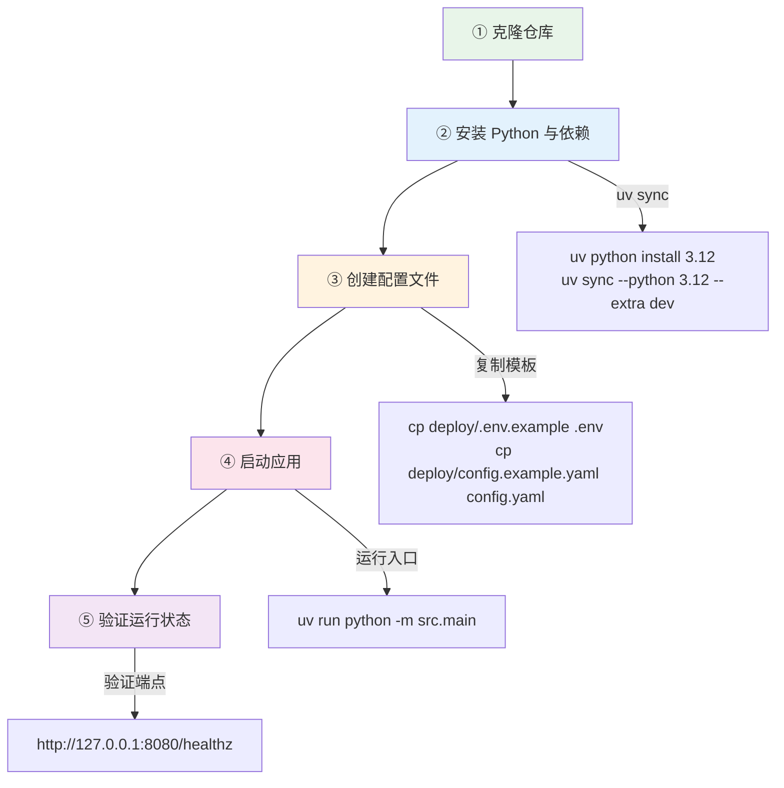

本文是一份面向初学者的**本地开发环境搭建指南**，将引导你从零开始完成 QQ 英语学习机器人的本地运行环境配置。内容涵盖前置依赖安装、配置文件编写、应用启动与验证，以及测试运行。如果你对项目整体定位还不了解，建议先阅读 [项目概览：QQ 英语学习机器人](1-xiang-mu-gai-lan-qq-ying-yu-xue-xi-ji-qi-ren)。

## 环境要求与前置准备

项目使用 **Python 3.12** 和 **uv** 包管理器（一个极速的 Python 包管理工具，替代 pip + venv）。数据库使用本地 SQLite 文件，无需额外安装数据库服务。以下是完整的前置依赖清单：

| 依赖项 | 最低版本 | 用途 | 安装方式 |
|--------|---------|------|---------|
| Python | 3.12（严格 <3.13） | 运行时语言 | `uv python install 3.12` 或系统包管理器 |
| uv | 最新版 | 包管理与虚拟环境 | `curl -LsSf https://astral.sh/uv/install.sh \| sh` |
| Git | 任意 | 克隆代码仓库 | 系统包管理器 |

项目在 [pyproject.toml](pyproject.toml#L6) 中通过 `requires-python = ">=3.12,<3.13"` 锁定了 Python 版本范围，请务必使用 3.12.x。

Sources: [pyproject.toml](pyproject.toml#L1-L34)

## 搭建流程总览

从克隆仓库到成功运行，整个流程可以分为五个阶段。下面的流程图展示了完整的操作路径：



接下来，我们将逐步展开每个阶段的具体操作。

## 第一步：克隆仓库与安装依赖

克隆项目到本地后，使用 uv 安装 Python 3.12 并同步项目依赖：

```bash
# 克隆仓库
git clone <your-repo-url> englishBot
cd englishBot

# 安装 Python 3.12（如果本地没有的话）
uv python install 3.12

# 同步依赖（--extra dev 会额外安装 pytest 等开发工具）
uv sync --python 3.12 --extra dev
```

`uv sync` 命令会自动完成以下工作：根据 [pyproject.toml](pyproject.toml#L7-L28) 中的 `dependencies` 列表创建虚拟环境（`.venv/`）并安装所有依赖包，包括 NoneBot2 框架、SQLAlchemy 异步数据库驱动、FastAPI、腾讯云 SDK、OpenAI 兼容客户端等 18 个核心依赖。

Sources: [pyproject.toml](pyproject.toml#L7-L34), [AGENTS.md](AGENTS.md#L6-L9)

## 第二步：创建配置文件

项目采用**双层配置体系**：运行时配置（`.env` 文件）和静态配置（`config.yaml` 文件）。首次搭建时，最简单的方式是从模板复制：

```bash
# 从 deploy 目录复制模板到项目根目录
cp deploy/.env.example .env
cp deploy/config.example.yaml config.yaml
```

这两个文件已被加入 [.gitignore](.gitignore#L12-L14)，不会被提交到版本控制中。

Sources: [README.md](README.md#L39-L44), [.gitignore](.gitignore#L12-L14)

### 运行时配置（.env）

`.env` 文件通过 pydantic-settings 自动加载（[models.py](src/infrastructure/settings/models.py#L11-L14)），包含密钥、端口、数据库连接等敏感或环境相关的参数。下表列出了所有可配置项及其默认值：

| 环境变量 | 默认值 | 必填 | 说明 |
|---------|--------|------|------|
| `APP_NAME` | `English Learning QQ Bot` | 否 | 应用名称 |
| `ENV` | `development` | 否 | 运行环境标识 |
| `HOST` | `0.0.0.0` | 否 | 监听地址 |
| `PORT` | `8080` | 否 | 监听端口 |
| `SECRET_KEY` | `replace-me` | **是** | 会话加密密钥，**生产环境务必更换为随机长字符串** |
| `ACCESS_TOKEN` | 空 | **是** | OneBot 协议的 access_token，用于 NapCat 对接 |
| `DATABASE_URL` | `sqlite+aiosqlite:///./data/english_bot.sqlite3` | 否 | SQLite 数据库路径 |
| `CONFIG_PATH` | `./config.yaml` | 否 | 静态配置文件路径 |
| `ADMIN_USERNAME` | `admin` | 否 | 管理后台登录用户名 |
| `ADMIN_PASSWORD` | `admin123` | 否 | 管理后台登录密码 |
| `TENCENT_TRANSLATE_SECRET_ID` | 空 | 否 | 腾讯云翻译 API SecretId |
| `TENCENT_TRANSLATE_SECRET_KEY` | 空 | 否 | 腾讯云翻译 API SecretKey |
| `TENCENT_TRANSLATE_REGION` | `ap-beijing` | 否 | 腾讯云区域 |
| `LLM_API_KEY` | 空 | 否 | OpenAI 兼容大模型 API Key |
| `LLM_BASE_URL` | `https://api.openai.com/v1` | 否 | LLM API 地址 |
| `LLM_MODEL` | `gpt-4o-mini` | 否 | LLM 模型名称 |

**关键说明**：`TENCENT_TRANSLATE_SECRET_ID`/`SECRET_KEY` 和 `LLM_API_KEY` 在本地开发时可以为空。项目遵循**降级优先**原则——当 API 密钥未配置时，Provider 会返回 mock 结果而不是报错崩溃，机器人仍然可以启动并响应基本命令。

Sources: [deploy/.env.example](deploy/.env.example#L1-L21), [src/infrastructure/settings/models.py](src/infrastructure/settings/models.py#L10-L36)

### 静态配置（config.yaml）

`config.yaml` 文件控制机器人的业务行为参数，如群号、定时任务 cron 表达式、学习参数等。它通过 YAML 格式加载并使用 pydantic BaseModel 校验（[loader.py](src/infrastructure/settings/loader.py#L21-L23)）。下表列出了顶层配置块及其用途：

| 配置块 | 说明 | 关键字段 |
|--------|------|---------|
| `bot` | 机器人基础行为 | `enabled_group_ids`（启用群号）、`admin_group_ids`（管理群号）、`context_ttl_minutes`（上下文缓存 TTL） |
| `scheduler` | 定时任务 cron | `daily_push_cron`、`weekly_report_cron`、`nightly_backup_cron` 等 |
| `content` | 学习内容来源 | `default_source`（默认 ted）、`ted_rss_urls`、`fallback_lesson_word_count` |
| `learning` | 学习系统参数 | `beginner_threshold`（新手阈值）、`weekly_quiz_question_count`（周测题数）等 |
| `admin` | 管理后台 UI | `title`、`enable_http_login_warning` |
| `message` | 消息渲染策略 | `render_mode`（hybrid/text）、`public_base_url`、`card_fallback_to_text` |

首次开发时，你需要将 `bot.enabled_group_ids` 和 `bot.admin_group_ids` 修改为你自己的 QQ 群号（字符串格式）。其余参数使用默认值即可正常运行。

Sources: [deploy/config.example.yaml](deploy/config.example.yaml#L1-L43), [src/infrastructure/settings/models.py](src/infrastructure/settings/models.py#L38-L94)

## 第三步：启动应用

配置完成后，通过一条命令即可启动应用：

```bash
uv run python -m src.main
```

启动时应用会自动完成以下初始化流程（定义在 [main.py](src/main.py#L50-L55) 和 [container.py](src/infrastructure/settings/container.py#L61-L66)）：

1. **加载配置**：读取 `.env` 和 `config.yaml`，合并为 `EffectiveSettings`
2. **初始化 NoneBot2**：注册 FastAPI driver 和 OneBot v11 适配器
3. **创建数据库**：自动创建 `data/` 目录并通过 SQLAlchemy `create_all` 建表
4. **构建服务容器**：实例化所有 Provider、Repository、UseCase 并注入依赖
5. **引导管理员账号**：根据 `.env` 中的用户名和密码创建管理员
6. **注册定时任务**：加载 APScheduler 的 cron 任务
7. **启动 HTTP 服务**：在配置的 `HOST:PORT` 上监听

数据库文件会自动创建在 `data/english_bot.sqlite3`，无需手动执行建表或迁移脚本。

Sources: [src/main.py](src/main.py#L1-L63), [src/infrastructure/settings/container.py](src/infrastructure/settings/container.py#L61-L66)

## 第四步：验证运行状态

启动成功后，可以通过以下端点验证服务是否正常运行：

| 端点 | 用途 | 预期响应 |
|------|------|---------|
| `http://127.0.0.1:8080/healthz` | 健康检查 | HTTP 200 |
| `http://127.0.0.1:8080/admin/login` | 管理后台登录页 | HTML 登录表单 |
| `http://127.0.0.1:8080/admin/debug` | 联调调试页 | 可直接测试翻译/纠错功能 |
| `http://127.0.0.1:8080/admin/cards` | 卡片预览页 | 生成任务/周测/周报的本地签名链接 |

用浏览器打开 `http://127.0.0.1:8080/admin/login`，使用 `.env` 中配置的 `ADMIN_USERNAME` 和 `ADMIN_PASSWORD` 登录，即可进入管理后台。在 **联调调试页**（`/admin/debug`）中可以直接输入文本测试翻译和纠错功能，无需连接 QQ。

Sources: [README.md](README.md#L55-L60)

## 运行测试

项目使用 **pytest + pytest-asyncio** 进行测试，已在 [pyproject.toml](pyproject.toml#L46-L48) 中配置了 `asyncio_mode = "auto"`，所有异步测试函数会自动被识别为协程。

```bash
# 运行全部测试
uv run pytest

# 运行单个测试文件
uv run pytest tests/test_learning_repository.py

# 运行单个测试函数
uv run pytest tests/test_learning_repository.py::test_function_name

# 显示详细输出
uv run pytest -v
```

当前测试套件覆盖了学习仓储、等级系统、复习调度、命令目录、消息投递、Provider Mock、错误聚合和卡片链接签名等核心模块。

Sources: [AGENTS.md](AGENTS.md#L14-L23), [pyproject.toml](pyproject.toml#L46-L48)

## 常见问题排查

| 问题现象 | 可能原因 | 解决方法 |
|---------|---------|---------|
| 启动报 `ModuleNotFoundError: No module named 'src'` | 未在项目根目录执行命令 | `cd` 到项目根目录后重新运行 |
| 启动报 `RuntimeError: FastAPI driver is required` | NoneBot2 driver 配置错误 | 确保 [main.py](src/main.py#L29) 中 `driver="~fastapi"` 未被修改 |
| 管理后台无法登录 | `.env` 中密码未修改或文件不存在 | 确认 `.env` 文件在根目录且 `ADMIN_PASSWORD` 已设置 |
| 翻译/纠错返回空结果 | API Key 未配置 | 这是正常的降级行为；配置 `TENCENT_TRANSLATE_SECRET_*` 或 `LLM_API_KEY` 后可恢复真实调用 |
| 数据库相关报错 | `data/` 目录权限问题 | 确保对项目目录有写权限，`data/` 目录会自动创建 |
| `uv sync` 失败 | uv 版本过旧 | 运行 `uv self update` 升级到最新版 |

Sources: [src/main.py](src/main.py#L36-L37), [src/infrastructure/settings/models.py](src/infrastructure/settings/models.py#L10-L36)

## 下一步

本地环境搭建完成后，你可以按以下路径继续探索：

- **连接 QQ 机器人**：参考 [Docker 部署与 NapCat 对接](3-docker-bu-shu-yu-napcat-dui-jie)，将本地应用与 NapCat 通过反向 WebSocket 连通，实现真实的群消息交互
- **了解管理后台**：参考 [管理后台与联调调试页](4-guan-li-hou-tai-yu-lian-diao-diao-shi-ye)，熟悉仪表盘、用户管理和运行时配置功能
- **深入架构设计**：参考 [整体架构：Clean Architecture 四层分层](5-zheng-ti-jia-gou-clean-architecture-si-ceng-fen-ceng)，理解项目的分层思想和依赖注入机制