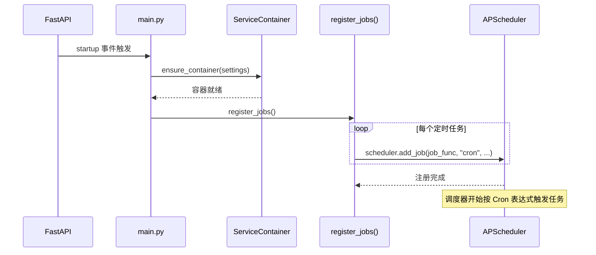
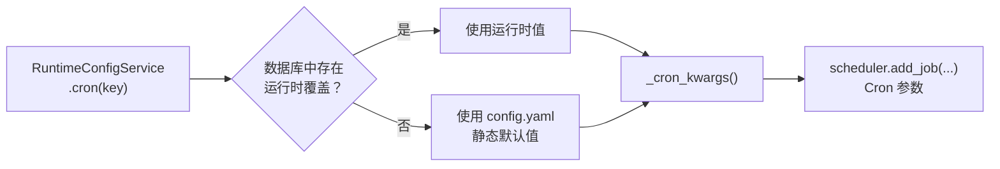

本页深入解析项目中基于 **nonebot-plugin-apscheduler** 的定时任务体系——从启动注册、Cron 表达式配置，到五个核心定时作业的执行逻辑与幂等保护机制。理解本页内容后，你将掌握为机器人新增或调整定时任务的完整方法。

## 整体架构：注册时机与调度集成

项目通过 [nonebot-plugin-apscheduler](https://github.com/nonebot/plugin-apscheduler)（`>=0.5.0`）将 APScheduler 嵌入 NoneBot2 生命周期。调度器的初始化不依赖任何显式配置——插件内部自动创建 `AsyncIOScheduler` 实例并以全局单例形式暴露 `scheduler` 对象。定时任务的注册发生在 FastAPI 的 `startup` 事件回调中：先通过 `ensure_container()` 完成依赖注入容器的异步初始化，再调用 `register_jobs()` 将五个定时作业一次性注册到调度器。



这种「延迟注册」策略确保了任务注册时所有数据库连接、Provider 实例和运行时配置都已准备就绪，避免了因依赖未初始化导致的运行时错误。

Sources: [main.py](src/main.py#L50-L55), [scheduler.py](src/plugins/scheduler.py#L16-L54), [pyproject.toml](pyproject.toml#L18)

## 五个定时任务一览

系统注册了五个职责各异的 Cron 定时任务，覆盖了内容推送、用户提醒、周报生成、周测发放和数据库备份等核心运维场景：

| 任务 ID | 函数名 | 默认 Cron 表达式 | 触发周期 | 业务用途 |
|---|---|---|---|---|
| `daily_push` | `daily_push_job` | `0 8 * * *` | 每天早上 8 点 | 为每个群生成今日学习任务并推送 |
| `daily_reminder` | `daily_reminder_job` | `0 20 * * *` | 每天晚上 8 点 | 提醒未完成当日任务的用户 |
| `weekly_report` | `weekly_report_job` | `0 9 * * 1` | 每周一早上 9 点 | 为每个注册用户生成并发送周报 |
| `weekly_quiz` | `weekly_quiz_job` | `0 19 * * 0` | 每周日晚上 7 点 | 为每个注册用户发放周测试题 |
| `nightly_backup` | `nightly_backup_job` | `0 2 * * *` | 每天凌晨 2 点 | 备份 SQLite 数据库文件 |

每个任务使用 `replace_existing=True` 参数注册，这意味着在应用热重启场景下不会产生重复任务——新的注册会覆盖旧的同 ID 任务。

Sources: [scheduler.py](src/plugins/scheduler.py#L16-L54), [models.py](src/infrastructure/settings/models.py#L45-L50), [config.yaml](config.yaml#L9-L14)

## Cron 表达式的双层配置机制

Cron 表达式遵循标准的 **五字段格式**（`分 时 日 月 周`），通过 `_cron_kwargs()` 工具函数将字符串拆解为 APScheduler 可识别的关键字参数：

```python
def _cron_kwargs(expression: str) -> dict[str, str]:
    minute, hour, day, month, day_of_week = expression.split()
    return {"minute": minute, "hour": hour, "day": day, "month": month, "day_of_week": day_of_week}
```

表达式的来源遵循项目的**双层配置体系**（详见 [双层配置体系：运行时配置与静态配置](13-shuang-ceng-pei-zhi-ti-xi-yun-xing-shi-pei-zhi-yu-jing-tai-pei-zhi)）：`RuntimeConfigService.cron(key)` 方法首先查询数据库中是否有运行时覆盖值，若没有则回退到 `config.yaml` 中的静态默认值。这意味着管理员可以通过管理后台在不重启服务的情况下动态调整任务的触发时间。



注册时通过 `get_container()` 获取已初始化的容器来读取 Cron 配置（同步调用），而任务执行时则通过 `await get_or_init_container()` 获取容器并刷新运行时配置（异步调用），两者形成了一个「注册时读取配置快照、执行时刷新最新配置」的协作模式。

Sources: [scheduler.py](src/plugins/scheduler.py#L185-L193), [runtime.py](src/infrastructure/settings/runtime.py#L58-L66), [models.py](src/infrastructure/settings/models.py#L45-L50)

## 任务执行统一范式

五个定时任务共享一套高度一致的执行范式，可以用以下伪代码模板概括：

```python
async def xxx_job() -> None:
    container = await get_or_init_container()       # ① 获取容器
    await container.runtime_config.refresh()         # ② 刷新运行时配置
    biz_key = datetime.now(UTC).strftime(...)        # ③ 生成业务幂等键
    if not await container.learning_repo.acquire_job_lock(
        job_name="xxx", biz_key=biz_key
    ):                                              # ④ 获取分布式锁
        return
    try:
        # ⑤ 执行核心业务逻辑
        ...
        await container.learning_repo.finish_job_lock(
            job_name="xxx", biz_key=biz_key, status="success"
        )                                           # ⑥ 标记成功
    except Exception:
        logger.exception("xxx job failed")
        await container.learning_repo.finish_job_lock(
            job_name="xxx", biz_key=biz_key, status="failed"
        )                                           # ⑦ 标记失败
```

这个范式的关键设计决策：

- **幂等键（biz_key）按业务粒度生成**：日任务使用 `%Y-%m-%d` 日期格式，周任务使用 `%G-W%V` ISO 周格式。同一天/同一周内，即使任务被多次触发也只会执行一次。
- **运行时配置刷新**：每次任务执行前都调用 `refresh()` 从数据库重新加载最新配置，确保运行时的 Cron 调整、群列表变更等能即时生效。
- **异常隔离**：所有异常被捕获并记录日志，不会向上传播到 APScheduler 导致调度器崩溃；同时将任务状态标记为 `failed`，便于运维排查。

Sources: [scheduler.py](src/plugins/scheduler.py#L57-L182)

## 各任务核心逻辑详解

### daily_push_job —— 每日学习任务推送

这是系统的核心推送任务。执行时遍历所有启用群（`enabled_group_ids()`），为每个群依次完成两步操作：首先通过 `LearningUseCase.build_today_lesson()` 构建当天的学习内容（从 TED RSS 抓取或使用内置短文回退），然后通过 `get_today_task_message()` 生成推送文本并发送到群聊。消息以纯文本 `MessageEnvelope` 形式投递。

Sources: [scheduler.py](src/plugins/scheduler.py#L57-L77)

### daily_reminder_job —— 每日完成提醒

一个轻量级的提醒任务。在执行前额外检查 `daily_reminder_enabled()` 开关——只有当运行时配置中启用了提醒功能时才发送固定文案。提醒内容为静态文本，不涉及数据库查询或业务计算。

Sources: [scheduler.py](src/plugins/scheduler.py#L80-L100)

### weekly_report_job —— 每周学习报告

遍历所有启用群中的已注册用户，通过 `ReportUseCase.build_weekly_report_envelope()` 为每位用户生成个性化周报信封。周报消息通过 `_send_group_envelope()` 发送到群聊，并使用 `mention_qq` 参数 @对应用户，确保用户能注意到自己的周报。

Sources: [scheduler.py](src/plugins/scheduler.py#L103-L130)

### weekly_quiz_job —— 每周测试发放

逻辑结构与周报任务相似，遍历所有群的所有注册用户，通过 `QuizUseCase.start_weekly_quiz_envelope()` 为每位用户启动周测并返回测试信封。同样通过 @用户的方式在群聊中定向推送。

Sources: [scheduler.py](src/plugins/scheduler.py#L133-L160)

### nightly_backup_job —— 每夜数据库备份

唯一一个不涉及消息推送的基础设施任务。仅当数据库 URL 的 `drivername` 以 `sqlite` 开头时才执行——将 SQLite 数据库文件复制到 `{data_dir}/backups/` 目录，文件名附带日期后缀（如 `english_bot-2025-01-15.sqlite3`）。对于非 SQLite 数据库（如部署时使用的 PostgreSQL），此任务静默跳过。

Sources: [scheduler.py](src/plugins/scheduler.py#L163-L182)

## 消息投递与异常容错

所有需要发送群消息的任务都统一通过 `_send_group_envelope()` 辅助函数完成投递。该函数接收 `MessageDeliveryService`、Bot 实例列表、群 ID 和 `MessageEnvelope` 信封，内部调用 `container.message_delivery_service.send_group_envelope()` 进行实际的消息渲染与发送（详见 [消息渲染与投递：纯文本与 NapCat 卡片](8-xiao-xi-xuan-ran-yu-tou-di-chun-wen-ben-yu-napcat-qia-pian)）。

值得注意的是异常容错的**双层设计**：外层 try/except 捕获任务级别的异常并更新 `JobRun` 状态为 `failed`；内层的 `_send_group_envelope()` 也包含独立的 try/except，即使某个群的消息发送失败也不会中断对其他群的处理。这意味着在多群部署场景下，单个群的消息投递失败不会产生级联效应。

Sources: [scheduler.py](src/plugins/scheduler.py#L196-L206)

## 幂等保护与 JobRun 模型

每个任务的幂等保护基于 `JobRun` 数据库模型实现（详见 [分布式任务锁与幂等保护](21-fen-bu-shi-ren-wu-suo-yu-mi-deng-bao-hu)）。`acquire_job_lock()` 方法查询 `(job_name, biz_key)` 组合的唯一约束：若已存在状态为 `running` 或 `success` 的记录则返回 `False` 跳过执行；否则创建新记录或重置已有 `failed` 记录为 `running`。`finish_job_lock()` 负责将记录状态更新为 `success` 或 `failed` 并写入完成时间。

这种基于数据库的幂等方案使得即使在多实例部署场景下（多个 Bot 进程共享同一数据库），同一个任务也不会被重复执行。

Sources: [learning.py](src/infrastructure/db/repositories/learning.py#L565-L591), [models.py](src/infrastructure/db/models.py#L249-L258)

## 如何新增一个定时任务

基于上述范式，新增定时任务只需三步：

1. **在 `config.yaml` 和 `SchedulerSettings` 中添加新的 Cron 字段**，如 `my_new_task_cron: "0 10 * * *"`。
2. **在 `RuntimeConfigService.cron()` 的 defaults 字典中注册该字段**，使其支持运行时覆盖。
3. **在 `scheduler.py` 中编写任务函数并注册**：遵循统一范式（获取容器 → 刷新配置 → 获取锁 → 执行 → 释放锁），并在 `register_jobs()` 中添加 `scheduler.add_job()` 调用。

Sources: [scheduler.py](src/plugins/scheduler.py#L16-L54), [runtime.py](src/infrastructure/settings/runtime.py#L58-L66), [models.py](src/infrastructure/settings/models.py#L45-L50)

## 延伸阅读

- [分布式任务锁与幂等保护](21-fen-bu-shi-ren-wu-suo-yu-mi-deng-bao-hu)——深入了解 `JobRun` 模型与 `acquire_job_lock` 的并发安全设计
- [双层配置体系：运行时配置与静态配置](13-shuang-ceng-pei-zhi-ti-xi-yun-xing-shi-pei-zhi-yu-jing-tai-pei-zhi)——理解 Cron 表达式的动态覆盖机制
- [手动依赖注入容器（ServiceContainer）](14-shou-dong-yi-lai-zhu-ru-rong-qi-servicecontainer)——了解 `get_or_init_container()` 的容器初始化策略