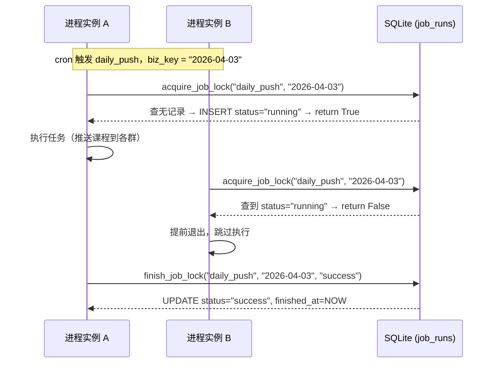

本页深入解析 englishBot 项目中定时任务的**互斥执行**与**幂等保护**机制。系统基于数据库唯一约束实现了一套轻量级的任务锁方案，确保即使 APScheduler 在异常重启或时钟漂移场景下触发重复调度，每个任务实例也仅执行一次，不会产生重复推送、重复周报或重复备份等副作用。方案无需引入 Redis 等外部中间件，完全依赖已有的 SQLite/SQLAlchemy 基础设施，在单实例部署模型下兼顾了简洁性与可靠性。

Sources: [scheduler.py](src/plugins/scheduler.py#L1-L55), [models.py](src/infrastructure/db/models.py#L249-L259)

## 问题背景：为什么需要任务锁

在 [APScheduler 定时任务注册与执行](20-apscheduler-ding-shi-ren-wu-zhu-ce-yu-zhi-xing) 一文中我们看到，系统注册了五个 cron 任务：每日推送、每日提醒、周报生成、周测验和夜间备份。这些任务都涉及**不可逆的外部副作用**——向 QQ 群发消息、生成周报、创建数据库备份。如果同一个任务在同一业务周期内被执行两次，后果包括：

- **重复消息骚扰**：同一篇每日课程被推送两次，用户收到重复的提醒消息
- **数据覆盖风险**：周报重复生成可能覆盖已有报告，或产生重复的 `WeeklyReport` 记录导致唯一约束报错
- **备份文件冗余**：同一日期的备份文件被反复写入

APScheduler 本身的 `replace_existing=True` 参数仅保证同一调度器实例内不会注册重复 Job，但无法防护以下场景：进程崩溃后重启、Docker 容器健康检查失败触发重启、或手动运维时短暂运行多个实例。这些场景都可能导致同一个 cron 时间窗口内，两个进程实例同时尝试执行同一个 Job。

Sources: [scheduler.py](src/plugins/scheduler.py#L16-L54), [docker-compose.yml](deploy/docker-compose.yml#L7-L9)

## 架构总览：数据库乐观锁模型

本项目的任务锁方案可以概括为**基于数据库唯一约束的幂等门控模式**（Database Unique-Constraint Based Idempotent Gate）。其核心思想是：每个任务的每次执行都由一个二元组 `(job_name, biz_key)` 唯一标识，其中 `job_name` 是任务名称，`biz_key` 是业务周期标识（如日期或周号）。数据库通过唯一约束保证同一二元组只能对应一条 `JobRun` 记录，从而在数据库层面实现互斥。



整个锁的生命周期由两个方法控制：`acquire_job_lock` 负责获取锁（互斥判定），`finish_job_lock` 负责释放锁并记录结果。二者均定义在 [LearningRepository](src/infrastructure/db/repositories/learning.py) 中，通过 SQLAlchemy 的异步会话执行。

Sources: [learning.py](src/infrastructure/db/repositories/learning.py#L565-L591)

## 数据模型：JobRun 表设计

`JobRun` 模型是整个锁机制的数据载体，其表结构如下：

| 字段 | 类型 | 说明 |
|---|---|---|
| `id` | `Integer` PK | 自增主键 |
| `job_name` | `String(64)` | 任务名称，如 `daily_push`、`weekly_report` |
| `biz_key` | `String(64)` | 业务周期标识，如 `2026-04-03` 或 `2026-W14` |
| `status` | `String(32)` | 任务状态：`running` / `success` / `failed` |
| `started_at` | `DateTime(tz)` | 任务开始时间 |
| `finished_at` | `DateTime(tz)` | 任务完成时间（可为空） |
| `created_at` | `DateTime(tz)` | 记录创建时间（继承自 `TimestampMixin`） |
| `updated_at` | `DateTime(tz)` | 记录更新时间（继承自 `TimestampMixin`） |

**关键约束**：`UniqueConstraint("job_name", "biz_key", name="uq_job_runs_job_key")` 确保 `(job_name, biz_key)` 二元组的全局唯一性。这是整个互斥机制的基石——数据库引擎保证了不可能存在两条相同组合的记录。

`status` 字段承担了双重语义：既是锁的状态标识，也是任务执行的审计日志。三态转换模型如下：

```
         acquire_job_lock()           finish_job_lock()
  (无记录) ──────────────► running ──────────────────► success
                              │                           ▲
                              │  finish_job_lock()        │
                              └──────────────► failed ────┘
                                                  │
                              acquire_job_lock()  │ (允许重试)
                              ◄───────────────────┘
```

Sources: [models.py](src/infrastructure/db/models.py#L249-L259), [base.py](src/infrastructure/db/base.py#L22-L33)

## 锁获取逻辑：acquire_job_lock

`acquire_job_lock` 方法实现了**查询-判断-写入**三步原子操作：

1. **查询**：以 `(job_name, biz_key)` 为条件查找 `JobRun` 记录
2. **互斥判定**：若记录存在且 `status` 为 `running` 或 `success`，立即返回 `False`——前者表示另一进程正在执行，后者表示当前业务周期已成功完成
3. **获取锁**：若记录不存在，创建新记录并设 `status="running"`；若记录存在但状态为 `failed`，则重置为 `running"` 并清空 `finished_at`，允许失败任务重试

这种设计精妙地同时实现了**互斥**（`running` 状态阻止并发）和**幂等**（`success` 状态阻止重复执行）两个目标，而**失败可重试**的设计又保证了系统的自愈能力。

```python
async def acquire_job_lock(self, *, job_name: str, biz_key: str) -> bool:
    async with self._session_factory() as session:
        row = await session.scalar(
            select(JobRun).where(JobRun.job_name == job_name, JobRun.biz_key == biz_key)
        )
        if row is not None and row.status in {"running", "success"}:
            return False  # 已在运行或已成功，跳过
        if row is None:
            row = JobRun(job_name=job_name, biz_key=biz_key, status="running")
            session.add(row)
        else:
            row.status = "running"
            row.started_at = datetime.now(UTC)
            row.finished_at = None
        await session.commit()
        return True
```

值得注意的是，在高并发场景下此实现存在理论上的竞态窗口（两个进程同时通过查询阶段、均未发现记录、然后竞争 INSERT）。但在本项目的实际部署模型下（单实例 Docker 容器 + SQLite 的写串行化特性），这一风险极低。若未来演进为 PostgreSQL 多实例部署，可升级为 `INSERT ... ON CONFLICT DO NOTHING` 的纯原子操作。

Sources: [learning.py](src/infrastructure/db/repositories/learning.py#L565-L580)

## 锁释放逻辑：finish_job_lock

`finish_job_lock` 负责在任务执行完毕后更新 `JobRun` 记录的状态和时间戳：

```python
async def finish_job_lock(self, *, job_name: str, biz_key: str, status: str) -> None:
    async with self._session_factory() as session:
        row = await session.scalar(
            select(JobRun).where(JobRun.job_name == job_name, JobRun.biz_key == biz_key)
        )
        if row is None:
            return
        row.status = status
        row.finished_at = datetime.now(UTC)
        await session.commit()
```

方法接收 `status` 参数，调用方可传入 `"success"` 或 `"failed"`。无论任务成功还是异常，都**必须**调用 `finish_job_lock`，否则记录将永久停留在 `running` 状态，阻止后续重试。这正是下一节中 try/except 模式的关键设计动机。

Sources: [learning.py](src/infrastructure/db/repositories/learning.py#L582-L591)

## 任务编排模式：统一的 try/finally 结构

所有五个定时任务函数严格遵循同一套编排模板，以 `daily_push_job` 为例：

```python
async def daily_push_job() -> None:
    container = await get_or_init_container()         # ① 获取依赖容器
    await container.runtime_config.refresh()           # ② 刷新运行时配置
    biz_key = datetime.now(UTC).strftime("%Y-%m-%d")   # ③ 生成业务周期键
    if not await container.learning_repo.acquire_job_lock(
        job_name="daily_push", biz_key=biz_key
    ):                                                 # ④ 尝试获取锁
        return                                         #   失败则立即退出
    try:
        # ... 实际业务逻辑 ...
        await container.learning_repo.finish_job_lock(
            job_name="daily_push", biz_key=biz_key, status="success"
        )                                              # ⑤ 成功：标记完成
    except Exception:
        logger.exception("daily push job failed")
        await container.learning_repo.finish_job_lock(
            job_name="daily_push", biz_key=biz_key, status="failed"
        )                                              # ⑥ 失败：标记失败
```

这套模板的要点在于 `finish_job_lock` 的**双路保证**：正常路径在 try 块末尾调用，异常路径在 except 块中调用。这确保了无论任务以何种方式终止，锁记录都会被正确更新，不会出现 `running` 状态的僵尸记录。

Sources: [scheduler.py](src/plugins/scheduler.py#L57-L78)

## 业务周期键策略

五个任务使用两类 `biz_key` 格式，对应不同的业务粒度：

| 任务 | `job_name` | `biz_key` 格式 | 示例值 | 粒度 |
|---|---|---|---|---|
| 每日课程推送 | `daily_push` | `%Y-%m-%d` | `2026-04-03` | 每日一次 |
| 每日提醒 | `daily_reminder` | `%Y-%m-%d` | `2026-04-03` | 每日一次 |
| 夜间备份 | `nightly_backup` | `%Y-%m-%d` | `2026-04-03` | 每日一次 |
| 周报生成 | `weekly_report` | `%G-W%V` | `2026-W14` | 每周一次 |
| 周测验 | `weekly_quiz` | `%G-W%V` | `2026-W14` | 每周一次 |

日任务使用 `datetime.now(UTC).strftime("%Y-%m-%d")`，周任务使用 `datetime.now(UTC).strftime("%G-W%V")`。`%G-W%V` 是 ISO 8601 周数格式，其中 `%G` 是 ISO 周所属年份（可能与日历年份不同），`%V` 是 ISO 周编号（01-53）。选择 UTC 而非本地时间作为基准，确保了即使部署在不同时区的服务器上，同一任务在同一业务周期内也使用相同的 `biz_key`。

Sources: [scheduler.py](src/plugins/scheduler.py#L60-L166)

## 幂等保护的效果分析

将上述机制组合起来，系统能够在以下场景中提供完整的幂等保护：

**场景一：正常单次执行**。cron 触发 → `acquire_job_lock` 查无记录，返回 True → 执行业务 → `finish_job_lock("success")` → 下次 cron 触发同一 biz_key 时，`acquire_job_lock` 发现 `status="success"` 返回 False，直接跳过。

**场景二：进程重启导致重复调度**。进程 A 在 cron 触发后开始执行，尚未完成时进程重启。进程 B 启动后 APScheduler 重新注册 Job，若仍在同一 cron 窗口，APScheduler 可能立即或稍后触发同一 Job。进程 B 的 `acquire_job_lock` 查到 `status="running"`，返回 False，跳过执行。此时进程 A 的旧记录停留在 `running` 状态——但如果进程 A 实际上已被杀死，该记录将成为僵尸。不过，由于 biz_key 是日期/周级别，到下一个业务周期时 `biz_key` 自然变化，不会阻塞后续执行。

**场景三：任务失败后自动重试**。任务执行过程中抛出异常 → except 块中 `finish_job_lock("failed")` → 若 cron 在同一周期内再次触发（或容器重启后重新注册），`acquire_job_lock` 查到 `status="failed"`，允许重试，将状态重置为 `running"`。

Sources: [scheduler.py](src/plugins/scheduler.py#L57-L182), [learning.py](src/infrastructure/db/repositories/learning.py#L565-L591)

## JobRun 的审计价值

除了互斥和幂等，`job_runs` 表还天然承担了**任务执行审计**的角色。每条记录完整保留了任务名称、业务周期、执行状态、开始时间和完成时间。在 [FastAPI 管理后台：仪表盘、用户管理与运行时配置](22-fastapi-guan-li-hou-tai-yi-biao-pan-yong-hu-guan-li-yu-yun-xing-shi-pei-zhi) 中，仪表盘的 `job_runs` 指标（通过 `get_dashboard_metrics` 聚合查询）便直接来源于此表，管理员可直观了解系统累计执行了多少次定时任务。

`get_dashboard_metrics` 方法中通过 `select(func.count()).select_from(JobRun)` 获取总任务执行数，作为系统健康度的参考指标之一。

Sources: [learning.py](src/infrastructure/db/repositories/learning.py#L593-L614)

## 设计权衡与局限性

当前方案在**单实例 SQLite 部署**模型下是最优选择，但存在已知的边界情况：

| 方面 | 当前表现 | 潜在风险 |
|---|---|---|
| 并发安全 | SQLite 写串行化 + 单进程，实际安全 | 多实例部署下存在竞态窗口 |
| 僵尸记录 | running 状态无超时自动清理 | 进程崩溃后需等到下一 biz_key 周期 |
| 锁粒度 | biz_key 为日期/周级别 | 同一天内同一任务无法手动重新执行 |
| 外部依赖 | 零（复用已有数据库） | 无——这恰恰是优势 |

若项目未来演进为多实例部署，有两个升级路径：一是将数据库迁移到 PostgreSQL 并使用 `INSERT ... ON CONFLICT` 实现真正的原子性 CAS 操作；二是引入 Redis 分布式锁（如 Redlock 算法），在内存层面完成互斥判定，减轻数据库压力。

Sources: [learning.py](src/infrastructure/db/repositories/learning.py#L565-L591), [docker-compose.yml](deploy/docker-compose.yml#L1-L48)

## 延伸阅读

- 了解任务锁所保护的五个定时任务的具体业务逻辑，请参阅 [APScheduler 定时任务注册与执行](20-apscheduler-ding-shi-ren-wu-zhu-ce-yu-zhi-xing)
- 了解 `LearningRepository` 的完整数据访问层设计，请参阅 [SQLite 数据库模型与 Repository 数据访问](17-sqlite-shu-ju-ku-mo-xing-yu-repository-shu-ju-fang-wen)
- 了解管理后台如何展示 `job_runs` 审计数据，请参阅 [FastAPI 管理后台：仪表盘、用户管理与运行时配置](22-fastapi-guan-li-hou-tai-yi-biao-pan-yong-hu-guan-li-yu-yun-xing-shi-pei-zhi)
- 了解依赖注入容器如何为定时任务提供所需的服务实例，请参阅 [手动依赖注入容器（ServiceContainer）](14-shou-dong-yi-lai-zhu-ru-rong-qi-servicecontainer)