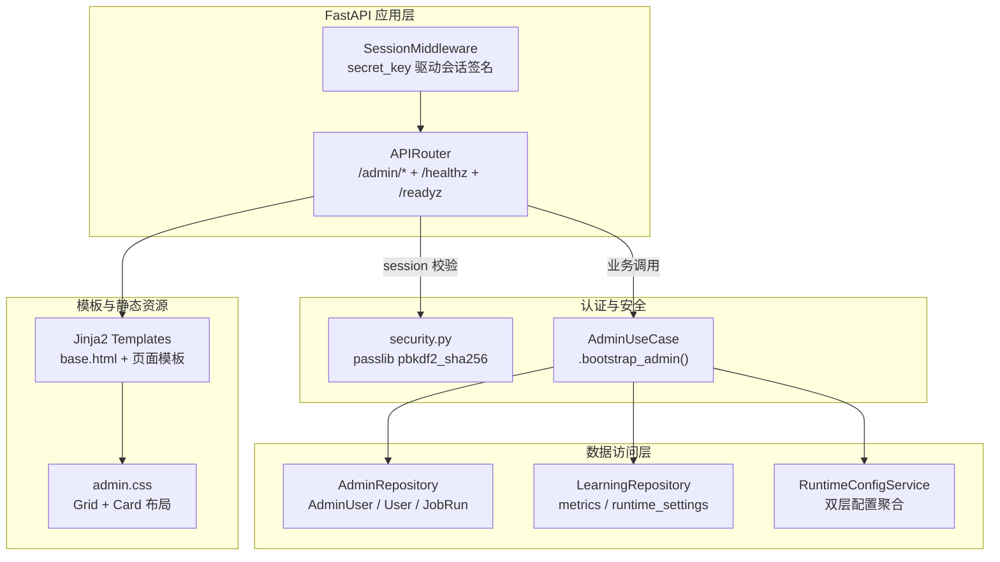

管理后台是 English Bot 中唯一的 Web 可视化操作面——它基于 FastAPI + Jinja2 模板引擎构建，以会话（Session）认证保护全部功能页面。页面覆盖四大运维场景：**仪表盘全局概览**、**用户列表查阅**、**运行时动态配置读写**，以及联调调试与卡片预览（后两者在 [管理后台与联调调试页](4-guan-li-hou-tai-yu-lian-diao-diao-shi-ye) 中有快速入门介绍）。本文聚焦前三个核心功能的架构设计与数据流。

Sources: [routes.py](src/admin/routes.py#L1-L19), [base.html](src/admin/templates/base.html#L1-L28)

## 整体架构：路由、模板与认证的三层协作

管理后台的技术栈并不复杂——FastAPI 的 `APIRouter` 承载路由，Jinja2 的 `TemplateResponse` 负责渲染，Starlette 的 `SessionMiddleware` 提供会话状态。但关键在于这三者如何通过 `ServiceContainer` 与领域层解耦。



上图揭示了管理后台的核心设计原则：**路由层只做认证校验和数据传递，所有业务逻辑下沉到 `AdminUseCase`**。每个路由函数的第一步都是 `_current_admin(request)` 守卫检查——如果会话中没有 `admin_username`，立即 303 重定向到登录页。这种"守卫-容器-用例-模板"四步模式贯穿所有管理页面。

Sources: [routes.py](src/admin/routes.py#L22-L29), [security.py](src/infrastructure/auth/security.py#L1-L15), [main.py](src/main.py#L40-L44)

## 会话认证与管理员引导

管理员账户并非手动创建，而是由 `AdminUseCase.bootstrap_admin()` 在容器初始化时自动保障。该方法从 `AppRuntimeSettings` 中读取 `admin_username` 和 `admin_password`（默认值分别为 `admin` / `admin123`，通过环境变量覆盖），使用 passlib 的 `pbkdf2_sha256` 方案哈希密码后写入 `admin_users` 表。如果该用户已存在则跳过——这是典型的幂等引导模式。

登录流程的认证链路为：表单提交 `username` + `password` → `AdminRepository.get_admin_user()` 查询数据库 → `verify_password()` 比对哈希 → 成功后写入 `request.session["admin_username"]`。登出则简单地调用 `request.session.clear()` 清空会话。值得注意的是，`SessionMiddleware` 的 `secret_key` 直接来自 `AppRuntimeSettings.secret_key`，在生产环境中必须通过环境变量设置为强随机值。

Sources: [routes.py](src/admin/routes.py#L72-L95), [admin_usecases.py](src/application/admin_usecases.py#L23-L27), [admin.py](src/infrastructure/db/repositories/admin.py#L14-L29), [models.py](src/infrastructure/settings/models.py#L10-L27)

## 仪表盘：八项指标与手动触发

仪表盘页面（`/admin`）是登录后的默认落地点，展示两类信息：**聚合指标卡片**和**最近任务执行记录**。

### 指标卡片

`get_dashboard_metrics()` 一次调用执行八条 `SELECT COUNT(...)` 聚合查询，覆盖系统全维度运行数据：

| 指标键 | 数据源表 | 业务含义 |
|--------|----------|----------|
| `message_events` | `message_events` | 累计处理的消息事件总数 |
| `active_users` | `message_events` (DISTINCT) | 发送过消息的去重用户数 |
| `enrolled_profiles` | `enrollments` | 群内注册的学习档案数 |
| `error_points` | `error_points` | 累计识别的语法/拼写错误点 |
| `review_items` | `review_items` | 间隔复习调度中的待复习项 |
| `task_submissions` | `task_submissions` | 每日任务提交记录数 |
| `quiz_sessions` | `quiz_sessions` | 周测会话总数 |
| `job_runs` | `job_runs` | 定时任务执行总次数 |

模板通过 `` 循环渲染为 CSS Grid 自适应卡片布局，每张卡片显示指标名和数值。

### 任务执行表

`AdminRepository.list_recent_jobs()` 查询 `job_runs` 表最近 20 条记录，按 `started_at` 降序排列。每条记录包含 `job_name`（如 `daily_push`）、`biz_key`（业务键，如日期 `2025-01-15` 或周标识 `2025-W03`）、`status`（`running` / `success` / `failed`）和 `started_at` 时间戳。

### 手动触发

仪表盘还提供三个手动触发按钮，对应 `POST /admin/triggers/{job_name}` 路由。该路由维护了一个 `job_map` 字典，将 URL 路径参数映射到 [APScheduler 定时任务注册与执行](20-apscheduler-ding-shi-ren-wu-zhu-ce-yu-zhi-xing) 中定义的具体 job 函数（`daily_push_job`、`weekly_report_job`、`weekly_quiz_job`）。触发后直接 `await job()` 执行，执行完毕重定向回仪表盘。

Sources: [routes.py](src/admin/routes.py#L98-L181), [dashboard.html](src/admin/templates/dashboard.html#L1-L59), [learning.py](src/infrastructure/db/repositories/learning.py#L593-L614), [admin.py](src/infrastructure/db/repositories/admin.py#L36-L39)

## 用户管理：全量列表与活跃追踪

用户列表页（`/admin/users`）调用 `AdminRepository.list_users()`，执行一条简单的 `SELECT * FROM users ORDER BY last_active_at DESC` 查询，返回所有注册用户。模板以表格形式展示四个字段：

| 列名 | 模型字段 | 来源说明 |
|------|----------|----------|
| QQ | `user.qq_user_id` | QQ 用户唯一标识 |
| 昵称 | `user.nickname` | 用户在群内的显示名 |
| 加入时间 | `user.joined_at` | 首次被 `ensure_user` 创建的时间 |
| 最近活跃 | `user.last_active_at` | 最近一次触发消息处理的时间 |

该页面当前为只读视图——不提供编辑、禁用或删除操作。用户记录由消息处理流程自动创建（通过 `IdentityRepository.ensure_user()`），`last_active_at` 也在每次消息处理时自动更新。按 `last_active_at` 降序排列确保最活跃的用户排在列表顶部，方便运维人员快速定位活跃群体。

Sources: [routes.py](src/admin/routes.py#L115-L125), [users.html](src/admin/templates/users.html#L1-L31), [admin.py](src/infrastructure/db/repositories/admin.py#L31-L34), [models.py](src/infrastructure/db/models.py#L11-L18)

## 运行时动态配置：双层配置的运行时写入

设置页（`/admin/settings`）是 [双层配置体系：运行时配置与静态配置](13-shuang-ceng-pei-zhi-ti-xi-yun-xing-shi-pei-zhi) 的 Web 管理入口。页面上展示三个区域：**配置写入表单**、**数据库中的动态配置列表**、**当前生效配置快照**。

### 写入流程

表单提交后，`settings_submit` 路由执行三步操作：

1. **`admin_usecase.update_setting(key, value)`** → 调用 `LearningRepository.upsert_runtime_setting()`，以 key 为唯一约束做 upsert（存在则更新 value 和 updated_at，不存在则插入新行）
2. **`runtime_config.refresh()`** → 重新从数据库加载全部 `runtime_settings` 行，覆盖 `RuntimeConfigService` 的内存缓存 `_cache`
3. **`register_jobs()`** → 重新注册所有 APScheduler 定时任务，使新的 cron 表达式立即生效

这个三步链确保了配置修改的"写入-缓存刷新-调度重载"原子性——虽然不是数据库事务级别的原子性，但在单实例部署场景下足够可靠。

### 生效配置快照

`RuntimeConfigService.effective_settings()` 方法返回一个包含 15 个键值对的字典，覆盖 `bot.*`、`learning.*`、`message.*`、`scheduler.*` 四大命名空间。每个值通过 `_get(key, default)` 方法获取：优先使用数据库缓存 `_cache` 中的运行时值，回退到 `StaticConfig`（`config.yaml`）中的默认值。

下表列出全部可动态配置的键及其所属命名空间：

| 命名空间 | 配置键 | 类型 | 默认值来源 |
|----------|--------|------|-----------|
| `bot` | `enabled_group_ids` | `list[str]` | `config.yaml` → `bot.enabled_group_ids` |
| `bot` | `admin_group_ids` | `list[str]` | `config.yaml` → `bot.admin_group_ids` |
| `bot` | `daily_reminder_enabled` | `bool` | `config.yaml` → `bot.daily_reminder_enabled` |
| `learning` | `daily_review_insert_count` | `int` | `config.yaml` → `learning.daily_review_insert_count` |
| `learning` | `weekly_quiz_question_count` | `int` | `config.yaml` → `learning.weekly_quiz_question_count` |
| `learning` | `weekly_quiz_review_ratio` | `float` | `config.yaml` → `learning.weekly_quiz_review_ratio` |
| `message` | `render_mode` | `str` | `config.yaml` → `message.render_mode` |
| `message` | `enable_task_cards` | `bool` | `config.yaml` → `message.enable_task_cards` |
| `message` | `public_base_url` | `str` | `config.yaml` → `message.public_base_url` |
| `message` | `link_expire_minutes` | `int` | `config.yaml` → `message.link_expire_minutes` |
| `message` | `card_fallback_to_text` | `bool` | `config.yaml` → `message.card_fallback_to_text` |
| `scheduler` | `daily_push_cron` | `str` | `config.yaml` → `scheduler.daily_push_cron` |
| `scheduler` | `daily_reminder_cron` | `str` | `config.yaml` → `scheduler.daily_reminder_cron` |
| `scheduler` | `weekly_report_cron` | `str` | `config.yaml` → `scheduler.weekly_report_cron` |
| `scheduler` | `weekly_quiz_cron` | `str` | `config.yaml` → `scheduler.weekly_quiz_cron` |
| `scheduler` | `nightly_backup_cron` | `str` | `config.yaml` → `scheduler.nightly_backup_cron` |

值得注意的是，`_parse_value()` 方法使用 `yaml.safe_load()` 解析用户输入的 value 字符串——这意味着输入 `true` 会被解析为布尔值，`[1, 2, 3]` 会被解析为列表，纯数字会被解析为整数。这为非技术运维人员提供了灵活但需要注意的配置方式。

Sources: [routes.py](src/admin/routes.py#L128-L155), [settings.html](src/admin/templates/settings.html#L1-L59), [admin_usecases.py](src/application/admin_usecases.py#L40-L48), [runtime.py](src/infrastructure/settings/runtime.py#L18-L98), [learning.py](src/infrastructure/db/repositories/learning.py#L616-L630)

## 健康检查与就绪探针

管理路由还承载两个基础设施级别的端点，供容器编排或负载均衡器使用：

- **`GET /healthz`** — 进程存活探针，无条件返回 `{"status": "ok"}`，用于判断 FastAPI 进程是否在运行
- **`GET /readyz`** — 就绪探针，尝试调用 `ensure_container()` 初始化整个依赖注入容器（包括数据库连接、Provider 初始化等）。如果容器构建失败则返回 503 状态码和异常类名，成功则返回 `{"status": "ready"}`

这两个端点不需要管理员登录，是面向基础设施而非人的接口。

Sources: [routes.py](src/admin/routes.py#L55-L69)

## 数据模型：AdminUser、RuntimeSetting 与 JobRun

管理后台涉及三个专属数据库模型，均定义在 `src/infrastructure/db/models.py` 中：

| 模型 | 表名 | 核心字段 | 唯一约束 |
|------|------|----------|----------|
| `AdminUser` | `admin_users` | `username`, `password_hash`, `status` | `username` |
| `RuntimeSetting` | `runtime_settings` | `key`, `value`, `updated_at` | `key` |
| `JobRun` | `job_runs` | `job_name`, `biz_key`, `status`, `started_at`, `finished_at` | `(job_name, biz_key)` |

`AdminUser` 和 `JobRun` 继承了 `TimestampMixin`，自动拥有 `created_at` 和 `updated_at` 字段。`RuntimeSetting` 则手动管理 `updated_at`，在每次 upsert 时显式设置为当前 UTC 时间。`JobRun` 的 `(job_name, biz_key)` 联合唯一约束正是 [分布式任务锁与幂等保护](21-fen-bu-shi-ren-wu-suo-yu-mi-deng-bao-hu) 机制的数据基础。

Sources: [models.py](src/infrastructure/db/models.py#L231-L259), [base.py](src/infrastructure/db/base.py#L22-L33)

## 前端布局与导航结构

`base.html` 定义了所有管理页面的外壳布局：左侧 240px 固定宽度深色侧边栏（`#152238`）+ 右侧自适应主内容区。侧边栏包含六个导航链接，对应管理后台的全部功能入口：

```
仪表盘 → /admin
用户   → /admin/users
动态配置 → /admin/settings
联调调试 → /admin/debug
卡片预览 → /admin/cards
退出   → /admin/logout
```

`login.html` 是唯一不继承 `base.html` 的模板——它使用独立的居中卡片布局（`.login-body` + `.login-card`），在未认证状态下提供登录表单。CSS 采用 Grid + 卡片式设计语言，所有面板使用 `rgba(255, 255, 255, 0.92)` 半透明白色背景加 `border-radius: 18px` 圆角，配合 `box-shadow` 产生悬浮效果。

Sources: [base.html](src/admin/templates/base.html#L1-L28), [login.html](src/admin/templates/login.html#L1-L24), [admin.css](src/admin/static/admin.css#L1-L183)

## 延伸阅读

- [双层配置体系：运行时配置与静态配置](13-shuang-ceng-pei-zhi-ti-xi-yun-xing-shi-pei-zhi-yu-jing-tai-pei-zhi) — 理解 `RuntimeConfigService` 如何在数据库配置与 YAML 配置之间做优先级聚合
- [手动依赖注入容器（ServiceContainer）](14-shou-dong-yi-lai-zhu-ru-rong-qi-servicecontainer) — 管理后台所有用例的依赖来源
- [APScheduler 定时任务注册与执行](20-apscheduler-ding-shi-ren-wu-zhu-ce-yu-zhi-xing) — 仪表盘手动触发按钮背后的 job 函数定义
- [免登录签名学习页：任务、周测与周报](23-mian-deng-lu-qian-ming-xue-xi-ye-ren-wu-zhou-ce-yu-zhou-bao) — 卡片预览页生成的签名链接所指向的学习页面