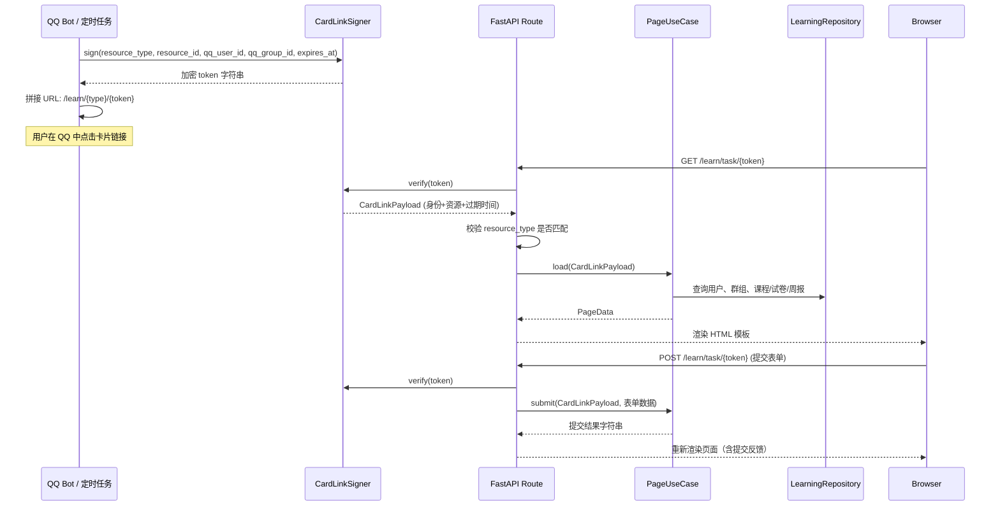

QQ 群用户在学习过程中需要完成每日任务、参加周测、查看周报——这些场景需要比纯文本消息更丰富的交互能力（表单提交、选项选择、数据表格）。本项目没有实现完整的用户注册/登录体系，而是采用 **签名令牌（Signed Token）** 方案：机器人在 QQ 消息中生成一条带签名的卡片链接，用户点击后直接进入对应的 HTML 学习页，全程无需登录。本文将解析这一机制从令牌签发到页面渲染的完整链路，涵盖任务页、周测页和周报页三种场景的 UseCase 编排、路由处理与模板结构。

## 整体架构：从 QQ 消息到浏览器页面

整个免登录学习页的运作可以划分为三个阶段：**令牌签发**（Bot 侧生成签名 URL 嵌入 QQ 卡片消息）→ **签名验证**（FastAPI 路由拦截请求，验签并提取身份信息）→ **页面渲染**（UseCase 加载数据，Jinja2 模板输出 HTML）。三者之间通过 `CardLinkPayload` 值对象作为统一的身份与资源凭证传递。



`CardLinkPayload` 是整个链路的核心数据结构，它封装了五个字段：`resource_type`（资源类型：task / quiz / report）、`resource_id`（资源 ID）、`qq_user_id`（用户 QQ 号）、`qq_group_id`（群 QQ 号）和 `expires_at`（过期时间）。这个值对象既是签名载荷，也是 UseCase 层获取用户身份的唯一入口。

Sources: [messaging.py](src/domain/value_objects/messaging.py#L20-L26), [card_links.py](src/infrastructure/auth/card_links.py#L1-L55)

## 签名机制：CardLinkSigner

签名机制基于 `itsdangerous` 库的 `URLSafeSerializer` 实现，采用对称加密方案。`CardLinkSigner` 在初始化时接收一个 `secret_key`，并使用固定的 salt `"english-bot-card-links"` 隔离签名空间，确保与其他可能的签名用途互不干扰。

**签发流程**（`sign` 方法）：将 `CardLinkPayload` 转为字典，把 `expires_at` 序列化为 ISO 格式字符串，然后通过 `URLSafeSerializer.dumps()` 生成一个 URL 安全的 token。**验证流程**（`verify` 方法）：反向操作——`loads()` 解码 token，还原 `expires_at` 并与当前时间比较，过期则抛出 `ValueError`，否则重建 `CardLinkPayload` 返回。

| 安全属性 | 实现方式 | 说明 |
|---|---|---|
| **防篡改** | URLSafeSerializer HMAC 签名 | 任何字段的修改都会导致签名校验失败 |
| **时效性** | `expires_at` 字段 + 服务端校验 | 默认 60 分钟，通过 `message.link_expire_minutes` 配置 |
| **资源隔离** | `resource_type` 路由级校验 | 签发给 task 的 token 无法访问 quiz 页面 |
| **身份绑定** | `qq_user_id` + `qq_group_id` 嵌入载荷 | 防止链接被其他用户或群组复用 |

需要特别注意的是，`URLSafeSerializer` 提供的是 **完整性保护**（防篡改）而非机密性保护（加密），token 中的 QQ 号等字段是可解码但不可伪造的。这对于本场景完全足够——学习页不涉及敏感数据，且通过过期时间限制了窗口期。

Sources: [card_links.py](src/infrastructure/auth/card_links.py#L11-L54), [models.py](src/infrastructure/settings/models.py#L80-L85)

## 三种学习页的 UseCase 编排

学习页的 UseCase 层遵循统一的编排模式：**验证身份 → 校验资源归属 → 加载数据 → 返回 PageData**。三个 `PageUseCase`（`TaskPageUseCase`、`QuizPageUseCase`、`ReportPageUseCase`）都依赖 `IdentityRepository` 和 `LearningRepository`，但各自的资源校验逻辑不同。

### TaskPageUseCase：每日任务学习页

任务页的核心流程是加载当天的课程内容（标题 + 原文节选）以及该课程关联的任务列表。`load` 方法首先通过 `token_payload.qq_user_id` 和 `qq_group_id` 解析出数据库内部的 `user` 和 `group` 实体，然后根据 `resource_id`（即 lesson ID）加载课程详情，并校验该课程是否属于当前群组。最后并行查询任务列表和该用户的提交记录，组装成 `TaskPageData` 返回。

`submit` 方法是一个薄代理，直接委托给 `LearningUseCase.submit_task()`，后者负责评分（基于提交长度的简单算法）和 LLM 反馈生成。PageUseCase 层在这里的价值在于 **身份转换**——将签名令牌中的 QQ 号转换为内部用户 ID，使底层 UseCase 不必感知签名机制。

Sources: [page_usecases.py](src/application/page_usecases.py#L13-L69)

### QuizPageUseCase：周测答题页

周测页的 `load` 方法校验更加严格：不仅检查用户和群组是否存在，还额外验证 **试卷归属**——`session.user_id != user.id or session.group_id != group.id` 时拒绝访问。这是因为每份试卷是为特定用户定制的（包含基于其高频错误的复习题），不能被他人查看或作答。

加载完成后返回试卷状态（session）、题目列表（questions）和已有答案（answers），模板据此渲染单选表单，已答过的题目会自动回填选项。`submit` 方法将表单中的 `q_1=A&q_2=B` 格式转换为 `dict[int, str]`，委托给 `QuizUseCase.submit_weekly_quiz()` 进行评分。

Sources: [page_usecases.py](src/application/page_usecases.py#L72-L113)

### ReportPageUseCase：学习周报页

周报页是唯一一个 **纯只读** 的学习页——没有 POST 提交路由。它的特殊之处在于具备 **懒构建** 能力：如果 `load` 方法发现指定 `biz_week` 的周报尚不存在，会先调用 `ReportUseCase.build_weekly_report()` 实时生成（触发 LLM 生成鼓励语、计算学习等级等），然后再查询并返回。这意味着用户首次打开周报链接时可能经历短暂的构建延迟。

周报的数据维度十分丰富，包含学习天数、任务完成率、翻译/纠错次数、周测平均分、等级评定、连续学习天数、累计积分、薄弱点分类及典型错误片段等。这些数据由 `ReportUseCase` 在构建阶段通过 `LearningRepository.get_weekly_report_stats()` 一次性聚合。

Sources: [page_usecases.py](src/application/page_usecases.py#L116-L156), [report_usecases.py](src/application/report_usecases.py#L44-L149)

## 路由注册与请求处理

学习页路由注册在 FastAPI 的 `APIRouter` 上，共有 5 个端点，分布在 `/learn/` 前缀下。所有路由共享一个统一的 **token 解析守卫** `_load_card_payload()`，该函数在路由处理函数内部被显式调用，完成签名验证和资源类型匹配。

| HTTP 方法 | URL 路径 | 功能 | 关键参数 |
|---|---|---|---|
| GET | `/learn/task/{token}` | 加载任务页 | token (路径参数) |
| POST | `/learn/task/{token}` | 提交任务答案 | task_id, submission_text (表单) |
| GET | `/learn/quiz/{token}` | 加载周测页 | token (路径参数) |
| POST | `/learn/quiz/{token}` | 提交周测答案 | q_1, q_2, ... (表单) |
| GET | `/learn/report/{token}` | 加载周报页 | token (路径参数) |

路由的错误处理采用统一的 **错误模板降级** 策略：所有异常被捕获后，渲染 `learn_error.html` 模板并返回 400 状态码。错误页面会展示具体的错误信息（如"链接已过期，请回到群里重新获取"）和引导文案。POST 路由在提交成功后会重新调用 `load` 刷新页面数据（此时提交记录已更新），实现"提交即反馈"的交互体验。

路由层不持有业务逻辑，其职责严格限定为：(1) 通过 `container` 获取依赖实例；(2) 调用 `_load_card_payload()` 完成身份验证；(3) 调用对应 PageUseCase 的 `load` 或 `submit`；(4) 将结果传给模板引擎渲染。

Sources: [routes.py](src/admin/routes.py#L48-L52), [routes.py](src/admin/routes.py#L408-L519)

## 模板体系：基础布局与页面特化

学习页的模板采用 **单继承** 结构：`learn_base.html` 作为基础骨架，提供 HTML 文档结构、viewport meta 标签和管理后台的 CSS 引用（`admin.css`），所有具体页面模板通过 `` 继承并填充 ``。

```
learn_base.html          ← 骨架：<html>/<head>/<body> + content block
├── learn_task.html      ← 任务页：标题 + 原文 + 任务列表(含提交表单)
├── learn_quiz.html      ← 周测页：题目列表 + 单选表单 + 提交按钮
├── learn_report.html    ← 周报页：统计表格 (纯展示，无交互)
└── learn_error.html     ← 错误页：异常提示 + 引导文案
```

**任务页模板**（`learn_task.html`）渲染逻辑：遍历 `page.tasks`，为每个任务生成独立的 `<section>`，包含任务类型标签、提示文本、上次提交记录（如果存在）和一个 textarea 表单。表单的 `action` 地址携带 token，`task_id` 通过 hidden input 传递。提交后页面顶部显示绿色通知条。

**周测页模板**（`learn_quiz.html`）渲染逻辑：将所有题目包裹在同一个 `<form>` 中，每道题的选项渲染为一组 `<input type="radio">`，name 为 `q_{{序号}}`，value 为 `A/B/C/D`。已作答的题目会通过 Jinja2 条件判断自动标记 `checked` 属性。

**周报页模板**（`learn_report.html`）渲染逻辑：纯展示型页面，使用 `<table>` 表格展示 12 项统计数据，数据来源于 `page.report.report_json` 字典。页面上方展示 LLM 生成的 `summary_text` 作为周报总结。

Sources: [learn_base.html](src/admin/templates/learn_base.html#L1-L15), [learn_task.html](src/admin/templates/learn_task.html#L1-L29), [learn_quiz.html](src/admin/templates/learn_quiz.html#L1-L30), [learn_report.html](src/admin/templates/learn_report.html#L1-L25), [learn_error.html](src/admin/templates/learn_error.html#L1-L10)

## 配置与卡片链接生成

学习页的可用性依赖两个关键配置项，它们共同决定了卡片链接是否生成以及有效期多长。这两个配置位于 `message` 配置组下，支持运行时动态修改（通过管理后台 [FastAPI 管理后台](22-fastapi-guan-li-hou-tai-yi-biao-pan-yong-hu-guan-li-yu-yun-xing-shi-pei-zhi) 的设置页面）。

| 配置键 | 默认值 | 作用 |
|---|---|---|
| `message.public_base_url` | `""` (空) | 服务的外网可访问地址，为空时不生成卡片链接 |
| `message.link_expire_minutes` | `60` | 签名令牌的有效时长（分钟） |

卡片链接的生成分散在三个 UseCase 中：`LearningUseCase._build_card_link()`、`QuizUseCase._build_card_link()` 和 `ReportUseCase._build_card_link()`。它们的实现几乎完全相同——读取 `public_base_url`，计算 `expires_at`，调用 `CardLinkSigner.sign()`，然后拼接为 `/learn/{type}/{token}` 格式的 URL。如果 `public_base_url` 为空，`_build_card_link()` 返回 `None`，消息将降级为纯文本模式（不带可点击链接）。

Sources: [runtime.py](src/infrastructure/settings/runtime.py#L48-L53), [learning_usecases.py](src/application/learning_usecases.py#L235-L255), [quiz_usecases.py](src/application/quiz_usecases.py#L284-L305), [report_usecases.py](src/application/report_usecases.py#L164-L184), [config.example.yaml](deploy/config.example.yaml#L37-L43)

## 依赖注入与 PageUseCase 装配

三个 PageUseCase 在 `ServiceContainer` 的初始化过程中被手动装配。它们处于依赖链的 **末端**——依赖其他已有的 UseCase 实例（`learning_usecase`、`quiz_usecase`、`report_usecase`）以及基础设施层的 Repository，但不被其他组件依赖。这种"UseCase 包装 UseCase"的设计使得签名验证逻辑可以集中在 PageUseCase 层，而底层的业务 UseCase 保持对签名机制的无感知。

`ServiceContainer` 的初始化顺序值得注意：三个底层 UseCase 先于三个 PageUseCase 创建，PageUseCase 被注入到底层 UseCase 的引用，而非反之。这保证了依赖方向的单一性，避免循环引用。

Sources: [container.py](src/infrastructure/settings/container.py#L139-L186)

## 测试覆盖

签名机制通过 `tests/test_card_links.py` 进行单元测试，验证两个核心场景：(1) 签名-验签的完整往返（`test_card_link_signer_roundtrip`）——确认 `resource_type`、`resource_id`、`qq_user_id`、`qq_group_id` 四个字段在序列化/反序列化后完全一致；(2) 过期令牌的拒绝（`test_card_link_signer_rejects_expired_token`）——确认 `verify()` 在 `expires_at` 已过时抛出含"已过期"信息的 `ValueError`。PageUseCase 层的逻辑（身份校验、资源归属判断）则通过集成测试或手动调试页覆盖。

Sources: [test_card_links.py](tests/test_card_links.py#L1-L38)

## 延伸阅读

- [卡片链接签名与过期验证（CardLinkSigner）](18-qia-pian-lian-jie-qian-ming-yu-guo-qi-yan-zheng-cardlinksigner) —— CardLinkSigner 的详细设计与安全分析
- [FastAPI 管理后台：仪表盘、用户管理与运行时配置](22-fastapi-guan-li-hou-tai-yi-biao-pan-yong-hu-guan-li-yu-yun-xing-shi-pei-zhi) —— 管理后台的卡片预览调试功能
- [手动依赖注入容器（ServiceContainer）](14-shou-dong-yi-lai-zhu-ru-rong-qi-servicecontainer) —— PageUseCase 的装配与生命周期
- [双层配置体系：运行时配置与静态配置](13-shuang-ceng-pei-zhi-ti-xi-yun-xing-shi-pei-zhi-yu-jing-tai-pei-zhi) —— `public_base_url` 和 `link_expire_minutes` 的配置优先级