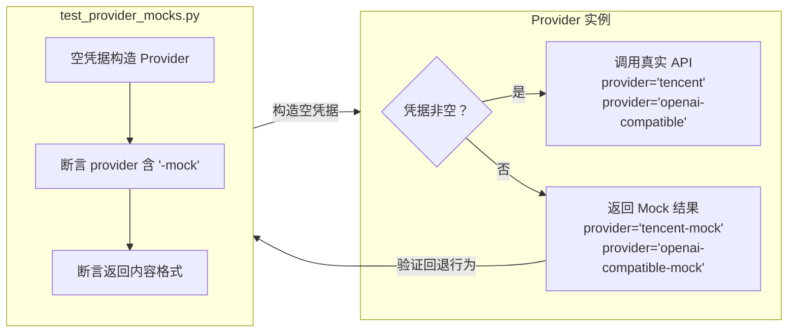
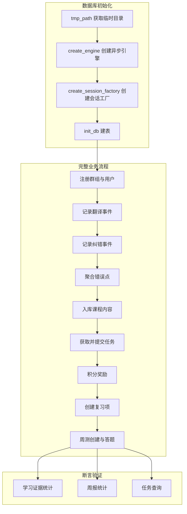

项目的测试体系紧密围绕 **Clean Architecture** 的分层边界设计：纯函数的领域服务零依赖即可同步测试，基础设施层通过构造器注入实现可替换性，外部 Provider 则采用内置空凭据回退的 Null Object 模式。整个测试套件共 8 个文件、393 行代码，覆盖了从领域逻辑到数据库集成、从命令匹配到消息投递降级的完整关键路径。核心配置位于 `pyproject.toml` 的 `[tool.pytest.ini_options]` 段，将 `asyncio_mode` 设为 `"auto"`，使得所有 `async def test_*` 函数自动被 pytest-asyncio 识别为协程测试，无需逐一标注 `@pytest.mark.asyncio`（尽管部分测试文件仍保留了显式标记以增强可读性）。

Sources: [pyproject.toml](pyproject.toml#L30-L48)

## 测试配置与运行机制

项目在 `pyproject.toml` 中声明了开发依赖和 pytest 配置。测试运行依赖两个核心包：`pytest>=8.3.4` 提供测试框架，`pytest-asyncio>=0.24.0` 提供异步测试支持。关键配置项如下：

| 配置项 | 值 | 作用 |
|---|---|---|
| `asyncio_mode` | `"auto"` | 自动识别 `async def` 测试函数为协程测试 |
| `testpaths` | `["tests"]` | 测试文件搜索路径 |

`asyncio_mode = "auto"` 意味着 pytest-asyncio 会自动将所有 `async def` 形式的测试函数包装为协程执行，而不要求每个测试都加 `@pytest.mark.asyncio` 装饰器。项目中部分测试（如 `test_provider_mocks.py`、`test_message_delivery.py`）仍显式标注了该装饰器，这是出于文档化意图——让读者一眼识别这是一个异步测试。

Sources: [pyproject.toml](pyproject.toml#L46-L48)

## 测试分层与覆盖全景

测试文件按被测模块所属的架构层次自然分布。下表展示了每个测试文件的定位、测试风格和依赖情况：

| 测试文件 | 被测模块 | 架构层 | 异步 | 外部依赖 | 测试策略 |
|---|---|---|---|---|---|
| `test_error_aggregation.py` | `ErrorAggregator` | 领域服务 | 否 | 无 | 纯函数直测 |
| `test_leveling.py` | `LevelService` | 领域服务 | 否 | 无 | 纯函数直测 |
| `test_review_service.py` | `ReviewScheduler` | 领域服务 | 否 | 无 | 纯函数直测 |
| `test_command_catalog.py` | `command_catalog` | 插件层 | 否 | 无 | 纯函数直测 |
| `test_card_links.py` | `CardLinkSigner` | 基础设施 | 否 | 无（`itsdangerous` 随项目安装） | 签名/验签往返 |
| `test_provider_mocks.py` | `TencentTranslateProvider` / `OpenAICompatibleProvider` | 基础设施 | 是 | 无 | 内置 Mock 回退 |
| `test_message_delivery.py` | `MessageDeliveryService` | 基础设施 | 是 | 无（手动 Stub） | 手动依赖替换 |
| `test_learning_repository.py` | `LearningRepository` | 基础设施 | 是 | SQLite（`tmp_path`） | 真实数据库集成 |

这种分层方式体现了核心原则：**领域层测试最简单（零依赖、同步），基础设施层测试逐步引入异步和外部组件，但通过设计手段（内置 Mock、手动 Stub、临时数据库）消除了对真实外部服务的依赖**。

Sources: [test_error_aggregation.py](tests/test_error_aggregation.py#L1-L16), [test_leveling.py](tests/test_leveling.py#L1-L17), [test_review_service.py](tests/test_review_service.py#L1-L15), [test_command_catalog.py](tests/test_command_catalog.py#L1-L22), [test_card_links.py](tests/test_card_links.py#L1-L38), [test_provider_mocks.py](tests/test_provider_mocks.py#L1-L40), [test_message_delivery.py](tests/test_message_delivery.py#L1-L108), [test_learning_repository.py](tests/test_learning_repository.py#L1-L145)

## 领域服务测试：纯函数直测

位于 `src/domain/services/` 下的三个领域服务（`ErrorAggregator`、`LevelService`、`ReviewScheduler`）都是**无状态的纯函数或纯方法**——它们不持有状态、不访问数据库、不调用网络，仅基于输入参数返回计算结果。这使得测试极其简洁：

`test_error_aggregation.py` 验证 `ErrorAggregator.merge()` 对相同签名（signature）的错误点负载执行去重：传入两个完全相同的 `ErrorPointPayload`，断言输出列表长度为 1。

Sources: [test_error_aggregation.py](tests/test_error_aggregation.py#L5-L14), [error_points.py](src/domain/services/error_points.py#L21-L26)

`test_leveling.py` 验证 `LevelService.evaluate()` 的升级逻辑：给定翻译 8 次、纠错 6 次、任务完成 4 次（activity_score = 8 + 12 + 12 = 32 ≥ 20）且测验均分 80 ≥ 70 的学习证据，用户应被评定为 `"intermediate"` 等级。

Sources: [test_leveling.py](tests/test_leveling.py#L4-L15), [leveling.py](src/domain/services/leveling.py#L20-L39)

`test_review_service.py` 验证 `ReviewScheduler.update_after_answer()` 的间隔重置策略：答错时，无论当前间隔多大（此处为 4 天），间隔都应归零重置为 1 天，连续正确计数归零，状态回到 `"pending"`。

Sources: [test_review_service.py](tests/test_review_service.py#L4-L13), [review.py](src/domain/services/review.py#L27-L49)

这三个测试共同展示了领域层测试的黄金法则：**构造输入 → 调用方法 → 断言输出**。无需 mock、无需 fixture、无需异步运行时，每个测试就是三五行代码。

## Provider 内置 Mock：Null Object 模式

本项目采用了一种独特的 Provider Mock 策略——**不是在测试端用 `unittest.mock.patch` 替换外部调用，而是在 Provider 实现内部预置了空凭据回退逻辑**。这种模式本质上是一个 Null Object：当凭据为空时，Provider 返回结构正确但内容为 mock 占位符的结果。

### 腾讯翻译 Provider 的 Mock 回退

`TencentTranslateProvider.translate()` 方法在检测到 `secret_id` 或 `secret_key` 为空字符串时，跳过真实 API 调用，直接返回格式为 `[mock:{target_lang}] {source_text}` 的模拟翻译结果，并将 `provider` 字段标记为 `"tencent-mock"`。语言检测（`detect_language`）则始终使用纯正则启发式方法（`_heuristic_detect`），不依赖网络请求，因此在任何环境下都能正常工作。

Sources: [translate_tencent.py](src/infrastructure/providers/translate_tencent.py#L28-L48), [translate_tencent.py](src/infrastructure/providers/translate_tencent.py#L101-L106)

### OpenAI 兼容大模型 Provider 的 Mock 回退

`OpenAICompatibleProvider` 在 `api_key`、`base_url` 或 `model` 任一为空时，对 `correct_english()` 返回原样文本加上 `"openai-compatible-mock"` 标记，对 `generate_feedback()` 返回固定鼓励文案 `"完成得不错，继续保持。"`。这意味着测试和开发环境只需传入空字符串构造 Provider，即可在不启动任何 LLM 服务的前提下验证完整的业务流程。

Sources: [llm_openai.py](src/infrastructure/providers/llm_openai.py#L19-L30), [llm_openai.py](src/infrastructure/providers/llm_openai.py#L102-L104)

### Mock 回退测试验证

`test_provider_mocks.py` 正是对上述回退行为的显式验证。它构造空凭据的 Provider 实例，调用 `detect_language`、`translate`、`correct_english` 和 `generate_feedback`，断言返回结果的 `provider` 字段包含 `"-mock"` 后缀，且返回内容满足基本格式约定（如 `result.translated_text.startswith("[mock:en]")`）。这个测试的核心价值在于：**它是 Provider Mock 契约的回归保护**——确保未来重构 Provider 实现时，空凭据回退行为不会被意外破坏。

Sources: [test_provider_mocks.py](tests/test_provider_mocks.py#L10-L39)

## 手动 Stub：消息投递测试

当被测代码依赖的接口较复杂（如 `RuntimeConfigService` 有十多个方法）时，项目不依赖任何 mock 框架，而是**直接编写轻量级 Stub 类**。`test_message_delivery.py` 展示了这一模式的完整实践。

### Stub 设计

`_RuntimeConfigStub` 实现了 `MessageDeliveryService` 所需的配置查询接口（`render_mode()`、`public_base_url()`、`enable_task_cards()`、`card_fallback_to_text()`），通过构造器参数控制返回值。`_BotStub` 模拟了 NoneBot 的 Bot 对象，将所有 `send_group_msg` 调用记录到 `self.messages` 列表中，并支持通过 `fail_json_once` 参数模拟一次 JSON 消息发送失败。

Sources: [test_message_delivery.py](tests/test_message_delivery.py#L9-L38)

### 三个测试场景

**场景一：无 public URL 时降级为纯文本**——`public_base_url` 返回空字符串，`MessageDeliveryService.can_send_card()` 判定条件不满足，直接走纯文本渲染路径，断言 bot 只发送了纯文本内容。

Sources: [test_message_delivery.py](tests/test_message_delivery.py#L41-L56)

**场景二：启用卡片时的正常投递**——`public_base_url` 返回有效 URL，卡片渲染器构建点击卡片 payload，断言 bot 收到的消息包含 `CQ:json` 和 `CQ:at` 标记。

Sources: [test_message_delivery.py](tests/test_message_delivery.py#L59-L82)

**场景三：卡片发送失败后降级**——`_BotStub` 配置为在第一次发送 JSON 消息时抛出异常，断言服务捕获异常后降级为 `fallback_text` 纯文本投递。

Sources: [test_message_delivery.py](tests/test_message_delivery.py#L85-L107)

这种手动 Stub 模式相比 `unittest.mock.MagicMock` 有两个显著优势：一是 Stub 代码即文档，清晰展示了被测代码对依赖的期望接口；二是 IDE 自动补全和类型检查能覆盖 Stub 代码，重构时编译器会报错提醒。

## 数据库集成测试：tmp_path 隔离

`test_learning_repository.py` 是套件中最复杂的测试（145 行），它对 `LearningRepository` 进行了**端到端集成验证**——在真实 SQLite 数据库上执行完整的业务操作序列。

### 数据库隔离策略

测试利用 pytest 内置的 `tmp_path` fixture 获取一个临时目录，构造 `sqlite+aiosqlite:///<temp>/learning-test.db` 连接字符串，通过 `create_engine` → `create_session_factory` → `init_db` 三步建立完全隔离的数据库环境。每个测试运行都在一个全新的空数据库上进行，测试结束后临时文件自动清理。

Sources: [test_learning_repository.py](tests/test_learning_repository.py#L14-L18), [session.py](src/infrastructure/db/session.py#L10-L20)

### 业务流程覆盖

这个测试实际上演练了一条**完整的用户学习生命周期**：用户注册（`ensure_user`）→ 群组注册（`ensure_group`）→ 加入群组（`enroll_user`）→ 消息事件记录（`create_message_event`）→ 翻译交互结果（`create_interaction_result`）→ 纠错交互结果 → 错误点聚合（`upsert_error_points`）→ 课程内容入库（`upsert_content_and_lesson`）→ 任务获取（`get_today_tasks`）→ 任务提交（`submit_task`）→ 积分奖励（`award_points`）→ 复习项创建（`ensure_review_items`）→ 周测创建与答题（`create_quiz_session` → `add_quiz_questions` → `save_quiz_answers`）→ 学习证据统计（`get_learning_evidence`）→ 周报统计（`get_weekly_report_stats`）→ 任务查询（`get_recent_tasks_for_quiz`）。最终通过 10 条断言验证了统计数据的一致性。

Sources: [test_learning_repository.py](tests/test_learning_repository.py#L20-L144)

## 签名与过期验证测试

`test_card_links.py` 测试 `CardLinkSigner` 的两个核心行为：**签名往返**和**过期拒绝**。

`test_card_link_signer_roundtrip()` 构造一个 10 分钟后过期的 token，验证 `sign()` → `verify()` 往返后所有字段（`resource_type`、`resource_id`、`qq_user_id`、`qq_group_id`）完整一致。

`test_card_link_signer_rejects_expired_token()` 构造一个 1 分钟前已过期的 token，验证 `verify()` 抛出 `ValueError("已过期")`。这里使用了 `pytest.raises` 上下文管理器配合 `match` 参数进行异常消息的正则匹配。

Sources: [test_card_links.py](tests/test_card_links.py#L8-L37), [card_links.py](src/infrastructure/auth/card_links.py#L15-L54)

## 命令匹配测试

`test_command_catalog.py` 覆盖了命令系统的三个维度：**精确匹配**（`"报名学习"` 直接命中）、**前缀匹配**（`" 提交任务 12 hello "` 去空格后匹配 `"提交任务"` 前缀）、**不匹配**（普通聊天文本返回 `None`），以及帮助文本的完整性（断言包含关键命令词和 `@机器人` 使用说明）。

Sources: [test_command_catalog.py](tests/test_command_catalog.py#L4-L21), [command_catalog.py](src/plugins/command_catalog.py#L1-L50)

## 测试策略总结与设计原则

下表汇总了项目使用的四种测试策略及其适用场景：

| 策略 | 适用场景 | 优势 | 示例 |
|---|---|---|---|
| **纯函数直测** | 无状态领域服务 | 零依赖、极简、运行快 | `ErrorAggregator`、`LevelService`、`ReviewScheduler` |
| **内置 Null Object Mock** | 外部 API Provider | 无需 mock 框架、测试即文档 | `TencentTranslateProvider`、`OpenAICompatibleProvider` |
| **手动 Stub 依赖替换** | 需要注入配置或协作对象的复杂服务 | 类型安全、IDE 友好、接口契约可见 | `MessageDeliveryService` 的 `_RuntimeConfigStub` 和 `_BotStub` |
| **tmp_path 数据库集成** | Repository 层数据访问 | 验证真实 SQL 和事务行为 | `LearningRepository` 完整生命周期测试 |

这些策略的共同精神是：**拒绝引入 mock 框架，优先通过架构设计让代码天生可测**。领域服务保持纯函数，Provider 通过空凭据自降级为 mock，基础设施组件通过构造器注入接受 Stub 替代。唯一需要真实外部组件（SQLite）的地方，使用 pytest 内置 fixture 实现进程级隔离。

Sources: [test_error_aggregation.py](tests/test_error_aggregation.py#L1-L16), [test_provider_mocks.py](tests/test_provider_mocks.py#L1-L40), [test_message_delivery.py](tests/test_message_delivery.py#L9-L38), [test_learning_repository.py](tests/test_learning_repository.py#L14-L18)

## 延伸阅读

测试体系覆盖的每个模块在文档中都有独立的深入解析页面。如果你想了解被测代码的完整设计意图，推荐按以下路径继续阅读：

- Provider Mock 测试所验证的两个 Provider 实现详见 [Provider 模式：腾讯翻译与 OpenAI 兼容大模型集成](15-provider-mo-shi-teng-xun-fan-yi-yu-openai-jian-rong-da-mo-xing-ji-cheng)
- `LearningRepository` 的完整数据模型和查询逻辑参见 [SQLite 数据库模型与 Repository 数据访问](17-sqlite-shu-ju-ku-mo-xing-yu-repository-shu-ju-fang-wen)
- `MessageDeliveryService` 的卡片降级策略和渲染流程参见 [消息渲染与投递：纯文本与 NapCat 卡片](8-xiao-xi-xuan-ran-yu-tou-di-chun-wen-ben-yu-napcat-qia-pian)
- 领域服务背后的业务逻辑参见 [错误点聚合（ErrorAggregator）与去重签名](10-cuo-wu-dian-ju-he-erroraggregator-yu-qu-zhong-qian-ming)、[间隔复习调度（ReviewScheduler）与倍增策略](11-jian-ge-fu-xi-diao-du-reviewscheduler-yu-bei-zeng-ce-lue)、[用户分级系统（LevelService）](12-yong-hu-fen-ji-xi-tong-levelservice)
- 如需为新增模块编写测试，请参考 [扩展指南：添加新命令与新 Provider](25-kuo-zhan-zhi-nan-tian-jia-xin-ming-ling-yu-xin-provider) 中的测试约定