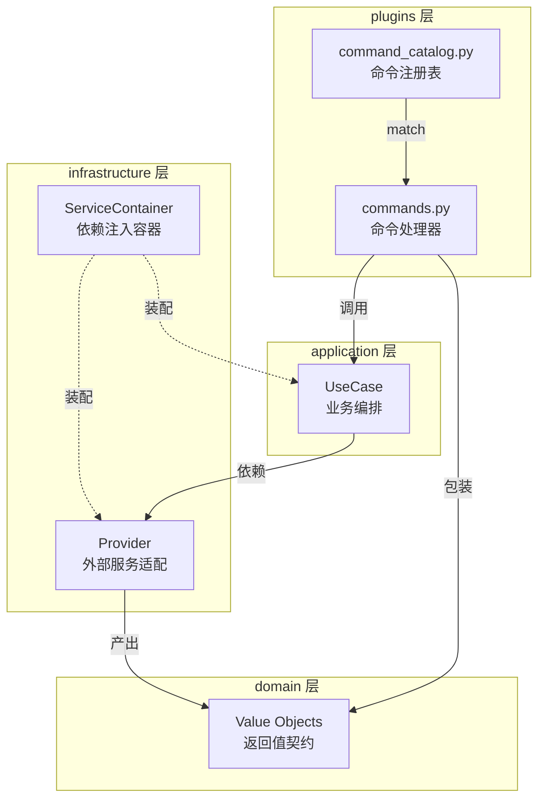
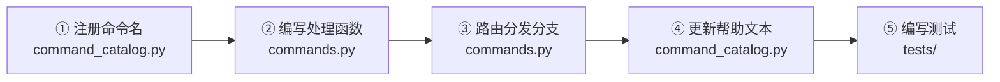
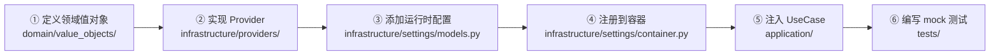

本文档是一份面向高级开发者的实战指南，系统性地阐述如何在 englishBot 项目中扩展两类核心能力——**QQ 群固定命令**与**基础设施 Provider**。项目采用 Clean Architecture 分层设计，命令系统位于 `plugins` 层，Provider 位于 `infrastructure` 层，二者通过 `ServiceContainer` 手动依赖注入完成装配。理解这套扩展模式，你就能在不破坏现有分层约束的前提下，高效地为机器人注入新能力。

Sources: [commands.py](src/plugins/commands.py#L1-L10), [container.py](src/infrastructure/settings/container.py#L1-L29)

## 扩展全景：命令与 Provider 的协作模型

在动手编写代码之前，先从架构视角理解一次完整扩展所触及的分层边界。下图展示了一条新命令从用户输入到最终响应所经过的全部层次，以及一个新 Provider 如何被注入到 UseCase 中参与业务流程。



这张图的要点在于：**命令层只做分发与参数解析，业务逻辑全部下沉到 UseCase；Provider 是基础设施对领域层的适配，通过值对象与上层解耦**。当你新增命令时，主要改动集中在左上角的 `Plugin` 区域；当你新增 Provider 时，改动集中在右下角的 `Infrastructure → Domain` 路径，并向上传递到 `ServiceContainer` 装配环节。

Sources: [command_catalog.py](src/plugins/command_catalog.py#L1-L51), [container.py](src/infrastructure/settings/container.py#L61-L99)

## 第一部分：添加新的固定命令

### 命令系统架构概览

项目的命令系统由两个文件协作完成。`command_catalog.py` 是**纯声名式的命令注册表**——它定义了哪些文本算作"固定命令"，以及如何匹配；`commands.py` 是**命令处理器**——它接收 NoneBot 的事件分发，将命令文本路由到对应的处理函数，并调用 UseCase 完成业务逻辑后返回响应。

命令被分为两种匹配模式：

| 匹配模式 | 定义位置 | 匹配逻辑 | 典型示例 |
|---------|---------|---------|---------|
| **精确匹配** | `EXACT_COMMANDS` 元组 | `text.strip() == command` | `帮助`、`报名学习`、`今日任务` |
| **前缀匹配** | `PREFIX_COMMANDS` 元组 | `text.strip().startswith(command)` | `提交任务 <参数>`、`答题 <参数>` |

Sources: [command_catalog.py](src/plugins/command_catalog.py#L1-L29)

### 添加命令的完整步骤

以下以添加一个虚构命令 **`学习统计`**（精确匹配，显示用户个人学习数据摘要）为例，演示完整的五步流程。



#### 步骤 ①：在命令注册表中注册命令名

打开 `src/plugins/command_catalog.py`，将新命令名添加到对应的元组中。精确匹配命令加入 `EXACT_COMMANDS`，带参数的前缀命令加入 `PREFIX_COMMANDS`。

```python
# command_catalog.py — 精确匹配命令
EXACT_COMMANDS = (
    "报名学习",
    "今日任务",
    "复习一下",
    "我的等级",
    "开始周测",
    "本周总结",
    "帮助",
    "学习统计",    # ← 新增
)
```

注册完成后，`match_fixed_command()` 和 `is_fixed_command_text()` 将自动识别这个新命令——因为它们遍历上述元组做匹配，无需任何额外逻辑。

Sources: [command_catalog.py](src/plugins/command_catalog.py#L3-L11), [command_catalog.py](src/plugins/command_catalog.py#L22-L29)

#### 步骤 ②：编写命令处理函数

在 `src/plugins/commands.py` 中新增一个 `async` 函数，遵循项目既有的 `_handle_xxx` 命名约定。处理函数的核心职责是：**从事件中提取用户身份与参数 → 获取 ServiceContainer → 调用对应 UseCase → 返回 `str` 或 `MessageEnvelope`**。

```python
async def _handle_learning_stats(event: GroupMessageEvent) -> str:
    container = await get_or_init_container()
    qq_user_id, nickname = _get_identity(event)
    # 假设 learning_usecase 已新增 get_learning_stats 方法
    return await container.learning_usecase.get_learning_stats(
        qq_group_id=str(event.group_id),
        qq_user_id=qq_user_id,
        nickname=nickname,
    )
```

**关键约定**：
- 精确匹配命令的处理函数签名固定为 `async def _handle_xxx(event: GroupMessageEvent) -> str | MessageEnvelope`。
- 前缀匹配命令需额外接收 `text: str` 参数以解析命令后缀（参见 `_handle_submit_task` 的实现模式）。
- 返回 `str` 会被 `_to_envelope()` 自动包装为 `MessageEnvelope(plain_text=...)`；如果需要卡片消息，直接返回 `MessageEnvelope` 实例。

Sources: [commands.py](src/plugins/commands.py#L30-L33), [commands.py](src/plugins/commands.py#L62-L77), [commands.py](src/plugins/commands.py#L146-L179)

#### 步骤 ③：在分发主函数中添加路由分支

在 `handle_group_command()` 的 `if/elif` 链中添加新分支。这个函数是所有固定命令的总入口，NoneBot 通过 `_matches_learning_command` 规则匹配到群消息后统一进入此函数。

```python
elif command_name == "学习统计":
    message = await _handle_learning_stats(event)
```

分支的位置不影响功能，但建议按命令的**使用频率**或**逻辑关联**排列——现有代码将高频操作（报名、任务）靠前，将低频查询（等级、总结）靠后。

Sources: [commands.py](src/plugins/commands.py#L152-L173)

#### 步骤 ④：更新帮助文本

`render_help_text()` 是用户发送 `帮助` 命令时看到的命令清单。每新增一个命令，都应同步更新此处，保持用户可见的命令列表与实际注册表一致。

```python
def render_help_text() -> str:
    return (
        "学习系统命令请直接发送，不需要 @机器人。\n\n"
        "固定命令：\n"
        "- 报名学习\n"
        ...
        "- 学习统计\n"    # ← 新增
        "- 帮助\n\n"
        "@机器人 只用于翻译、纠错、表达润色和语法解释。"
    )
```

Sources: [command_catalog.py](src/plugins/command_catalog.py#L36-L50)

#### 步骤 ⑤：编写测试

测试应覆盖两个层面：命令匹配逻辑和帮助文本一致性。

```python
# tests/test_command_catalog.py

def test_match_learning_stats():
    assert match_fixed_command("学习统计") == "学习统计"

def test_help_text_includes_learning_stats():
    assert "学习统计" in render_help_text()
```

处理函数的集成测试需要 mock `get_or_init_container()` 的返回值，或通过注入空配置的 Provider 实例来验证端到端流程。项目在 `tests/test_provider_mocks.py` 中展示了"空配置 → mock 回退"的测试范式。

Sources: [test_command_catalog.py](tests/test_command_catalog.py#L1-L22), [test_provider_mocks.py](tests/test_provider_mocks.py#L1-L40)

### 前缀命令的参数解析模式

前缀命令（如 `提交任务`、`答题`）需要在处理函数中手动解析命令文本中跟在命令名后面的参数。以 `_handle_submit_task` 为例，它通过 `text.removeprefix("提交任务").strip()` 提取参数部分，再按空格切分出任务 ID 和内容。这种模式简单直接，适合参数格式稳定的场景；如果未来参数结构复杂，可以考虑引入轻量级参数解析器。

Sources: [commands.py](src/plugins/commands.py#L62-L77)

### 命令扩展 Checklist

| 步骤 | 文件 | 改动内容 | 验证方式 |
|-----|------|---------|---------|
| 注册命令名 | `command_catalog.py` | 添加到 `EXACT_COMMANDS` 或 `PREFIX_COMMANDS` | `test_match_fixed_command` 通过 |
| 编写处理函数 | `commands.py` | 新增 `_handle_xxx()` | 可被分发主函数调用 |
| 添加路由分支 | `commands.py` | `handle_group_command()` 新增 `elif` | QQ 群中发送命令触发响应 |
| 更新帮助文本 | `command_catalog.py` | `render_help_text()` 追加说明 | `test_render_help_text` 通过 |
| 编写测试 | `tests/` | 匹配测试 + 帮助文本断言 | `pytest` 全绿 |

Sources: [command_catalog.py](src/plugins/command_catalog.py#L1-L51), [commands.py](src/plugins/commands.py#L1-L180)

## 第二部分：添加新的 Provider

### Provider 模式解析

Provider 是基础设施层对外部服务的适配封装。项目中目前有三类 Provider，各自承担不同的职责：

| Provider | 文件 | 职责 | 上游消费者 |
|----------|------|------|-----------|
| `TencentTranslateProvider` | `translate_tencent.py` | 语言检测 + 文本翻译 | `MessageUseCase` |
| `OpenAICompatibleProvider` | `llm_openai.py` | 纠错、翻译润色、反馈生成 | `MessageUseCase`、`LearningUseCase`、`ReportUseCase` |
| `TedContentProvider` | `content_ted.py` | RSS 抓取 + 课程组装 | `LearningUseCase` |

Provider 的设计遵循三个核心原则：**构造函数接收纯数据配置（不依赖框架）**、**通过领域值对象与上层解耦**、**空配置时自动回退到 mock 行为**。最后一点尤为重要——它意味着开发和测试环境中即使没有真实 API 密钥，系统也能正常运行并产出可预测的结果。

Sources: [translate_tencent.py](src/infrastructure/providers/translate_tencent.py#L12-L62), [llm_openai.py](src/infrastructure/providers/llm_openai.py#L13-L76), [content_ted.py](src/infrastructure/providers/content_ted.py#L13-L67)

### Provider 的设计契约

一个合规的 Provider 必须满足以下契约：

1. **构造函数使用 `*` 仅接收关键字参数**，所有外部配置通过参数注入，不读取环境变量或全局状态。
2. **公开方法返回领域值对象**（如 `TranslationResult`、`CorrectionResult`、`LessonBundle`），而非原始 dict。
3. **内置 mock 回退**——当关键配置为空时，方法返回带有 `provider="xxx-mock"` 标记的结果，不抛出异常。
4. **网络调用使用 `tenacity` 重试**——对不稳定的外部 API 添加 `@retry` 装饰器。
5. **同步 SDK 调用包装为 `asyncio.to_thread()`**——避免阻塞事件循环（参考 `TencentTranslateProvider._translate_sync`）。

Sources: [translate_tencent.py](src/infrastructure/providers/translate_tencent.py#L31-L62), [llm_openai.py](src/infrastructure/providers/llm_openai.py#L19-L76)

### 添加 Provider 的完整步骤

以下以添加一个虚构的 **`DeepLTranslateProvider`**（DeepL 翻译服务适配器）为例，演示完整的六步流程。



#### 步骤 ①：确认或定义领域值对象

Provider 的返回值必须是 domain 层的值对象。如果新 Provider 产出的数据结构与现有值对象匹配（如翻译结果对应 `TranslationResult`），则直接复用；否则需要在 `src/domain/value_objects/` 中新增 dataclass。

以翻译 Provider 为例，`TranslationResult` 已经定义了完整的字段集：

```python
@dataclass(slots=True)
class TranslationResult:
    source_text: str
    translated_text: str
    source_language: LanguageType
    target_language: LanguageType
    provider: str    # 用于标识来源，mock 时填 "xxx-mock"
```

Sources: [learning.py](src/domain/value_objects/learning.py#L14-L21)

#### 步骤 ②：实现 Provider 类

在 `src/infrastructure/providers/` 下创建新文件，遵循既有的命名惯例 `{功能}_{服务商}.py`。

```python
# src/infrastructure/providers/translate_deepl.py
from __future__ import annotations

import httpx
from tenacity import retry, stop_after_attempt, wait_fixed

from src.domain.value_objects.learning import LanguageType, TranslationResult


class DeepLTranslateProvider:
    def __init__(self, *, api_key: str, base_url: str, timeout: float = 12.0) -> None:
        self._api_key = api_key
        self._base_url = base_url.rstrip("/")
        self._timeout = timeout

    @retry(wait=wait_fixed(1), stop=stop_after_attempt(3), reraise=True)
    async def translate(
        self,
        text: str,
        *,
        source_lang: LanguageType | None,
        target_lang: LanguageType,
    ) -> TranslationResult:
        # Mock 回退：api_key 为空时返回 mock 结果
        if not self._api_key:
            return TranslationResult(
                source_text=text,
                translated_text=f"[mock:deepl:{target_lang.value}] {text}",
                source_language=source_lang or LanguageType.UNKNOWN,
                target_language=target_lang,
                provider="deepl-mock",
            )

        # 真实 API 调用
        async with httpx.AsyncClient(timeout=self._timeout) as client:
            response = await client.post(
                f"{self._base_url}/v2/translate",
                headers={"Authorization": f"DeepL-Auth-Key {self._api_key}"},
                data={
                    "text": text,
                    "source_lang": self._map_language(source_lang),
                    "target_lang": self._map_language(target_lang),
                },
            )
            response.raise_for_status()
            translated = response.json()["translations"][0]["text"]

        return TranslationResult(
            source_text=text,
            translated_text=translated,
            source_language=source_lang or LanguageType.UNKNOWN,
            target_language=target_lang,
            provider="deepl",
        )

    @staticmethod
    def _map_language(lang: LanguageType | None) -> str:
        mapping = {LanguageType.ENGLISH: "EN", LanguageType.CHINESE: "ZH"}
        return mapping.get(lang, "AUTO") if lang else "AUTO"
```

Sources: [translate_tencent.py](src/infrastructure/providers/translate_tencent.py#L12-L107), [llm_openai.py](src/infrastructure/providers/llm_openai.py#L1-L142)

#### 步骤 ③：添加运行时配置项

在 `src/infrastructure/settings/models.py` 的 `AppRuntimeSettings` 中添加新 Provider 的配置字段。这些字段通过 `.env` 文件或环境变量注入。

```python
class AppRuntimeSettings(BaseSettings):
    # ... 现有字段 ...

    # 新增 DeepL 配置
    deepl_api_key: str = ""
    deepl_base_url: str = "https://api-free.deepl.com"
```

Sources: [models.py](src/infrastructure/settings/models.py#L10-L36)

#### 步骤 ④：注册到 ServiceContainer

这一步是手动依赖注入的核心。需要在 `ServiceContainer` dataclass 中声明新 Provider 字段，并在 `build_container()` 函数中完成实例化和装配。

```python
# container.py — 声明字段
@dataclass(slots=True)
class ServiceContainer:
    # ... 现有字段 ...
    translate_provider: TencentTranslateProvider
    deepl_provider: DeepLTranslateProvider      # ← 新增
    # ...

# container.py — 在 build_container() 中实例化
async def build_container(settings: EffectiveSettings) -> ServiceContainer:
    # ... 现有初始化代码 ...
    deepl_provider = DeepLTranslateProvider(
        api_key=settings.runtime.deepl_api_key,
        base_url=settings.runtime.deepl_base_url,
    )
    # ... 传递给 ServiceContainer 构造 ...
```

Sources: [container.py](src/infrastructure/settings/container.py#L31-L56), [container.py](src/infrastructure/settings/container.py#L61-L87)

#### 步骤 ⑤：注入到 UseCase

在需要使用新 Provider 的 UseCase 中，通过构造函数注入。UseCase 不关心 Provider 的内部实现，只依赖其公开方法签名和返回的值对象。

```python
class MessageUseCase:
    def __init__(
        self,
        *,
        # ... 现有依赖 ...
        translate_provider: TencentTranslateProvider,
        deepl_provider: DeepLTranslateProvider,   # ← 新增
    ) -> None:
        self._translate_provider = translate_provider
        self._deepl_provider = deepl_provider     # ← 新增
```

然后在 `build_container()` 中更新 UseCase 的构造调用，传入新 Provider 实例。注意，如果你希望保持向后兼容（如让 DeepL 作为备选翻译源而非替换腾讯翻译），可以同时在 Container 中保留两个 Provider，由 UseCase 根据配置决定使用哪个。

Sources: [message_usecases.py](src/application/message_usecases.py#L25-L43), [container.py](src/infrastructure/settings/container.py#L100-L108)

#### 步骤 ⑥：编写 Mock 测试

遵循项目的测试范式：用空配置实例化 Provider，验证 mock 回退行为和值对象契约。

```python
# tests/test_provider_mocks.py

@pytest.mark.asyncio
async def test_deepl_translate_provider_falls_back_to_mock_without_credentials():
    provider = DeepLTranslateProvider(api_key="", base_url="")
    result = await provider.translate(
        "你好",
        source_lang=LanguageType.CHINESE,
        target_lang=LanguageType.ENGLISH,
    )
    assert result.provider == "deepl-mock"
    assert result.source_text == "你好"
    assert "[mock:deepl:en]" in result.translated_text
```

Sources: [test_provider_mocks.py](tests/test_provider_mocks.py#L1-L40)

### Provider 扩展 Checklist

| 步骤 | 文件 | 改动内容 |
|-----|------|---------|
| 确认值对象 | `domain/value_objects/` | 复用或新增 dataclass |
| 实现 Provider | `infrastructure/providers/` | 新文件，含 mock 回退 + retry |
| 配置字段 | `settings/models.py` | `AppRuntimeSettings` 新增字段 |
| 容器注册 | `settings/container.py` | `ServiceContainer` 字段 + `build_container()` 实例化 |
| UseCase 注入 | `application/xxx_usecases.py` | 构造函数新增参数 |
| Mock 测试 | `tests/` | 空配置实例化 + 断言 provider 标记 |

Sources: [models.py](src/infrastructure/settings/models.py#L1-L108), [container.py](src/infrastructure/settings/container.py#L1-L212)

## 进阶：UseCase 层的扩展模式

当新命令需要触发全新的业务流程（而不仅仅是调用现有 UseCase 的方法）时，你可能需要新建一个 UseCase 类。以 `QuizUseCase` 为例，它的构造函数声明了对 `IdentityRepository`、`LearningRepository`、`RuntimeConfigService`、`ReviewScheduler`、`CardLinkSigner`、`NapCatCardRenderer` 的依赖——这些依赖全部由 `ServiceContainer.build_container()` 手动注入。

新建 UseCase 的步骤：

1. 在 `src/application/` 下创建新文件（如 `stats_usecases.py`）。
2. UseCase 类通过 `__init__` 的仅关键字参数声明依赖，不直接导入 Container。
3. 在 `ServiceContainer` dataclass 中新增 UseCase 字段。
4. 在 `build_container()` 中实例化 UseCase 并传入已创建的依赖。
5. 在命令处理函数中通过 `container.xxx_usecase` 访问。

这种模式确保了 **UseCase 完全不知道 Container 的存在**——它只通过构造函数接收依赖，保持高度可测试性。

Sources: [quiz_usecases.py](src/application/quiz_usecases.py#L15-L31), [container.py](src/infrastructure/settings/container.py#L122-L138)

## 测试策略：Stub 与 Mock 的最佳实践

项目的测试体系中有两种主要的隔离手段，理解它们的适用场景对于编写高质量的扩展测试至关重要。

**Provider Mock 回退** 是项目内建的能力。每个 Provider 在关键配置为空时会自动进入 mock 模式，返回带有 `provider="xxx-mock"` 标记的值对象。这意味着你的测试无需任何 mock 框架就能覆盖 Provider 的基本契约——只需用空配置实例化即可，如 `test_provider_mocks.py` 中所示。

**Stub 替身** 用于替换 UseCase 的非 Provider 依赖。`test_message_delivery.py` 中的 `_RuntimeConfigStub` 和 `_BotStub` 展示了这种模式——它们是手写的轻量级替身，仅实现被测代码实际调用的方法签名，不引入 mock 框架的状态验证复杂度。

| 隔离手段 | 适用场景 | 示例 |
|---------|---------|------|
| Provider Mock 回退 | 测试 Provider 自身、测试 UseCase 对 Provider 的集成 | `TencentTranslateProvider(secret_id="", ...)` |
| Stub 替身 | 测试 UseCase 对基础设施的集成、测试消息投递 | `_RuntimeConfigStub(render_mode="hybrid", ...)` |

Sources: [test_provider_mocks.py](tests/test_provider_mocks.py#L10-L39), [test_message_delivery.py](tests/test_message_delivery.py#L9-L40)

## 设计决策与权衡

**为什么不使用 Protocol / Abstract Base Class？** 项目当前没有为 Provider 定义抽象基类或 `typing.Protocol`，而是通过构造函数注入具体类。这是一个有意为之的简化决策——Provider 种类有限（目前三个），且每个 Provider 的方法签名差异较大（翻译、纠错、内容抓取），强行抽象为统一接口反而增加复杂度。如果未来 Provider 数量显著增长（例如同时支持 5 种翻译引擎），可以引入 `Protocol` 定义统一的 `translate()` 签名，让 UseCase 依赖抽象而非具体实现。

**为什么命令路由使用 `if/elif` 而不是字典映射？** `if/elif` 链与命令注册表的元组定义在逻辑上是分离的——注册表负责"识别"，分发器负责"执行"。字典映射（`{"报名学习": _handle_enroll}`）虽然更 Pythonic，但在命令处理函数需要不同参数签名时（如前缀命令需要额外 `text` 参数），字典的统一签名约束会导致不必要的包装层。当前的 `if/elif` 虽然稍显冗长，但保持了每个处理函数的参数自然性。

Sources: [command_catalog.py](src/plugins/command_catalog.py#L22-L29), [commands.py](src/plugins/commands.py#L152-L173)

## 延伸阅读

- 要深入理解命令匹配与 NoneBot 事件分发的底层机制，参见 [固定命令注册与分发机制](7-gu-ding-ming-ling-zhu-ce-yu-fen-fa-ji-zhi)。
- 要理解 `@机器人` 消息如何进入 `MessageUseCase` 并调用 Provider，参见 [@机器人 消息处理流程：语言检测、翻译与纠错](6-atji-qi-ren-xiao-xi-chu-li-liu-cheng-yu-yan-jian-ce-fan-yi-yu-jiu-cuo)。
- 要理解 `ServiceContainer` 的完整装配流程与单例管理，参见 [手动依赖注入容器（ServiceContainer）](14-shou-dong-yi-lai-zhu-ru-rong-qi-servicecontainer)。
- 要理解现有 Provider 的具体实现细节与配置注入方式，参见 [Provider 模式：腾讯翻译与 OpenAI 兼容大模型集成](15-provider-mo-shi-teng-xun-fan-yi-yu-openai-jian-rong-da-mo-xing-ji-cheng)。
- 要理解项目测试体系的整体架构与异步测试模式，参见 [测试体系：pytest 异步测试与 Provider Mock](24-ce-shi-ti-xi-pytest-yi-bu-ce-shi-yu-provider-mock)。