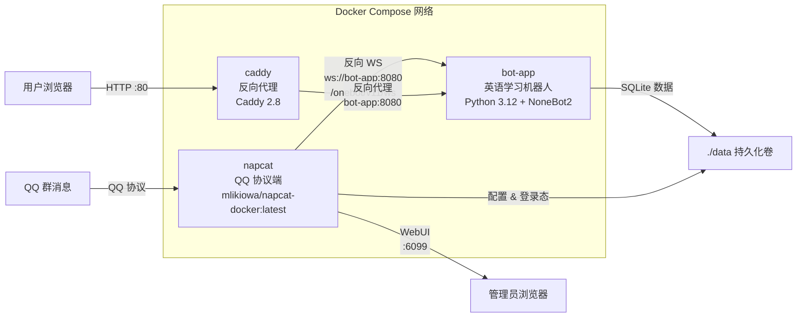
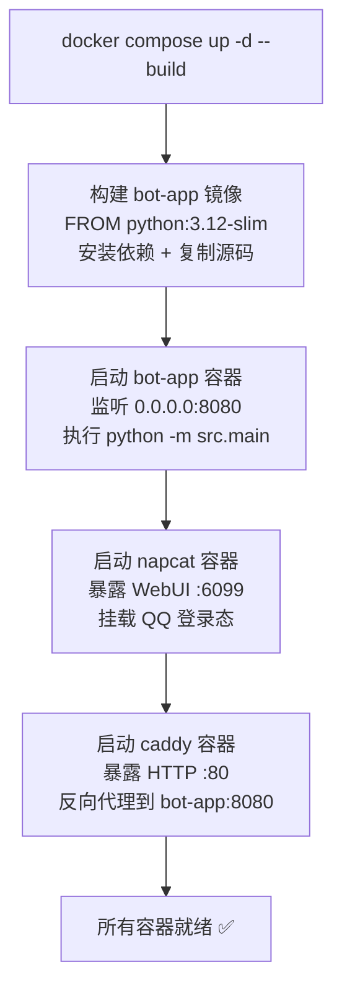
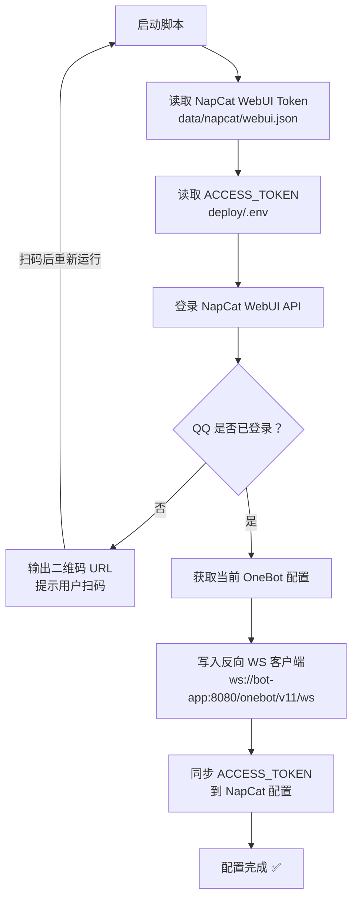
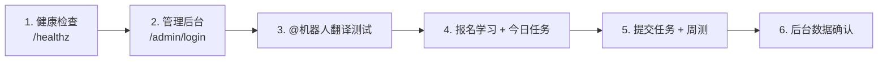
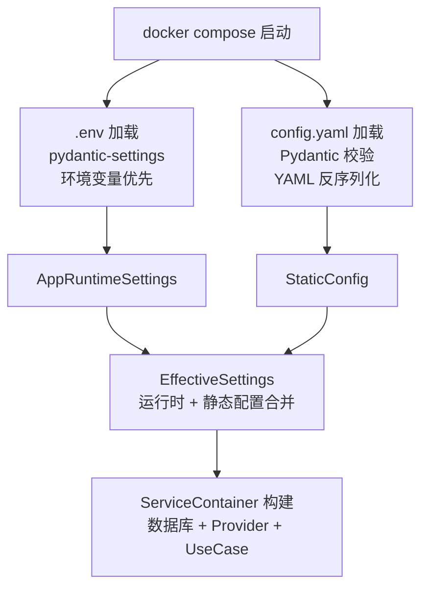

本文档面向初次部署的开发者，完整介绍如何通过 Docker Compose 一键启动英语学习 QQ 机器人，并将其与 NapCat（QQ 协议端）通过 OneBot v11 反向 WebSocket 协议完成对接。你将了解部署架构的三容器协作原理、配置文件的每一项含义，以及从零到机器人上线运行的全套操作步骤。

## 部署架构总览

整个部署方案由三个 Docker 容器组成，它们在同一个 Docker Compose 网络内协同工作：



**三个容器各司其职**：`bot-app` 是核心机器人服务（NoneBot2 + FastAPI），监听 8080 端口等待 OneBot WebSocket 连接；`napcat` 负责与腾讯 QQ 服务器通信，将群消息转化为 OneBot v11 标准事件后通过反向 WebSocket 推送给机器人；`caddy` 作为反向代理对外暴露 HTTP 端口，将管理后台和健康检查请求转发给 bot-app。

Sources: [docker-compose.yml](deploy/docker-compose.yml#L1-L48), [Dockerfile](deploy/Dockerfile#L1-L22), [Caddyfile](deploy/Caddyfile#L1-L21)

## 部署文件结构

所有部署相关文件集中在 `deploy/` 目录下，与源代码解耦：

```
deploy/
├── .env.example          # 环境变量模板（密钥、端口、API 凭证）
├── config.example.yaml   # 静态配置模板（群号、调度、学习参数）
├── Dockerfile            # bot-app 镜像构建文件
├── docker-compose.yml    # 三容器编排定义
├── Caddyfile             # Caddy 反向代理路由规则
└── DEPLOY.md             # 原始部署说明
```

运行时会在项目根目录生成 `data/` 目录用于持久化：

```
data/                         # Docker 卷挂载点
├── english_bot.sqlite3       # 机器人数据库
├── napcat/                   # NapCat WebUI 配置
├── napcat-qq/                # QQ 登录态（避免重复扫码）
└── napcat-cache/             # 二维码缓存与临时文件
```

Sources: [docker-compose.yml](deploy/docker-compose.yml#L10-L12), [docker-compose.yml](deploy/docker-compose.yml#L29-L31)

## 第一步：准备配置文件

在 `deploy/` 目录下复制模板文件：

```bash
cd deploy
cp .env.example .env
cp config.example.yaml config.yaml
```

### 环境变量 `.env` 详解

`.env` 文件承载运行时配置，包括密钥、端口、API 凭证等敏感或环境相关的参数。下表列出所有配置项及其用途：

| 变量名 | 默认值 | 说明 |
|--------|--------|------|
| `SECRET_KEY` | `replace-with-a-long-random-string` | 管理 Session 加密密钥，**必须替换为随机字符串** |
| `ACCESS_TOKEN` | `replace-with-onebot-access-token` | OneBot WebSocket 鉴权令牌，NapCat 侧需保持一致 |
| `ADMIN_USERNAME` | `admin` | 管理后台登录用户名 |
| `ADMIN_PASSWORD` | `replace-with-admin-password` | 管理后台登录密码 |
| `DATABASE_URL` | `sqlite+aiosqlite:///./data/english_bot.sqlite3` | SQLite 数据库路径，一般无需修改 |
| `HOST` / `PORT` | `0.0.0.0` / `8080` | bot-app 监听地址和端口 |
| `TENCENT_TRANSLATE_SECRET_ID` | 空 | 腾讯云翻译 API 密钥 ID |
| `TENCENT_TRANSLATE_SECRET_KEY` | 空 | 腾讯云翻译 API 密钥 |
| `LLM_API_KEY` | 空 | OpenAI 兼容大模型 API Key |
| `LLM_BASE_URL` | `https://api.openai.com/v1` | 大模型 API 地址 |
| `LLM_MODEL` | `gpt-4o-mini` | 大模型名称 |
| `CADDY_HTTP_PORT` | `80` | Caddy 对外暴露的 HTTP 端口 |
| `NAPCAT_WEBUI_PORT` | `6099` | NapCat WebUI 端口 |
| `NAPCAT_UID` / `NAPCAT_GID` | `1000` | NapCat 容器内用户/组 ID |

生成随机 `SECRET_KEY` 的快捷命令：

```bash
python3 -c "import secrets; print(secrets.token_urlsafe(32))"
```

Sources: [.env.example](deploy/.env.example#L1-L22), [models.py](src/infrastructure/settings/models.py#L10-L36)

### 静态配置 `config.yaml` 详解

`config.yaml` 管理机器人的业务参数，与运行时环境无关。下表按分区列出关键字段：

| 配置分区 | 关键字段 | 说明 |
|----------|----------|------|
| `bot` | `enabled_group_ids` | 允许机器人工作的 QQ 群号列表 |
| `bot` | `admin_group_ids` | 接收管理通知的 QQ 群号 |
| `scheduler` | `daily_push_cron` | 每日任务推送时间（默认早 8 点） |
| `scheduler` | `weekly_report_cron` | 周报推送时间（默认周一早 9 点） |
| `scheduler` | `weekly_quiz_cron` | 周测推送时间（默认周日晚 7 点） |
| `learning` | `beginner_threshold` | 新手到中级的经验值阈值 |
| `learning` | `weekly_quiz_question_count` | 周测题目数量 |
| `message` | `render_mode` | 消息渲染模式（`hybrid`/`text`） |
| `message` | `public_base_url` | 卡片链接的公网基地址 |

**首次部署建议**：先只填一个测试群号到 `enabled_group_ids` 和 `admin_group_ids`，完成联调后再逐步扩展。

Sources: [config.example.yaml](deploy/config.example.yaml#L1-L43), [models.py](src/infrastructure/settings/models.py#L38-L95)

## 第二步：构建并启动服务

在 `deploy/` 目录下执行：

```bash
docker compose up -d --build
```

这条命令会依次完成以下动作：



启动后检查容器状态和日志：

```bash
docker compose ps
docker compose logs -f bot-app
```

**bot-app 的启动流程**在代码层面是这样的：NoneBot2 以 FastAPI 驱动模式初始化，注册 OneBot v11 适配器，然后通过 `src.main` 中的 startup 事件触发 `ensure_container()` 构建依赖注入容器——这会初始化 SQLite 数据库（自动建表）、实例化所有 Provider 和 UseCase，最后加载定时任务调度器。整个过程约 20 秒内完成。

Sources: [Dockerfile](deploy/Dockerfile#L1-L22), [docker-compose.yml](deploy/docker-compose.yml#L2-L20), [main.py](src/main.py#L29-L55), [container.py](src/infrastructure/settings/container.py#L61-L65)

## 第三步：配置 NapCat 对接

NapCat 是 QQ 协议的实现端，它通过 **OneBot v11 反向 WebSocket** 将 QQ 消息推送给机器人。这一步是整个部署中最关键的对环节。

### 方式一：自动配置脚本（推荐）

项目提供了 `configure_napcat_ws.py` 脚本，可自动完成 NapCat 的反向 WebSocket 配置：

```bash
uv run python scripts/configure_napcat_ws.py --refresh-qr
```

脚本的执行逻辑如下：



脚本的核心参数：

| 参数 | 默认值 | 说明 |
|------|--------|------|
| `--base-url` | `http://127.0.0.1:6099` | NapCat WebUI 地址 |
| `--name` | `english-bot-local` | 网络配置名称 |
| `--url` | `ws://bot-app:8080/onebot/v11/ws` | 反向 WebSocket 地址 |
| `--message-post-format` | `array` | 消息格式（`array` 或 `string`） |
| `--heart-interval` | `30000` | 心跳间隔（毫秒） |
| `--reconnect-interval` | `30000` | 重连间隔（毫秒） |
| `--refresh-qr` | 关闭 | 未登录时刷新二维码 |
| `--debug` | 关闭 | 启用调试模式 |

**首次使用流程**：第一次运行时 QQ 尚未登录，脚本会输出二维码 URL。用手机 QQ 扫码登录后，再次运行脚本即可自动写入配置。

Sources: [configure_napcat_ws.py](scripts/configure_napcat_ws.py#L74-L109), [configure_napcat_ws.py](scripts/configure_napcat_ws.py#L128-L174)

### 方式二：手动配置 WebUI

如果自动脚本不可用，也可以通过 NapCat WebUI 手动操作：

1. 访问 `http://<服务器IP>:6099` 打开 NapCat WebUI
2. 完成 QQ 扫码登录
3. 进入「OneBot 网络配置」页面
4. 新增一个**反向 WebSocket 客户端**，填写：

| 配置项 | 值 |
|--------|-----|
| 名称 | `english-bot-local` |
| 连接地址 | `ws://bot-app:8080/onebot/v11/ws` |
| 访问令牌 | 与 `.env` 中 `ACCESS_TOKEN` 保持一致 |
| 消息格式 | `array` |
| 心跳间隔 | `30000` |

**关键提醒**：连接地址必须使用 Docker 内部域名 `bot-app`，因为 NapCat 和机器人在同一个 Compose 网络中。如果 NapCat 部署在独立机器上，则应改为机器人的公网可达地址。

Sources: [DEPLOY.md](deploy/DEPLOY.md#L86-L118)

## 第四步：验证服务

服务启动后，按以下顺序逐项验证：



**验证清单**：

| 检查项 | 访问方式 | 预期结果 |
|--------|----------|----------|
| 机器人健康检查 | `http://<IP>/healthz` | 返回 200 OK |
| 就绪检查 | `http://<IP>/readyz` | 返回 200 OK |
| 管理后台 | `http://<IP>/admin/login` | 显示登录页面 |
| QQ 翻译 | 在群内 `@机器人 你好` | 返回英文翻译 |
| QQ 纠错 | `@机器人 I is a student` | 返回纠错结果 |
| 命令系统 | 发送 `报名学习` | 注册成功提示 |
| 定时任务 | 查看后台仪表盘 | 任务/周测数据已入库 |

Sources: [Caddyfile](deploy/Caddyfile#L1-L21), [DEPLOY.md](deploy/DEPLOY.md#L120-L139)

## 配置体系在 Docker 环境中的加载机制

理解配置加载机制有助于排查启动问题。机器人采用**双层配置体系**：

- **运行时配置**（`AppRuntimeSettings`）：从 `.env` 文件加载，通过 `pydantic-settings` 自动读取环境变量，覆盖密钥、端口、API 凭证等
- **静态配置**（`StaticConfig`）：从 `config.yaml` 加载，通过 Pydantic 模型校验，覆盖群号、调度时间、学习参数等



在 Docker 环境中，`docker-compose.yml` 通过卷挂载将配置文件注入容器：`.env` 通过 `env_file` 指令加载，`config.yaml` 通过只读卷挂载到 `/app/config.yaml`。

Sources: [docker-compose.yml](deploy/docker-compose.yml#L8-L12), [loader.py](src/infrastructure/settings/loader.py#L14-L32), [models.py](src/infrastructure/settings/models.py#L97-L108), [main.py](src/main.py#L18-L34)

## 持久化与数据安全

三个容器的数据通过 Docker 卷挂载到宿主机 `data/` 目录，确保容器重启后数据不丢失：

| 容器内路径 | 宿主机路径 | 内容 |
|------------|------------|------|
| `/app/data` | `./data` | SQLite 数据库、机器人运行数据 |
| `/app/napcat/config` | `./data/napcat` | NapCat WebUI 配置文件 |
| `/app/.config/QQ` | `./data/napcat-qq` | QQ 登录态，避免每次重启都扫码 |
| `/app/napcat/cache` | `./data/napcat-cache` | 二维码缓存 |

其中 `config.yaml` 以只读模式（`:ro`）挂载，防止容器内进程意外修改配置。

Sources: [docker-compose.yml](deploy/docker-compose.yml#L10-L12), [docker-compose.yml](deploy/docker-compose.yml#L29-L31)

## 常见问题排查

| 症状 | 可能原因 | 排查方法 |
|------|----------|----------|
| NapCat 连不上机器人 | WS 地址或 Token 不一致 | 检查反向 WS 地址是否为 `ws://bot-app:8080/onebot/v11/ws`，Token 是否与 `.env` 中 `ACCESS_TOKEN` 一致 |
| 群里没回复 | 群号未配置 / QQ 未登录 | 确认 `config.yaml` 中 `enabled_group_ids` 包含目标群号；检查 NapCat WebUI 中 QQ 登录状态 |
| 管理后台能打开但翻译不工作 | API 密钥未配置 | 检查 `.env` 中 `TENCENT_TRANSLATE_SECRET_*` 和 `LLM_API_KEY` 是否已填写 |
| 容器启动后立即退出 | 数据库初始化失败 | 执行 `docker compose logs -f bot-app` 查看错误日志 |
| 健康检查失败 | 容器未完全启动 | 等待 20 秒 start_period 后重试，或检查 8080 端口是否被占用 |

日志查看的常用命令：

```bash
# 查看所有容器日志
docker compose logs -f

# 只看机器人日志
docker compose logs -f bot-app

# 同时查看机器人和 NapCat 日志（排查连接问题）
docker compose logs -f bot-app napcat
```

Sources: [DEPLOY.md](deploy/DEPLOY.md#L140-L171)

## 生产环境安全建议

当前部署方案使用**公网 IP + HTTP**，适合开发调试和试点联调。正式上线前建议完成以下加固：

1. **配置 HTTPS**：为 Caddy 添加域名和 TLS 证书，将 `Caddyfile` 中的 `:80` 替换为你的域名
2. **限制管理后台访问**：通过防火墙规则或 Caddy 的 `remote_ip` 指令限制 `/admin*` 路径的访问来源
3. **更换强密钥**：确保 `SECRET_KEY`、`ACCESS_TOKEN`、`ADMIN_PASSWORD` 均为高强度随机值
4. **定期备份**：`data/english_bot.sqlite3` 是唯一的数据文件，建议设置 cron 定时备份

Sources: [DEPLOY.md](deploy/DEPLOY.md#L172-L180)

## 下一步

部署完成后，你可以继续阅读以下页面深入了解系统：

- [管理后台与联调调试页](4-guan-li-hou-tai-yu-lian-diao-diao-shi-ye) — 了解管理后台仪表盘和运行时配置的功能细节
- [整体架构：Clean Architecture 四层分层](5-zheng-ti-jia-gou-clean-architecture-si-ceng-fen-ceng) — 理解机器人从基础设施层到领域层的完整架构设计
- [双层配置体系：运行时配置与静态配置](13-shuang-ceng-pei-zhi-ti-xi-yun-xing-shi-pei-zhi-yu-jing-tai-pei-zhi) — 深入理解本页提到的双层配置加载机制