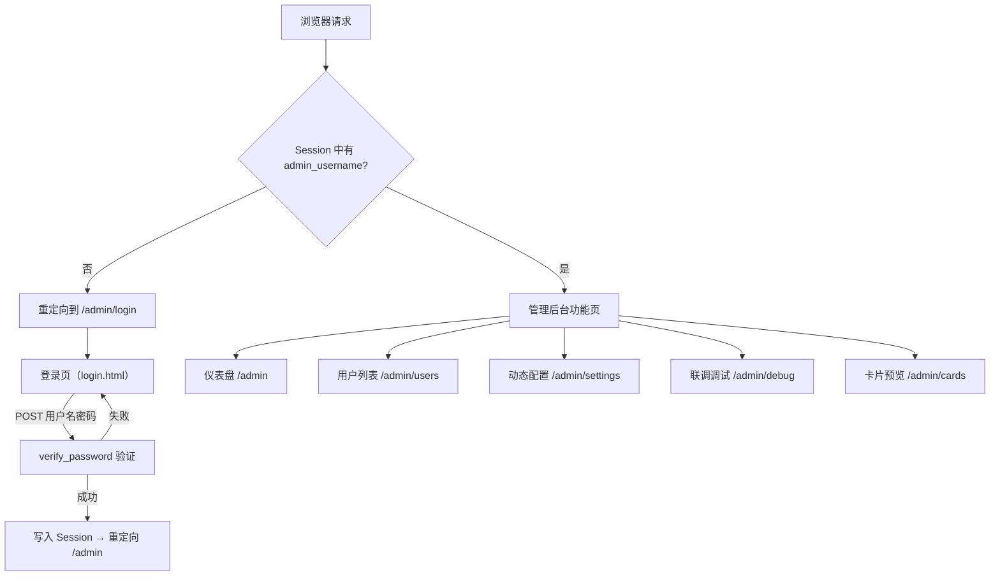
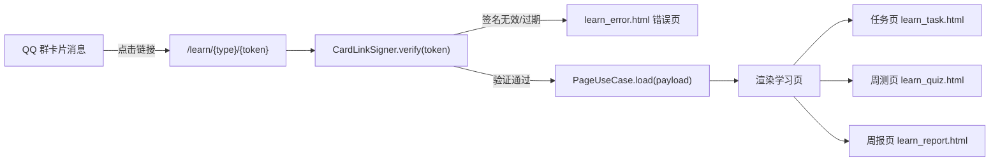

本文介绍 English Bot 的 **Web 管理后台**和**联调调试页**——它们是开发者在本地调试、运维巡检和问题排查时的核心入口。管理后台基于 FastAPI 内嵌的 Jinja2 模板渲染，提供了仪表盘、用户管理、运行时配置修改、消息模拟调试和卡片预览五大功能模块；同时还有一套面向 QQ 用户的**免登录签名学习页**（任务、周测、周报），由管理后台的同一路由文件统一托管。阅读本文后，你将清楚管理后台能做什么、如何访问、以及它在整个系统中的定位。

Sources: [routes.py](src/admin/routes.py#L1-L19), [main.py](src/main.py#L40-L44)

## 整体架构：路由、模板与会话鉴权

管理后台不是独立服务，而是作为 FastAPI `APIRouter` 挂载在 NoneBot 的 FastAPI 驱动之上。NoneBot 框架本身使用 `~fastapi` 驱动模式，在启动时直接暴露一个 FastAPI 应用实例（`app = driver.server_app`），管理后台的路由（`admin_router`）通过 `app.include_router(admin_router)` 注册到同一进程中，与 NoneBot 的 OneBot 消息处理共存。

下面的 Mermaid 图展示了管理后台的路由注册与请求处理流程。**前置知识**：Mermaid 是一种从文本生成流程图的标记语言，`flowchart` 表示流程图，`TD` 表示从上到下排列。



**会话鉴权机制**非常简洁：使用 Starlette 的 `SessionMiddleware`（在 [main.py](src/main.py#L42) 中注册），以 `SECRET_KEY` 环境变量作为签名密钥。每个需要鉴权的路由处理函数都通过 `_current_admin(request)` 检查 `request.session` 中是否存在 `admin_username` 键；不存在则 303 重定向到登录页。密码验证使用 `passlib` 的 `pbkdf2_sha256` 哈希方案，管理员账户在容器初始化时自动 bootstrap（确保存在）。

Sources: [main.py](src/main.py#L29-L44), [routes.py](src/admin/routes.py#L22-L29), [security.py](src/infrastructure/auth/security.py#L1-L15), [container.py](src/infrastructure/settings/container.py#L154-L160)

## 管理后台五大功能页

管理后台的侧边栏导航定义在 `base.html` 中，包含六个入口（仪表盘、用户、动态配置、联调调试、卡片预览、退出），下面逐一说明。

Sources: [base.html](src/admin/templates/base.html#L10-L26)

### 仪表盘（/admin）

仪表盘是管理后台的首页，展示两类信息：

| 区域 | 数据来源 | 说明 |
|------|---------|------|
| **指标卡片** | `LearningRepository.get_dashboard_metrics()` | 展示用户数、消息数、任务完成数等核心统计 |
| **手动触发按钮** | 直接调用 [scheduler.py](src/plugins/scheduler.py) 中的异步函数 | 可即时触发「每日内容推送」「周报生成」「周测生成」三个定时任务 |
| **最近任务执行表** | `AdminRepository.list_recent_jobs()` | 显示最近执行的定时任务名称、业务键、状态和开始时间 |

手动触发的实现值得注意：它直接 import 并 `await` 调用 `scheduler.py` 中定义的 `daily_push_job`、`weekly_report_job`、`weekly_quiz_job` 等异步函数，而非通过 APScheduler 调度。这意味着在仪表盘触发任务时，任务是在当前请求的协程中同步执行的。

Sources: [routes.py](src/admin/routes.py#L98-L112), [routes.py](src/admin/routes.py#L158-L181), [dashboard.html](src/admin/templates/dashboard.html#L1-L58)

### 用户列表（/admin/users）

用户列表页从 `AdminRepository.list_users()` 获取所有已注册用户，以表格形式展示 QQ 号、昵称、加入时间和最近活跃时间。这是一个只读页面，不提供编辑或删除操作。

Sources: [routes.py](src/admin/routes.py#L115-L125), [users.html](src/admin/templates/users.html#L1-L31)

### 动态配置（/admin/settings）

动态配置页允许管理员**在运行时修改**存储在 SQLite 中的配置项（如群号、cron 表达式等），无需重启服务。页面分为三个区域：

1. **配置写入表单**：输入键值对，POST 提交后调用 `AdminUseCase.update_setting()`，写入完成后立即调用 `register_jobs()` 重新注册 APScheduler 定时任务，确保 cron 变更即时生效。
2. **已存储配置表**：展示数据库中所有运行时配置的键、值和更新时间。
3. **当前生效配置表**：展示 `RuntimeConfigService.effective_settings()` 返回的合并后配置，即静态配置（`config.yaml`）被运行时配置覆盖后的最终结果。

Sources: [routes.py](src/admin/routes.py#L128-L155), [settings.html](src/admin/templates/settings.html#L1-L58), [admin_usecases.py](src/application/admin_usecases.py#L40-L48)

### 联调调试页（/admin/debug）⭐

这是开发阶段**最常用的功能页**。它允许你在不连接 QQ 的情况下，直接测试完整的翻译、纠错和落库链路。调试页的表单提供以下输入字段：

| 字段 | 默认值 | 说明 |
|------|--------|------|
| `message_text` | 空 | 要测试的消息文本（英文或中文均可） |
| `group_id` | 第一个启用的群号 | 模拟的 QQ 群号 |
| `user_id` | `debug-user-1` | 模拟的 QQ 用户 ID |
| `nickname` | `Debugger` | 模拟的昵称 |
| `persist_to_db` | 未勾选 | 是否写入 SQLite 数据库 |

**两种运行模式**是理解调试页的关键：

| 模式 | 触发条件 | 行为 |
|------|---------|------|
| **dry_run_no_db** | 未勾选「写入 SQLite」 | 仅调用语言检测 + 翻译/纠错 Provider，**不落库**，直接展示结果文本 |
| **persist_to_db** | 勾选「写入 SQLite」 | 完整走一遍 `MessageUseCase.handle_at_message()` 链路，**写入 `message_events`、`interaction_results`、`error_points` 三张表**，并展示数据库回执 |

在 `persist_to_db` 模式下，调试页会先记录操作前的数据库行数（`before_counts`），执行完整消息处理后再记录行数（`after_counts`），最后用差值（`delta`）展示本次操作在各表中新增了多少条记录。这个设计让你可以精确验证一次消息处理到底产生了哪些数据。

Sources: [routes.py](src/admin/routes.py#L184-L307), [debug.html](src/admin/templates/debug.html#L1-L61)

### 卡片预览页（/admin/cards）

卡片预览页用于**本地生成和检查** NapCat 卡片消息的完整内容，无需实际发送到 QQ 群。它支持三种卡片类型：

| 卡片类型 | 调用的 UseCase | 生成内容 |
|---------|---------------|---------|
| `task`（今日任务） | `LearningUseCase.get_today_task_envelope()` | 任务文本 + 签名学习页链接 + 卡片 Payload JSON |
| `quiz`（周测） | `QuizUseCase.start_weekly_quiz_envelope()` | 周测文本 + 签名链接 + Payload |
| `report`（周报） | `ReportUseCase.build_weekly_report_envelope()` | 周报摘要 + 签名链接 + Payload |

预览结果展示三个部分：**文本回退**（即纯文本模式下的消息内容）、**学习页链接**（带签名的 URL）、**卡片 Payload**（NapCat JSON 格式，可复制到 NapCat 文档中验证格式）。提交前会自动调用 `LearningUseCase.enroll()` 确保测试用户已注册。

Sources: [routes.py](src/admin/routes.py#L310-L405), [cards.html](src/admin/templates/cards.html#L1-L48)

## 健康检查端点

管理后台同一路由文件中还注册了两个无鉴权的健康检查端点，供负载均衡器或监控工具使用：

| 端点 | 方法 | 说明 |
|------|------|------|
| `/healthz` | GET | 始终返回 `{"status": "ok"}`，表示进程存活 |
| `/readyz` | GET | 尝试初始化 `ServiceContainer`，成功返回 `{"status": "ready"}`，失败返回 503 + 异常类名 |

Sources: [routes.py](src/admin/routes.py#L55-L69)

## 免登录签名学习页

学习页是面向 QQ 用户的**独立页面**，不需要管理员登录。用户通过 QQ 群里的卡片链接（如 `/learn/task/{token}`）访问，`token` 由 `CardLinkSigner` 使用 `itsdangerous.URLSafeSerializer` 签名，包含资源类型、资源 ID、用户 ID、群 ID 和过期时间。



三种学习页的职责如下：

| 学习页 | 路由 | 功能 |
|--------|------|------|
| **任务页** | `/learn/task/{token}` | 展示今日短文和任务列表，支持在线提交任务并获得评分反馈 |
| **周测页** | `/learn/quiz/{token}` | 展示选择题试卷，提交整卷后显示得分 |
| **周报页** | `/learn/report/{token}` | 只读展示本周学习统计（天数、完成率、翻译/纠错次数、等级、积分等） |

学习页使用独立的模板基类 `learn_base.html`（不继承管理后台的 `base.html`），没有侧边栏导航，是一个简洁的单页布局。所有学习页共享同一个错误页面模板 `learn_error.html`，当签名验证失败或资源不存在时，提示用户"回到群里重新获取"。

Sources: [routes.py](src/admin/routes.py#L408-L520), [card_links.py](src/infrastructure/auth/card_links.py#L1-L55), [learn_base.html](src/admin/templates/learn_base.html#L1-L15), [page_usecases.py](src/application/page_usecases.py#L1-L69)

## 访问与登录

管理后台的访问地址为 `http://{host}:{port}/admin`，默认端口 `8080`。首次访问会被重定向到登录页（`/admin/login`），使用管理员账户登录后进入仪表盘。

管理员账户由环境变量控制，在服务启动时自动创建（如果不存在）：

| 环境变量 | 默认值 | 说明 |
|---------|--------|------|
| `ADMIN_USERNAME` | `admin` | 管理员用户名 |
| `ADMIN_PASSWORD` | `admin123` | 管理员密码（**生产环境务必修改**） |
| `SECRET_KEY` | `replace-me` | Session 签名密钥（**生产环境务必替换为随机字符串**） |

本地开发时，这些值来自项目根目录的 `.env` 文件或环境变量；Docker 部署时来自 `deploy/.env` 文件。

Sources: [models.py](src/infrastructure/settings/models.py#L10-L27), [.env.example](deploy/.env.example#L5-L10)

## 目录结构一览

管理后台的所有文件集中在 `src/admin/` 目录下，结构清晰：

```
src/admin/
├── __init__.py              # 包标记文件
├── routes.py                # 所有路由定义（管理页 + 学习页 + 健康检查）
├── static/
│   └── admin.css            # 全局样式（管理后台 + 学习页共用）
└── templates/
    ├── base.html            # 管理后台布局基类（侧边栏 + 主内容区）
    ├── learn_base.html      # 学习页布局基类（无侧边栏）
    ├── login.html           # 登录页（独立页面，不继承 base.html）
    ├── dashboard.html       # 仪表盘
    ├── users.html           # 用户列表
    ├── settings.html        # 动态配置
    ├── debug.html           # 联调调试
    ├── cards.html           # 卡片预览
    ├── learn_task.html      # 任务学习页
    ├── learn_quiz.html      # 周测学习页
    ├── learn_report.html    # 周报学习页
    └── learn_error.html     # 学习页统一错误页
```

Sources: [admin directory](src/admin/routes.py#L1-L1)

## 推荐阅读路线

本文作为快速入门的最后一篇，覆盖了管理后台的全貌。接下来你可以根据兴趣深入不同方向：

- 想了解**为什么管理后台能直接调用定时任务函数**？→ [APScheduler 定时任务注册与执行](20-apscheduler-ding-shi-ren-wu-zhu-ce-yu-zhi-xing)
- 想了解**卡片链接签名的底层实现**？→ [卡片链接签名与过期验证（CardLinkSigner）](18-qia-pian-lian-jie-qian-ming-yu-guo-qi-yan-zheng-cardlinksigner)
- 想了解**管理后台各页面的完整数据流**？→ [FastAPI 管理后台：仪表盘、用户管理与运行时配置](22-fastapi-guan-li-hou-tai-yi-biao-pan-yong-hu-guan-li-yu-yun-xing-shi-pei-zhi) 和 [免登录签名学习页：任务、周测与周报](23-mian-deng-lu-qian-ming-xue-xi-ye-ren-wu-zhou-ce-yu-zhou-bao)
- 准备好理解**整个系统的分层设计**？→ [整体架构：Clean Architecture 四层分层](5-zheng-ti-jia-gou-clean-architecture-si-ceng-fen-ceng)