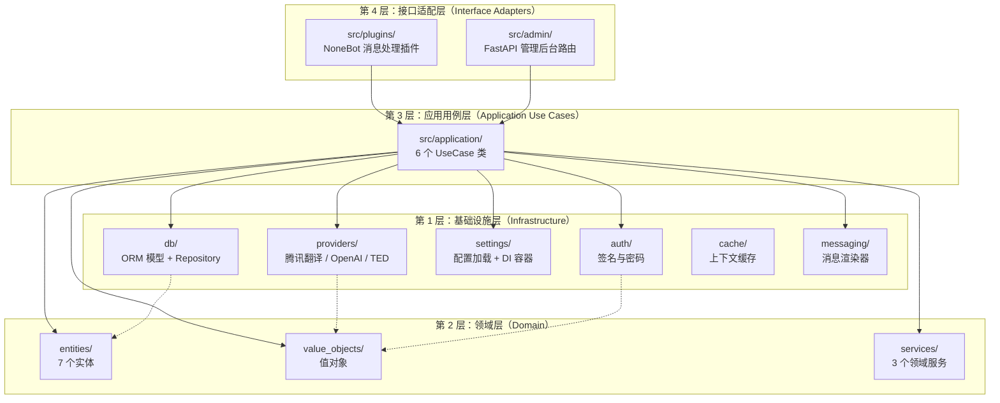
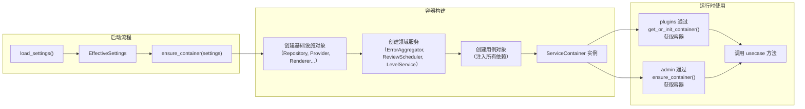
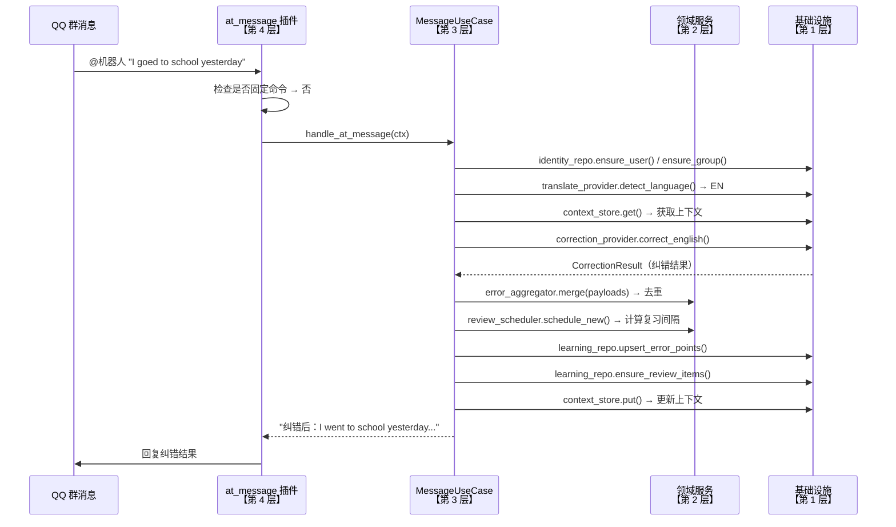

本项目采用 **Clean Architecture** 的核心理念，将代码组织为四个职责明确的层次。这种分层方式让每一层只关心自己的事情：领域层不碰数据库，基础设施层不碰业务逻辑，而插件层只负责接收消息并调用用例。理解这四层结构，是阅读整个代码库的第一步。

Sources: [main.py](src/main.py#L1-L64), [container.py](src/infrastructure/settings/container.py#L1-L56)

## 四层结构总览

下图展示了四层的依赖关系和数据流向。箭头表示"依赖"——外层可以依赖内层，但内层绝不依赖外层。这是 Clean Architecture 最核心的规则。



> **注意**：上图中实线箭头表示直接 import 依赖，虚线箭头表示数据映射关系。本项目的 Application 层直接 import 了 Infrastructure 层的具体类（如 `LearningRepository`、`OpenAICompatibleProvider`），这是一种务实的简化选择——省去了定义抽象接口的开销，代价是 Application 层与 Infrastructure 层存在编译期耦合。详见 [手动依赖注入容器（ServiceContainer）](14-shou-dong-yi-lai-zhu-ru-rong-qi-servicecontainer) 页面中的讨论。

Sources: [container.py](src/infrastructure/settings/container.py#L1-L56), [message_usecases.py](src/application/message_usecases.py#L1-L43)

## 第 2 层：领域层（Domain）

领域层位于 `src/domain/` 目录，是整个系统的**核心**。它定义了与英语学习相关的业务概念，不依赖任何外部库或框架——你可以把它想象成一本"英语学习的规则手册"，只关心业务规则本身。

该层包含三个子目录，分别对应三种领域构造：

| 子目录 | 包含内容 | 关键类/文件 |
|--------|----------|------------|
| `entities/` | **实体**：拥有唯一标识、生命周期独立的业务对象 | `UserProfile`, `ErrorPointEntity`, `ReviewItemEntity`, `QuizSessionEntity` 等 |
| `value_objects/` | **值对象**：没有独立标识、由属性值定义的不可变对象 | `TranslationResult`, `CorrectionResult`, `MessageEnvelope`, `LessonBundle` 等 |
| `services/` | **领域服务**：不属于任何单一实体的业务逻辑 | `ErrorAggregator`, `ReviewScheduler`, `LevelService` |

领域层的设计遵循一个关键原则：**纯 Python，零外部依赖**。实体使用标准 `@dataclass` 而非 ORM 模型，领域服务使用纯算法而非数据库查询。例如 `ReviewScheduler` 的间隔倍增策略——答对间隔翻倍（上限 30 天）、答错重置为 1 天——完全在内存中计算，不涉及任何 I/O 操作。

Sources: [models.py](src/domain/entities/models.py#L1-L79), [learning.py](src/domain/value_objects/learning.py#L1-L84), [messaging.py](src/domain/value_objects/messaging.py#L1-L27), [review.py](src/domain/services/review.py#L1-L51), [leveling.py](src/domain/services/leveling.py#L1-L41), [error_points.py](src/domain/services/error_points.py#L1-L28)

## 第 3 层：应用用例层（Application Use Cases）

应用层位于 `src/application/` 目录，负责**编排**业务流程——它调用领域层的服务完成核心计算，同时调用基础设施层完成数据持久化和外部 API 调用。每个用例类对应一组相关的用户操作。

项目包含以下 6 个用例类：

| 用例类 | 文件 | 职责范围 |
|--------|------|----------|
| `MessageUseCase` | `message_usecases.py` | @机器人 消息处理：语言检测 → 翻译/纠错 → 错误点持久化 → 复习调度 |
| `LearningUseCase` | `learning_usecases.py` | 学习流程：报名、每日任务生成与提交、复习、等级刷新 |
| `QuizUseCase` | `quiz_usecases.py` | 周测：生成题目、提交答案、评分、错题复习调度 |
| `ReportUseCase` | `report_usecases.py` | 周报：汇总统计数据、LLM 生成鼓励语、等级重算 |
| `TaskPageUseCase` / `QuizPageUseCase` / `ReportPageUseCase` | `page_usecases.py` | Web 学习页：加载卡片链接对应的数据并转发到对应用例 |
| `AdminUseCase` | `admin_usecases.py` | 管理后台：仪表盘、用户列表、运行时配置更新 |

用例层最典型的编排模式可以通过 `MessageUseCase.handle_at_message` 方法来理解：它先通过 `IdentityRepository` 确保用户和群组存在，然后通过 `TencentTranslateProvider` 检测语言，再通过 `OpenAICompatibleProvider` 执行纠错或翻译，最后通过 `LearningRepository` 持久化结果。整个流程像一个"指挥官"——自己不干活，但知道让谁干活。

Sources: [message_usecases.py](src/application/message_usecases.py#L25-L139), [learning_usecases.py](src/application/learning_usecases.py#L27-L256), [quiz_usecases.py](src/application/quiz_usecases.py#L15-L200), [report_usecases.py](src/application/report_usecases.py#L15-L185), [page_usecases.py](src/application/page_usecases.py#L23-L156), [admin_usecases.py](src/application/admin_usecases.py#L9-L49)

## 第 1 层：基础设施层（Infrastructure）

基础设施层位于 `src/infrastructure/` 目录，是整个系统的**外围实现**——它处理所有与外部世界的交互，包括数据库读写、API 调用、消息渲染、配置管理等。领域层和用例层只关心"做什么"，基础设施层负责"怎么做"。

该层包含 6 个功能模块：

| 模块 | 路径 | 核心职责 |
|------|------|----------|
| **数据库** | `db/` | SQLAlchemy ORM 模型定义、Repository 数据访问类、会话管理 |
| **Provider** | `providers/` | 腾讯翻译 API 封装、OpenAI 兼容大模型封装、TED RSS 内容抓取 |
| **配置** | `settings/` | 运行时/静态双层配置加载、`ServiceContainer` 依赖注入容器 |
| **认证** | `auth/` | 卡片链接签名与过期验证（`CardLinkSigner`）、管理后台密码哈希 |
| **缓存** | `cache/` | LRU 上下文缓存（`ContextStore`），用于保持对话上下文 |
| **消息** | `messaging/` | 纯文本渲染器、NapCat JSON 卡片渲染器、消息投递服务 |

一个关键的设计细节：Repository 类（如 `LearningRepository`）在方法内部管理数据库会话的创建和提交，而非让调用者传递 session。这种模式让用例层代码更简洁，同时将事务边界封装在 Repository 内部。

Sources: [models.py](src/infrastructure/db/models.py#L1-L200), [session.py](src/infrastructure/db/session.py#L1-L22), [base.py](src/infrastructure/db/base.py#L1-L35), [learning.py](src/infrastructure/db/repositories/learning.py#L32-L56), [identity.py](src/infrastructure/db/repositories/identity.py#L11-L101), [translate_tencent.py](src/infrastructure/providers/translate_tencent.py#L12-L107), [llm_openai.py](src/infrastructure/providers/llm_openai.py#L12-L142), [content_ted.py](src/infrastructure/providers/content_ted.py#L12-L82), [loader.py](src/infrastructure/settings/loader.py#L14-L33), [models.py](src/infrastructure/settings/models.py#L10-L108), [runtime.py](src/infrastructure/settings/runtime.py#L13-L99), [container.py](src/infrastructure/settings/container.py#L61-L187), [card_links.py](src/infrastructure/auth/card_links.py#L11-L55), [context_store.py](src/infrastructure/cache/context_store.py#L13-L37), [renderers.py](src/infrastructure/messaging/renderers.py#L11-L124)

## 第 4 层：接口适配层（Interface Adapters）

接口适配层由两个入口组成，分别对应两种不同的用户交互方式：

**NoneBot 插件**（`src/plugins/`）负责处理 QQ 群消息。它包含三个核心文件：

| 文件 | 职责 |
|------|------|
| `at_message.py` | 监听 @机器人 消息，调用 `MessageUseCase` 执行翻译/纠错 |
| `commands.py` | 匹配固定命令文本（如"报名学习"、"今日任务"），分发到对应用例方法 |
| `command_catalog.py` | 维护命令注册表（精确匹配 + 前缀匹配），提供帮助文本渲染 |
| `scheduler.py` | 注册 APScheduler 定时任务，调用用例执行每日推送、周测、周报等 |

**FastAPI 路由**（`src/admin/routes.py`）负责管理后台和学习页。它提供登录/登出、仪表盘、用户管理、运行时配置编辑、调试联调等功能，同时承载了卡片链接对应的 Web 学习页（任务页、答题页、周报页）。

接口层的代码风格非常统一：从 NoneBot 事件或 FastAPI 请求中提取参数，通过 `get_or_init_container()` 获取容器，然后调用对应的用例方法，最后将结果返回给用户。它不做任何业务判断——这些全部委托给用例层。

Sources: [at_message.py](src/plugins/at_message.py#L1-L43), [commands.py](src/plugins/commands.py#L1-L180), [command_catalog.py](src/plugins/command_catalog.py#L1-L51), [scheduler.py](src/plugins/scheduler.py#L1-L55), [routes.py](src/admin/routes.py#L1-L200)

## 依赖注入：ServiceContainer 如何串联四层

四层之间的协作需要一个"组装中心"——这就是 `ServiceContainer`。它在应用启动时（`main.py` 的 `on_startup` 事件中）被创建，负责实例化所有 Repository、Provider、领域服务和用例对象，并将它们注入到需要的地方。



`ServiceContainer` 是一个 `@dataclass`，持有所有服务实例的引用。它被存储为模块级变量 `_container`，通过 `get_or_init_container()` 和 `ensure_container()` 两个函数提供全局访问。这种"手动 DI"模式虽然没有 Spring 那样的自动注入能力，但对于本项目的规模而言足够清晰和可维护。

Sources: [container.py](src/infrastructure/settings/container.py#L31-L212), [main.py](src/main.py#L50-L55), [at_message.py](src/plugins/at_message.py#L18), [routes.py](src/admin/routes.py#L26-L28)

## 一条消息的完整旅程

让我们用一条具体的消息来串联四层的工作流程。当用户在 QQ 群里 @机器人 发送一句英文时：



这条消息的旅程从第 4 层（插件）进入，经第 3 层（用例）编排，调用第 2 层（领域服务）做去重和复习调度计算，最终通过第 1 层（基础设施）与数据库和外部 API 交互。每一层只做自己该做的事，层次之间通过方法调用和数据传递协作。

Sources: [at_message.py](src/plugins/at_message.py#L16-L42), [message_usecases.py](src/application/message_usecases.py#L45-L96), [error_points.py](src/domain/services/error_points.py#L8-L27), [review.py](src/domain/services/review.py#L15-L49)

## 四层目录结构速查

```
src/
├── domain/                        ← 第 2 层：领域层（零外部依赖）
│   ├── entities/
│   │   └── models.py              # UserProfile, ErrorPointEntity, ReviewItemEntity...
│   ├── services/
│   │   ├── error_points.py        # ErrorAggregator（错误点去重签名）
│   │   ├── leveling.py            # LevelService（用户分级评估）
│   │   └── review.py              # ReviewScheduler（间隔复习调度）
│   └── value_objects/
│       ├── learning.py            # TranslationResult, CorrectionResult, LessonBundle...
│       └── messaging.py           # MessageEnvelope, CardLinkPayload
│
├── application/                   ← 第 3 层：应用用例层
│   ├── admin_usecases.py          # AdminUseCase
│   ├── learning_usecases.py       # LearningUseCase（报名/任务/复习/等级）
│   ├── message_usecases.py        # MessageUseCase（@消息翻译/纠错）
│   ├── page_usecases.py           # TaskPage/QuizPage/ReportPage 用例
│   ├── quiz_usecases.py           # QuizUseCase（周测生成/提交/评分）
│   └── report_usecases.py         # ReportUseCase（周报生成）
│
├── infrastructure/                ← 第 1 层：基础设施层
│   ├── auth/
│   │   ├── card_links.py          # CardLinkSigner（卡片链接签名验证）
│   │   └── security.py            # 密码哈希与校验
│   ├── cache/
│   │   └── context_store.py       # ContextStore（LRU 对话上下文缓存）
│   ├── db/
│   │   ├── base.py                # SQLAlchemy Base + TimestampMixin
│   │   ├── models.py              # 18 张表的 ORM 模型定义
│   │   ├── repositories/
│   │   │   ├── admin.py           # AdminRepository
│   │   │   ├── identity.py        # IdentityRepository（用户/群组/报名）
│   │   │   └── learning.py        # LearningRepository（学习数据全面操作）
│   │   └── session.py             # Engine / SessionFactory / init_db
│   ├── messaging/
│   │   └── renderers.py           # PlainTextRenderer / NapCatCardRenderer / MessageDeliveryService
│   ├── providers/
│   │   ├── content_ted.py         # TedContentProvider（RSS 抓取 + 回退短文）
│   │   ├── llm_openai.py          # OpenAICompatibleProvider（纠错/翻译优化/反馈生成）
│   │   └── translate_tencent.py   # TencentTranslateProvider（语言检测 + 翻译）
│   └── settings/
│       ├── container.py           # ServiceContainer（手动 DI 容器）
│       ├── loader.py              # load_settings()（双层配置加载）
│       ├── models.py              # AppRuntimeSettings / StaticConfig / EffectiveSettings
│       └── runtime.py             # RuntimeConfigService（运行时配置热更新）
│
├── plugins/                       ← 第 4 层：接口适配层（NoneBot 插件）
│   ├── at_message.py              # @机器人 消息处理
│   ├── command_catalog.py         # 命令注册表
│   ├── commands.py                # 固定命令分发
│   └── scheduler.py               # APScheduler 定时任务
│
├── admin/                         ← 第 4 层：接口适配层（FastAPI 路由）
│   ├── routes.py                  # 管理后台 + 学习页路由
│   ├── static/                    # 静态资源
│   └── templates/                 # Jinja2 HTML 模板
│
└── main.py                        # 应用入口：初始化 NoneBot + FastAPI
```

Sources: [目录结构](src/)

## 下一步阅读建议

理解了四层分层的整体结构后，建议按以下顺序深入各层细节：

1. **消息处理流程**：从用户视角出发，先看消息如何从 QQ 进入系统——[@机器人 消息处理流程：语言检测、翻译与纠错](6-atji-qi-ren-xiao-xi-chu-li-liu-cheng-yu-yan-jian-ce-fan-yi-yu-jiu-cuo)
2. **命令系统**：了解固定命令的注册与分发——[固定命令注册与分发机制](7-gu-ding-ming-ling-zhu-ce-yu-fen-fa-ji-zhi)
3. **领域模型**：深入领域层的实体和值对象设计——[领域实体与值对象设计](9-ling-yu-shi-ti-yu-zhi-dui-xiang-she-ji)
4. **依赖注入**：理解容器如何串联四层——[手动依赖注入容器（ServiceContainer）](14-shou-dong-yi-lai-zhu-ru-rong-qi-servicecontainer)