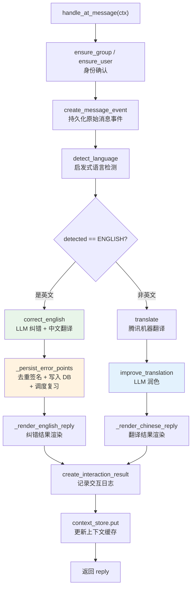

当用户在 QQ 群中 @机器人 并发送一段自由文本时，系统需要判断这段文字的语言方向——是英文需要纠错，还是中文需要翻译成英文——然后调度相应的 Provider 完成处理，最后将结构化结果渲染为可读的回复消息。本文档深入剖析这条端到端消息处理管线的每一个环节：入口路由与过滤、语言检测策略、英文纠错与错误点持久化、中文翻译与润色、上下文缓存机制，以及最终结果渲染。理解这条管线是把握整个 [整体架构：Clean Architecture 四层分层](5-zheng-ti-jia-gou-clean-architecture-si-ceng-fen-ceng) 中"应用层编排"思想的关键入口。

Sources: [at_message.py](src/plugins/at_message.py#L1-L43), [message_usecases.py](src/application/message_usecases.py#L1-L140)

## 入口路由：@机器人 触发与前置过滤

@机器人 消息的入口是 NoneBot2 的 `on_message` 匹配器，通过 `rule=to_me()` 规则限定仅当群消息中 @机器人 时才触发。该匹配器以 `priority=10, block=True` 注册，确保被匹配后不再向低优先级处理器传递事件。触发后执行 `handle_at_message` 函数，该函数在业务处理前完成三道前置过滤：

**群白名单校验**——从 `ServiceContainer` 的运行时配置中读取 `enabled_group_ids()`，若配置了白名单且当前群不在其中，直接静默返回，不做任何响应。**空消息兜底**——如果 @机器人 后没有附带任何文本（例如仅 @ 而不说话），返回一段引导提示。**命令分流**——调用 `is_fixed_command_text()` 检查消息是否命中学习系统固定命令（如"报名学习""今日任务"等），如果命中则引导用户直接发送命令而非 @机器人，并附带帮助文本。

通过三道过滤后，函数构造一个 `MessageCommandContext` 数据对象，包含消息 ID、群 ID、用户 ID、昵称和清洗后的文本，然后委托给应用层的 `MessageUseCase.handle_at_message()` 方法执行核心逻辑。

Sources: [at_message.py](src/plugins/at_message.py#L13-L43), [command_catalog.py](src/plugins/command_catalog.py#L1-L51)

## 核心处理管线总览

进入 `MessageUseCase.handle_at_message()` 后，处理流程按照以下管线顺序执行，每个阶段职责清晰、边界分明：



Sources: [message_usecases.py](src/application/message_usecases.py#L45-L96)

### 阶段一：身份确认与事件记录

管线前两步是纯数据库写操作。首先通过 `IdentityRepository` 的 `ensure_group` 和 `ensure_user` 方法确保群和用户实体存在（若不存在则自动创建），拿到内部整数主键 `group.id` 和 `user.id`。随后调用 `LearningRepository.create_message_event` 将这条原始消息以 `event_type="at_message"` 写入 `message_events` 表，获取自增的 `event.id`，供后续交互记录关联使用。这种"先写原始事件、再写处理结果"的设计确保了即使后续处理失败，原始消息也已被记录。

Sources: [message_usecases.py](src/application/message_usecases.py#L46-L54), [learning.py](src/infrastructure/db/repositories/learning.py#L36-L56)

### 阶段二：启发式语言检测

语言检测由 `TencentTranslateProvider.detect_language()` 完成，但它并不调用腾讯 API，而是采用**纯本地的启发式正则匹配**策略。具体规则如下表所示：

| 检测规则 | 正则表达式 | 返回值 | 优先级 |
|---------|-----------|--------|-------|
| 包含中文字符 | `[\u4e00-\u9fff]` | `LanguageType.CHINESE` | 最高 |
| 包含英文字母 | `[A-Za-z]` | `LanguageType.ENGLISH` | 次高 |
| 均不匹配 | — | `LanguageType.UNKNOWN` | 兜底 |

关键设计决策：**中文字符优先级高于英文字母**。这意味着像"你好，world"这样中英混排的文本会被判定为中文，进入翻译流程而非纠错流程。`LanguageType` 是一个继承自 `str` 和 `Enum` 的枚举类型，值分别为 `"en"`、`"zh"`、`"unknown"`，方便直接传递给腾讯翻译 API 的 `Source`/`Target` 参数。

Sources: [translate_tencent.py](src/infrastructure/providers/translate_tencent.py#L28-L29), [translate_tencent.py](src/infrastructure/providers/translate_tencent.py#L101-L106), [learning.py](src/domain/value_objects/learning.py#L8-L11)

### 阶段三A：英文纠错路径

当 `detected == LanguageType.ENGLISH` 时，系统走纠错路径。此路径同时调用 `OpenAICompatibleProvider.correct_english()`，向兼容 OpenAI Chat Completions 协议的大模型发送纠错请求。

**Prompt 工程**方面，系统 prompt 精确要求模型返回一个包含五个顶层字段的结构化 JSON：`corrected_text`（纠正后文本）、`zh_translation`（中文翻译）、`natural_expression`（更自然表达）、`explanation`（整体说明）以及 `error_points` 数组。每个错误点包含 `error_type`（限定为 tense/article/preposition/word_choice/spelling/expression/grammar/agreement/natural_expression 九种之一）、`source_fragment`、`correct_fragment` 和 `explanation`。User prompt 中携带了上下文缓存内容（如有）和待纠错文本。Temperature 设为 0.2 以获取稳定输出。

**降级容错**方面，当 `api_key`、`base_url`、`model` 任一为空时，`correct_english` 不发网络请求，直接返回本地 mock 结果——原样回传输入文本，并附带说明"未配置 OpenAI 兼容模型接口"。这使得开发和测试环境无需真实 LLM 即可运行。

**重试机制**方面，通过 `tenacity` 库配置了 `stop_after_attempt(2)` 和 `wait_fixed(1)` 策略，即最多重试 1 次，每次间隔 1 秒。

Sources: [message_usecases.py](src/application/message_usecases.py#L59-L63), [llm_openai.py](src/infrastructure/providers/llm_openai.py#L19-L76)

### 阶段四A：错误点持久化与复习调度

纠错完成后，若 `CorrectionResult.error_points` 非空，系统进入错误点持久化流程 `_persist_error_points`。这是整条管线中最具业务厚度的环节：

**第一步：去重签名**——`ErrorAggregator.merge()` 对所有错误点计算签名（`error_type|source_fragment|correct_fragment` 的拼接小写），相同签名的错误点只保留第一个，消除 LLM 返回中的重复项。

**第二步：Upsert 写入**——`LearningRepository.upsert_error_points()` 对每个错误点在 `error_points` 表中执行查找：如果同一用户、同一群、相同 `error_type + source_fragment + correct_fragment` 组合已存在，则 `frequency += 1` 并更新 `last_seen_at` 和 `explanation`；否则插入新记录。这意味着系统自动追踪用户反复犯同类错误的频次。

**第三步：复习调度**——调用 `ReviewScheduler.schedule_new()` 生成初始复习计划（间隔 1 天，状态 `pending`），然后通过 `ensure_review_items` 为每个错误点创建或找到对应的 `review_items` 记录，将纠错发现与间隔复习系统自动对接。

Sources: [message_usecases.py](src/application/message_usecases.py#L98-L121), [error_points.py](src/domain/services/error_points.py#L1-L28), [learning.py](src/infrastructure/db/repositories/learning.py#L129-L170), [review.py](src/domain/services/review.py#L18-L25)

### 阶段三B：中文翻译路径

当语言检测结果非英文时，系统走翻译路径。这是一个**双阶段管道**：

**第一阶段：机器翻译**——调用 `TencentTranslateProvider.translate()`，将原文翻译为目标语言 `LanguageType.ENGLISH`。翻译方法内部先规范化语言代码（`CHINESE→"zh"`, `ENGLISH→"en"`, `UNKNOWN→"auto"`），然后通过 `asyncio.to_thread` 将同步的腾讯 TMT SDK 调用包装为异步。同样配置了 `tenacity` 重试（最多 3 次，间隔 1 秒），并且在凭证为空时降级为 `[mock:en]` 前缀的本地输出。

**第二阶段：LLM 润色**——调用 `OpenAICompatibleProvider.improve_translation()`，将原始中文、机器翻译基础结果和上下文缓存一并发送给大模型，要求其将基础翻译优化为"更自然的英文"。Temperature 设为 0.3，比纠错的 0.2 略高以允许更多表达灵活性。返回的 `natural_text` 直接作为纯文本使用（非 JSON 解析）。

这种"机器翻译打底 + LLM 润色"的两段式设计兼顾了**速度**（腾讯翻译毫秒级响应）和**质量**（LLM 赋予自然表达力）。

Sources: [message_usecases.py](src/application/message_usecases.py#L64-L79), [translate_tencent.py](src/infrastructure/providers/translate_tencent.py#L31-L62), [llm_openai.py](src/infrastructure/providers/llm_openai.py#L78-L100)

### 阶段五：结果渲染

两种路径最终都进入各自的渲染方法，将结构化数据格式化为用户可读的文本消息：

**英文纠错回复**由 `_render_english_reply` 生成，格式如下：

```
纠错后：
{corrected_text}

中文翻译：
{zh_translation}

说明：{explanation 或 '表达已经比较自然。'}
错误点：
- {error_type}: `{source_fragment}` -> `{correct_fragment}`
  (最多展示前 5 个错误点，无错误点则显示"本次未识别到明显错误")
```

**中文翻译回复**由 `_render_chinese_reply` 生成，格式更加简洁：

```
英文翻译：
{base_translation}

更自然表达：
{natural_text}
```

Sources: [message_usecases.py](src/application/message_usecases.py#L123-L139)

### 阶段六：交互日志与上下文缓存

渲染完成后，管线执行两个收尾操作：

**交互日志记录**——调用 `create_interaction_result` 将 `event_id`、`action_type`（`"english_correction"` 或 `"chinese_translation"`）、`provider` 标识（纠错为 `"openai_compatible"`，翻译为 `"tencent+openai_compatible"`）和完整回复文本写入 `interaction_results` 表，构建完整的消息处理审计链。

**上下文缓存更新**——调用 `ContextStore.put()`，以 `group_id:user_id` 为 key 写入一条摘要（截取用户最近消息和机器人回复前 120 字符），TTL 默认 15 分钟。这是一个进程内的纯字典 LRU 实现，`ConversationContext` 对象包含 `summary` 和 `expires_at` 字段。`get()` 操作在读取时会自动清理过期条目。这条上下文摘要将在同一用户的下一次 @机器人 交互中作为 prompt 的一部分传递给 LLM，使模型能理解多轮对话的连贯语义。

Sources: [message_usecases.py](src/application/message_usecases.py#L81-L96), [context_store.py](src/infrastructure/cache/context_store.py#L1-L37), [learning.py](src/infrastructure/db/repositories/learning.py#L58-L78)

## 依赖注入与 Provider 组装

`MessageUseCase` 通过 [手动依赖注入容器（ServiceContainer）](14-shou-dong-yi-lai-zhu-ru-rong-qi-servicecontainer) 的 `build_container()` 函数组装。它接收七个显式依赖：`identity_repo`、`learning_repo`、`translate_provider`（腾讯翻译）、`correction_provider`（OpenAI 兼容 LLM）、`context_store`、`error_aggregator` 和 `review_scheduler`。所有依赖在容器构建时即已初始化完毕，`handle_at_message` 无需关心底层 Provider 的凭证配置或网络细节，体现了 Clean Architecture 中**应用层仅编排、不关心基础设施**的原则。

Sources: [container.py](src/infrastructure/settings/container.py#L100-L108)

## 两条路径的对比总结

| 维度 | 英文纠错路径 | 中文翻译路径 |
|------|------------|------------|
| 触发条件 | `detected == LanguageType.ENGLISH` | `detected != LanguageType.ENGLISH` |
| 外部 Provider | OpenAI 兼容 LLM（一次调用） | 腾讯翻译 + OpenAI 兼容 LLM（两次调用） |
| LLM Temperature | 0.2（追求精确） | 翻译无 LLM 调用；润色 0.3（略允许创意） |
| 副作用 | 持久化错误点 + 调度复习 | 无额外持久化 |
| action_type | `english_correction` | `chinese_translation` |
| provider 标识 | `openai_compatible` | `tencent+openai_compatible` |
| 回复结构 | 纠错后 + 中文翻译 + 说明 + 错误点列表 | 机器翻译 + 更自然表达 |

Sources: [message_usecases.py](src/application/message_usecases.py#L56-L96)

## 延伸阅读

- [固定命令注册与分发机制](7-gu-ding-ming-ling-zhu-ce-yu-fen-fa-ji-zhi)：了解 @机器人 与直接发送命令的两条入口如何分离
- [Provider 模式：腾讯翻译与 OpenAI 兼容大模型集成](15-provider-mo-shi-teng-xun-fan-yi-yu-openai-jian-rong-da-mo-xing-ji-cheng)：深入两个 Provider 的完整实现细节
- [错误点聚合（ErrorAggregator）与去重签名](10-cuo-wu-dian-ju-he-erroraggregator-yu-qu-zhong-qian-ming)：错误点签名算法与聚合策略详解
- [间隔复习调度（ReviewScheduler）与倍增策略](11-jian-ge-fu-xi-diao-du-reviewscheduler-yu-bei-zeng-ce-lue)：纠错发现的错误点如何自动进入复习周期
- [LRU 上下文缓存（ContextStore）](19-lru-shang-xia-wen-huan-cun-contextstore)：上下文缓存的 TTL 管理与 LRU 淘汰策略