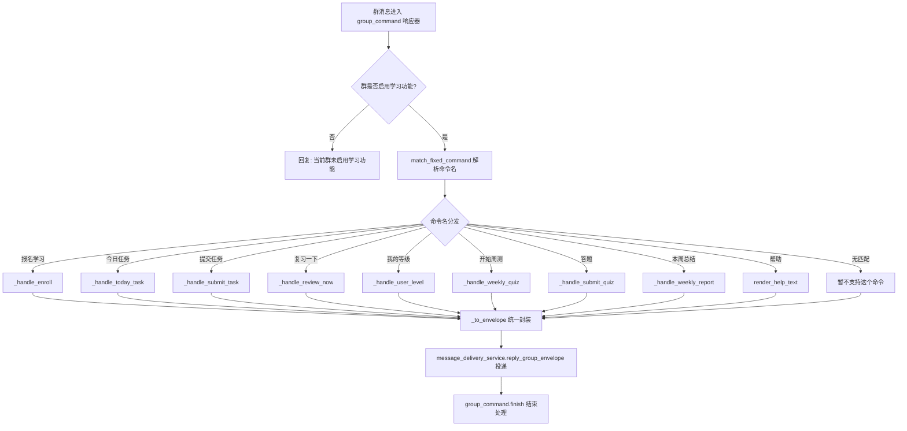
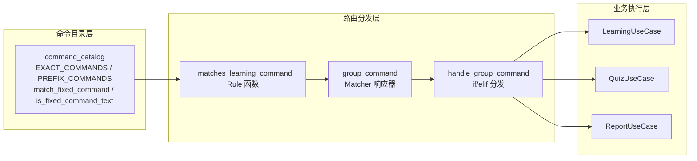

本机器人的消息处理分为两条独立通道：**@机器人触发**的自然语言处理（翻译、纠错等），以及**固定文本命令触发**的学习系统操作（报名、任务、复习等）。本文聚焦后者，深入解析固定命令从注册、匹配到分发的完整机制——由 `command_catalog` 提供声明式命令表，由 `commands` 插件通过 NoneBot2 Rule 机制拦截并路由到对应的应用层用例。

Sources: [command_catalog.py](src/plugins/command_catalog.py#L1-L51), [commands.py](src/plugins/commands.py#L1-L180)

## 命令目录：声明式注册表

`command_catalog` 模块是整个命令系统的"元数据中枢"，它不包含任何业务逻辑，仅以两个元组定义了全部固定命令，并提供三个纯函数完成匹配与校验。

### 两种命令类型

| 类型 | 变量名 | 匹配规则 | 包含命令 |
|------|--------|----------|----------|
| **精确匹配** | `EXACT_COMMANDS` | 纯文本完全相等 | `报名学习`、`今日任务`、`复习一下`、`我的等级`、`开始周测`、`本周总结`、`帮助` |
| **前缀匹配** | `PREFIX_COMMANDS` | 文本以命令开头，后接参数 | `提交任务`、`答题` |

Sources: [command_catalog.py](src/plugins/command_catalog.py#L3-L15)

这种二元分类的设计决策源于用户输入模式的本质差异：**精确命令**（如 `帮助`、`报名学习`）是零参数的触发型指令，用户发送的就是命令本身；**前缀命令**（如 `提交任务 123 我的回答`）则携带动态参数，命令文本只是消息的前缀部分。将两者显式分离，使得匹配逻辑既简洁又高效——精确命令用 O(1) 的集合查找，前缀命令用 O(n) 的线性扫描（n 仅为 2，可忽略）。

Sources: [command_catalog.py](src/plugins/command_catalog.py#L3-L15)

### 三个核心函数

```python
def normalize_command_text(text: str) -> str:    # 仅做 strip()，去除首尾空白
def match_fixed_command(text: str) -> str | None # 返回匹配到的命令名或 None
def is_fixed_command_text(text: str) -> bool     # 布尔包装，供 Rule 使用
```

`match_fixed_command` 的匹配策略遵循"精确优先"原则：先检查完整文本是否属于 `EXACT_COMMANDS`，若不匹配再逐个检查 `PREFIX_COMMANDS` 中的前缀。`is_fixed_command_text` 是对 `match_fixed_command` 的布尔封装，专门用于构造 NoneBot2 的 Rule 函数——Rule 只关心"是否匹配"，不关心"匹配到了什么"。

Sources: [command_catalog.py](src/plugins/command_catalog.py#L18-L33)

### 帮助文本生成

`render_help_text()` 函数返回一份预构建的帮助字符串，列出全部固定命令的用法说明，并在末尾明确告知用户 `@机器人` 仅用于翻译与纠错。这份文本在两处被消费：命令分发处理器中响应 `帮助` 命令，以及 `@机器人` 处理器中引导误用固定命令的用户。

Sources: [command_catalog.py](src/plugins/command_catalog.py#L36-L50)

## 插件注册与拦截机制

固定命令处理器以 NoneBot2 插件形式存在，通过 `main.py` 中的显式 `load_plugin` 调用加载。这种加载方式（而非 NoneBot2 默认的目录扫描）确保了插件的加载顺序可控，且插件间无隐式依赖。

Sources: [main.py](src/main.py#L46-L48)

### Rule 拦截器：精确过滤群消息

```python
def _matches_learning_command(event: Event) -> bool:
    if not isinstance(event, GroupMessageEvent):
        return False
    return is_fixed_command_text(_command_text(event))

group_command = on_message(rule=Rule(_matches_learning_command), priority=5, block=True)
```

`group_command` 是一个 NoneBot2 的**消息响应器（Matcher）**，它通过三个参数精确控制行为：

- **`rule=Rule(_matches_learning_command)`**：自定义 Rule 函数过滤非群消息和非固定命令文本，确保只有群聊中发送的固定命令才会进入处理器。
- **`priority=5`**：优先级数值，数值越小优先级越高。`@机器人` 处理器的优先级为 10，因此固定命令总是先于 `@机器人` 被匹配。
- **`block=True`**：匹配成功后阻断后续低优先级响应器，避免同一条消息被 `@机器人` 处理器二次处理。

Sources: [commands.py](src/plugins/commands.py#L21-L27)

这种优先级设计解决了一个关键场景：当用户 `@机器人` 并发送 `帮助` 时，固定命令响应器（priority=5）优先匹配，而 `@机器人` 响应器（priority=10）因 `block=True` 被阻断。但实际上，`_matches_learning_command` 只匹配 `event.get_plaintext()` 的纯文本内容（不含 @信息），因此 `@机器人 帮助` 的纯文本只有 `帮助`，仍会被固定命令拦截。不过 `at_message` 插件使用了 `to_me()` Rule，它匹配的是"被 @的事件"——而固定命令的 Rule 不检查是否被 @，只检查纯文本内容。这意味着即使是被 @的消息，只要纯文本匹配固定命令，优先级 5 的 `group_command` 也会先被触发并 block 后续处理。

Sources: [commands.py](src/plugins/commands.py#L17-L27), [at_message.py](src/plugins/at_message.py#L13)

### 与 @机器人 处理器的防御协作

`at_message` 插件自身也包含一层防御逻辑：如果用户 `@机器人` 发送的是固定命令文本，它会主动拦截并回复引导信息（"学习系统命令请直接发送，不需要 @机器人"），而非将命令传递给自然语言处理流程。这是双保险设计——即便消息未被固定命令响应器拦截（理论上不会发生），`@机器人` 处理器也不会错误处理固定命令。

Sources: [at_message.py](src/plugins/at_message.py#L26-L30)

## 命令分发：从文本到用例

`handle_group_command` 是固定命令的核心分发函数。它的工作流程可以概括为三步：**权限校验 → 命令匹配 → 用例调用**。



Sources: [commands.py](src/plugins/commands.py#L145-L179)

### 群级权限前置校验

在命令分发之前，处理器首先检查当前群是否在 `enabled_group_ids` 白名单中。如果管理员配置了白名单且当前群不在其中，直接回复"当前群未启用学习功能"并终止。这是一个**快速失败**设计——避免在未授权的群中执行任何数据库查询或 API 调用。

Sources: [commands.py](src/plugins/commands.py#L147-L150)

### 命令到处理函数的映射

分发逻辑采用经典的 `if/elif` 链，每个分支调用一个独立的 `_handle_*` 异步函数。这些处理函数共享统一的结构模式：

1. 通过 `get_or_init_container()` 获取依赖注入容器
2. 从事件中提取 `qq_user_id` 和 `nickname`（通过 `_get_identity` 辅助函数）
3. 调用容器中对应的应用层 UseCase 方法
4. 返回 `str` 或 `MessageEnvelope`

| 命令 | 处理函数 | 调用的 UseCase | 返回类型 |
|------|---------|---------------|---------|
| 报名学习 | `_handle_enroll` | `learning_usecase.enroll` | `str` |
| 今日任务 | `_handle_today_task` | `learning_usecase.get_today_task_envelope` | `MessageEnvelope` |
| 提交任务 | `_handle_submit_task` | `learning_usecase.submit_task` | `str` |
| 复习一下 | `_handle_review_now` | `learning_usecase.review_now` | `str` |
| 我的等级 | `_handle_user_level` | `learning_usecase.refresh_user_level` | `str` |
| 开始周测 | `_handle_weekly_quiz` | `quiz_usecase.start_weekly_quiz_envelope` | `MessageEnvelope` |
| 答题 | `_handle_submit_quiz` | `quiz_usecase.submit_weekly_quiz` | `str` |
| 本周总结 | `_handle_weekly_report` | `report_usecase.build_weekly_report_envelope` | `MessageEnvelope` |
| 帮助 | — | `render_help_text()` | `str` |

Sources: [commands.py](src/plugins/commands.py#L153-L173)

值得注意的是，`提交任务` 和 `答题` 两个前缀命令的处理函数额外接收原始 `text` 参数，在函数内部自行解析参数（如 `text.removeprefix("提交任务").strip()`），而非依赖外部分析器。这种"延迟解析"策略使得参数验证逻辑紧贴业务处理，保持命令目录层的纯粹性。

Sources: [commands.py](src/plugins/commands.py#L62-L77), [commands.py](src/plugins/commands.py#L111-L132)

### 统一投递：MessageEnvelope 适配

所有处理函数的返回值最终都要经过 `_to_envelope` 转换和 `message_delivery_service.reply_group_envelope` 投递。`_to_envelope` 是一个轻量适配器，将纯字符串包装为 `MessageEnvelope(plain_text=message)`，而已经返回 `MessageEnvelope` 的命令（如 `今日任务`、`开始周测`、`本周总结`）则直接透传。这种统一出口设计使得消息投递层只需处理一种数据类型，具体的纯文本/卡片渲染决策由 `MessageDeliveryService` 内部完成。

Sources: [commands.py](src/plugins/commands.py#L30-L33), [commands.py](src/plugins/commands.py#L174-L179)

## 完整命令一览与用户交互格式

下表汇总了用户视角的全部固定命令及其参数格式，供开发者理解命令的预期输入形态。

| 命令 | 格式 | 说明 | 参数说明 |
|------|------|------|---------|
| 报名学习 | `报名学习` | 加入英语训练营 | 无参数 |
| 今日任务 | `今日任务` | 获取当日学习任务 | 无参数 |
| 提交任务 | `提交任务 <ID> <内容>` | 提交指定任务的回答 | ID 为数字，内容为英文文本 |
| 复习一下 | `复习一下` | 触发间隔复习 | 无参数 |
| 我的等级 | `我的等级` | 查询并刷新当前等级 | 无参数 |
| 开始周测 | `开始周测` | 启动周测答题 | 无参数 |
| 答题 | `答题 <试卷ID> 1:A 2:B` | 提交周测答案 | 试卷ID 为数字，答案格式 `序号:选项` |
| 本周总结 | `本周总结` | 生成本周学习报告 | 无参数 |
| 帮助 | `帮助` | 显示全部命令说明 | 无参数 |

Sources: [command_catalog.py](src/plugins/command_catalog.py#L36-L49)

## 架构设计总结

整个固定命令系统遵循**三层分离**原则：**命令目录层**（`command_catalog`）负责声明与匹配，**路由分发层**（`commands` 插件）负责拦截与调度，**业务执行层**（各 UseCase）负责实际逻辑。这种分离使得添加新命令只需三步：在 `command_catalog` 中注册命令文本、在 `commands.py` 中添加 `_handle_*` 函数和 `elif` 分支、在应用层实现对应 UseCase 方法。测试同样三层独立——`test_command_catalog.py` 只验证匹配逻辑，不涉及任何 NoneBot 框架依赖。

Sources: [test_command_catalog.py](tests/test_command_catalog.py#L1-L22)



Sources: [command_catalog.py](src/plugins/command_catalog.py#L1-L51), [commands.py](src/plugins/commands.py#L1-L180)

## 延伸阅读

- 了解 @机器人触发的自然语言处理流程，参见 [@机器人 消息处理流程：语言检测、翻译与纠错](6-atji-qi-ren-xiao-xi-chu-li-liu-cheng-yu-yan-jian-ce-fan-yi-yu-jiu-cuo)
- 了解命令返回值如何被渲染为纯文本或 NapCat 卡片消息，参见 [消息渲染与投递：纯文本与 NapCat 卡片](8-xiao-xi-xuan-ran-yu-tou-di-chun-wen-ben-yu-napcat-qia-pian)
- 了解如何添加新的固定命令，参见 [扩展指南：添加新命令与新 Provider](25-kuo-zhan-zhi-nan-tian-jia-xin-ming-ling-yu-xin-provider)
- 了解依赖注入容器如何为命令处理器提供 UseCase 实例，参见 [手动依赖注入容器（ServiceContainer）](14-shou-dong-yi-lai-zhu-ru-rong-qi-servicecontainer)