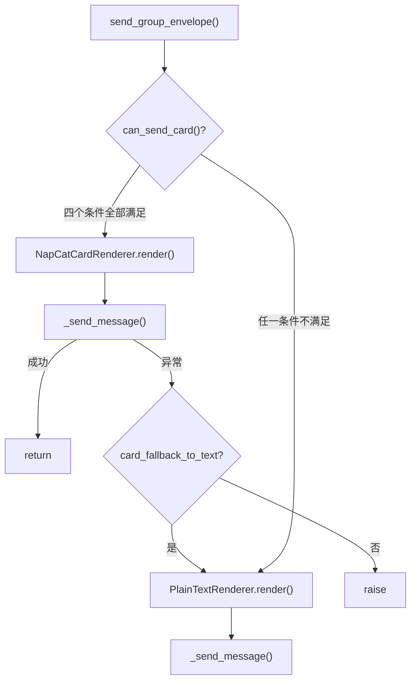
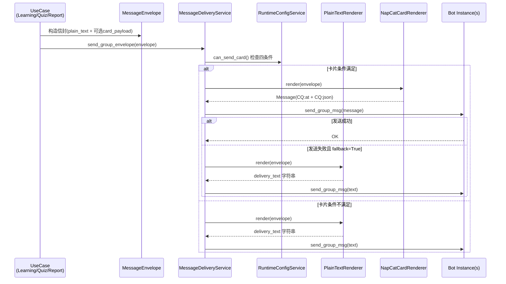

本文深入剖析 English Bot 的消息输出管线——从应用层构造 `MessageEnvelope` 信封对象，到基础设施层根据运行时配置选择**纯文本**或 **NapCat JSON 卡片**两种渲染策略，最终通过多 Bot 实例轮询投递到 QQ 群。理解这条管线是掌握定时推送、命令回复和卡片深度链接的基础。

## MessageEnvelope：多态消息信封

系统在领域值对象层定义了一个统一的**消息信封** `MessageEnvelope`，作为应用层与基础设施层之间的契约。信封同时携带纯文本和可选的卡片数据，让渲染决策完全延迟到投递时刻：

```python
@dataclass(slots=True)
class MessageEnvelope:
    plain_text: str                          # 始终存在的纯文本内容
    fallback_text: str | None = None         # 卡片失败时的回退文本（含链接）
    card_payload: dict[str, Any] | None = None  # NapCat JSON 卡片字典
    card_link_url: str | None = None         # 签名后的学习页 URL
    card_title: str | None = None            # 卡片标题

    def delivery_text(self) -> str:
        return self.fallback_text or self.plain_text
```

`delivery_text()` 体现了核心设计意图：当信封同时包含 `fallback_text`（纯文本 + 链接）和 `plain_text`（纯文本）时，纯文本渲染器优先使用前者，确保即使不走卡片通道，用户仍能收到带链接的消息。三个应用层 UseCase 负责构造信封——`LearningUseCase` 构造任务信封、`QuizUseCase` 构造周测信封、`ReportUseCase` 构造周报信封——它们的共同模式是：**先构建纯文本，再尝试构建带签名的卡片链接，链接失败则降级为纯文本信封**。

Sources: [messaging.py](src/domain/value_objects/messaging.py#L1-L27)

## 双渲染器策略：PlainText 与 NapCatCard

基础设施层提供两个独立的渲染器，遵循**策略模式（Strategy Pattern）**，由 `MessageDeliveryService` 根据运行时配置动态选择。

### PlainTextRenderer

纯文本渲染器逻辑极简——提取信封的 `delivery_text()`，如果需要 @用户则拼接 CQ 码前缀。这条路径用于所有不支持卡片的场景（定时提醒、简短回复、配置缺失时降级）：

```python
class PlainTextRenderer:
    def render(self, envelope: MessageEnvelope, *, mention_qq: str | None = None) -> str:
        text = envelope.delivery_text()
        if mention_qq:
            return f"[CQ:at,qq={mention_qq}]\n{text}"
        return text
```

### NapCatCardRenderer

卡片渲染器承担两个职责：`build_click_card()` 构建 JSON 卡片字典，`render()` 将其组装为 nonebot 的 `Message` 对象。它使用 OneBot v11 的 `MessageSegment.json()` 发送腾讯结构化消息，格式为 `com.tencent.structmsg` 的 news 类型卡片，支持标题（最长 60 字）、摘要（最长 120 字）和跳转 URL：

```python
class NapCatCardRenderer:
    def build_click_card(self, *, title, summary, url, action_label, tag="English Bot") -> dict:
        return {
            "app": "com.tencent.structmsg",
            "config": {"autosize": 1, "forward": 1},
            "meta": {
                "news": {
                    "tag": tag,
                    "title": title[:60],
                    "desc": f"{summary[:120]}\n点击操作：{action_label}",
                    "jumpUrl": url,
                }
            },
            "prompt": f"[{tag}] {title[:40]}",
            "ver": "0.0.0.1",
            "view": "news",
        }
```

两种渲染器在 @用户的处理上风格不同：纯文本用 CQ 码字符串 `[CQ:at,qq=...]`，卡片用 nonebot 原生的 `MessageSegment.at()` 加 `MessageSegment.json()`。这源于底层消息类型差异——纯文本渲染器返回 `str`，卡片渲染器返回 OneBot `Message` 对象。

Sources: [renderers.py](src/infrastructure/messaging/renderers.py#L11-L57)

## 投递决策与降级机制

`MessageDeliveryService` 是整个渲染-投递管线的**编排器**。它的核心方法是 `send_group_envelope()`，决策流程如下：



### can_send_card() 四条件判定

卡片投递必须同时满足以下四个运行时条件，任一不满足即走纯文本路径：

| 条件 | 配置项 | 默认值 | 含义 |
|------|--------|--------|------|
| 渲染模式为 hybrid | `message.render_mode` | `"hybrid"` | 设为 `"text_only"` 可全局禁用卡片 |
| 启用任务卡片 | `message.enable_task_cards` | `True` | 细粒度卡片开关 |
| 公网基础 URL 非空 | `message.public_base_url` | `""` | 卡片链接需要公网可达的学习页 |
| 信封包含卡片数据 | `envelope.card_payload` | — | 由 UseCase 层决定是否生成 |

### 降级策略

当卡片发送在运行时抛出异常（如 NapCat 不支持 JSON 消息），系统检查 `card_fallback_to_text` 配置：若为 `True`（默认），静默降级为纯文本并使用 `delivery_text()`（即带链接的 `fallback_text`）；若为 `False`，直接向上抛出异常。这个设计确保了卡片是**增强体验而非必要条件**——即使 NapCat 环境完全不可用，纯文本通道仍能保证核心消息送达。

Sources: [renderers.py](src/infrastructure/messaging/renderers.py#L60-L123), [runtime.py](src/infrastructure/settings/runtime.py#L42-L56), [models.py](src/infrastructure/settings/models.py#L80-L85)

## 多 Bot 轮询投递

`_send_message()` 实现了一个简洁的 **Bot 实例轮询**机制。它遍历所有可用的 nonebot Bot 实例（来自 `get_bots()`），逐个尝试 `send_group_msg()`，首个成功即返回。只有当所有实例都失败时才抛出最后一个异常：

```python
async def _send_message(self, *, bots: list, group_id: str, message) -> None:
    last_error: Exception | None = None
    for bot in bots:
        try:
            await bot.send_group_msg(group_id=int(group_id), message=message)
            return
        except Exception as exc:
            last_error = exc
    if last_error is not None:
        raise last_error
```

这个设计适配了 NapCat 多实例部署场景——当机器人配置了多个 QQ 账号时，系统自动利用所有可用连接提高投递成功率。调度器中的 `_send_group_envelope()` 在此基础上又加了一层 try/except，防止单群投递失败影响其他群的消息推送。

Sources: [renderers.py](src/infrastructure/messaging/renderers.py#L114-L123), [scheduler.py](src/plugins/scheduler.py#L196-L206)

## 信封构造：三个 UseCase 的统一模式

`LearningUseCase`、`QuizUseCase` 和 `ReportUseCase` 以相同的三步模式构造 `MessageEnvelope`：

**第一步**：构建纯文本内容（`plain_text`），这是任何情况下都能展示的基础消息。

**第二步**：调用 `_build_card_link()` 尝试生成带签名的学习页 URL。该方法通过 `CardLinkSigner` 将 `resource_type`、`resource_id`、`qq_user_id`、`qq_group_id` 和 `expires_at` 编码为一个 URL-safe token，拼接到 `public_base_url` 之后。如果 `public_base_url` 为空，直接返回 `None`，跳过卡片构造。

**第三步**：若链接生成成功，调用 `NapCatCardRenderer.build_click_card()` 构建卡片 JSON，并将 `fallback_text` 设为纯文本加链接的形式，确保降级时用户仍可点击。

三个 UseCase 的信封参数对比：

| UseCase | resource_type | card action_label | 卡片标题 |
|---------|--------------|-------------------|----------|
| `LearningUseCase` | `"task"` | `"打开任务页"` | 课程内容标题 |
| `QuizUseCase` | `"quiz"` | `"开始答题"` | `"本周英语小测"` |
| `ReportUseCase` | `"report"` | `"查看周报"` | `"{周标识} 学习周报"` |

Sources: [learning_usecases.py](src/application/learning_usecases.py#L88-L128), [quiz_usecases.py](src/application/quiz_usecases.py#L42-L115), [report_usecases.py](src/application/report_usecases.py#L44-L149)

## 两条投递路径：定时推送 vs 命令回复

系统中存在两条不同的消息投递路径，它们共享同一个 `MessageDeliveryService`，但调用方式有显著差异。

### 定时推送路径

定时任务（[APScheduler 定时任务注册与执行](20-apscheduler-ding-shi-ren-wu-zhu-ce-yu-zhi-xing)）通过 `_send_group_envelope()` 辅助函数投递。该路径从 `get_bots()` 获取**所有在线 Bot 实例**，使用 `send_group_envelope()` 发送。定时推送的特点是：Bot 对象由框架全局提供、支持多实例轮询、异常被静默吞掉（不影响其他群），且周报/周测场景会传入 `mention_qq` 参数以 @特定用户：

```python
# scheduler.py 中的调用示例
await container.message_delivery_service.send_group_envelope(
    bots=bots, group_id=group_id, envelope=envelope, mention_qq=user.qq_user_id,
)
```

### 命令回复路径

用户在群内发送固定命令（[固定命令注册与分发机制](7-gu-ding-ming-ling-zhu-ce-yu-fen-fa-ji-zhi)）时，通过 `reply_group_envelope()` 投递。该路径仅使用**当前触发事件的单个 Bot 实例**，将 bot 列表包装为单元素列表后委托给 `send_group_envelope()`。注意命令路径不传 `mention_qq`，因为用户已在群内主动触发，无需再次 @：

```python
# commands.py 中的调用
await container.message_delivery_service.reply_group_envelope(
    bot=bot, group_id=str(event.group_id), envelope=_to_envelope(message),
)
```

`_to_envelope()` 辅助函数负责将 UseCase 返回的 `str` 或 `MessageEnvelope` 统一为信封类型——纯字符串被包装为只有 `plain_text` 的最简信封，天然跳过卡片通道。

Sources: [scheduler.py](src/plugins/scheduler.py#L57-L101), [commands.py](src/plugins/commands.py#L145-L179), [renderers.py](src/infrastructure/messaging/renderers.py#L80-L112)

## 运行时配置驱动的渲染行为

消息渲染行为完全由**运行时配置**控制，而非静态配置。`RuntimeConfigService` 通过 `_get(key, default)` 方法先查数据库缓存，再回退到 `config.yaml` 的静态值。管理员可在运行时通过管理后台（[FastAPI 管理后台](22-fastapi-guan-li-hou-tai-yi-biao-pan-yong-hu-guan-li-yu-yun-xing-shi-pei-zhi)）动态调整以下五个消息相关配置：

| 配置键 | 类型 | 静态默认值 | 控制范围 |
|--------|------|-----------|----------|
| `message.render_mode` | `str` | `"hybrid"` | 全局渲染模式 |
| `message.enable_task_cards` | `bool` | `True` | 是否生成卡片 |
| `message.public_base_url` | `str` | `""` | 卡片链接的公网基础 URL |
| `message.link_expire_minutes` | `int` | `60` | 签名链接过期时间（分钟） |
| `message.card_fallback_to_text` | `bool` | `True` | 卡片失败时是否降级 |

一个关键的运维要点：**`public_base_url` 为空字符串时，所有卡片功能被自动禁用**。这意味着在内网开发环境下，即使 `render_mode` 为 `"hybrid"` 且 `enable_task_cards` 为 `True`，系统也会因为无法构造公网链接而走纯文本路径。这是有意为之的安全设计——卡片中的学习页链接必须通过 [CardLinkSigner](18-qia-pian-lian-jie-qian-ming-yu-guo-qi-yan-zheng-cardlinksigner) 签名验证，而签名验证需要公网可达的服务端。

Sources: [runtime.py](src/infrastructure/settings/runtime.py#L42-L56), [models.py](src/infrastructure/settings/models.py#L80-L85)

## 完整管线数据流

以下流程图展示了从 UseCase 构造信封到最终投递到 QQ 群的完整数据流：



## 测试覆盖

`test_message_delivery.py` 通过 Stub 对象验证了三个核心场景：

- **无公网 URL 时降级为纯文本**：`public_base_url=""` 导致 `can_send_card()` 返回 `False`，直接走 `PlainTextRenderer`，最终发送的是信封的 `plain_text` 内容。
- **卡片条件满足时发送 JSON 卡片**：完整的 hybrid 模式下，消息中包含 `CQ:json` 和 `CQ:at` 段，验证了卡片渲染器的正确输出。
- **卡片发送失败后降级到 fallback_text**：Bot Stub 模拟 JSON 发送异常，系统降级后发送 `fallback_text`（而非 `plain_text`），证明降级路径使用了带链接的回退文本。

Sources: [test_message_delivery.py](tests/test_message_delivery.py#L1-L108)

## 下一步阅读

- [卡片链接签名与过期验证（CardLinkSigner）](18-qia-pian-lian-jie-qian-ming-yu-guo-qi-yan-zheng-cardlinksigner) — 了解卡片 URL 的签名机制和过期验证逻辑
- [双层配置体系：运行时配置与静态配置](13-shuang-ceng-pei-zhi-ti-xi-yun-xing-shi-pei-zhi-yu-jing-tai-pei-zhi) — 理解 `RuntimeConfigService` 如何桥接数据库动态配置和 YAML 静态配置
- [固定命令注册与分发机制](7-gu-ding-ming-ling-zhu-ce-yu-fen-fa-ji-zhi) — 查看命令路径如何触发信封投递