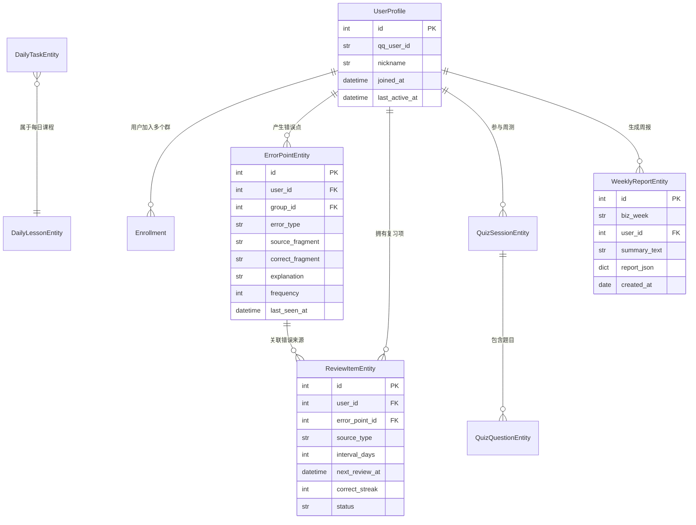
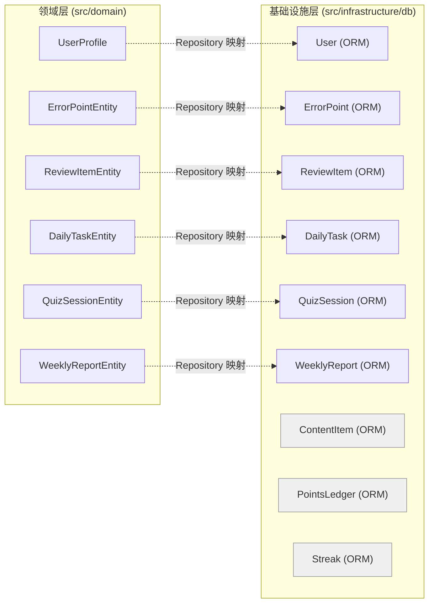
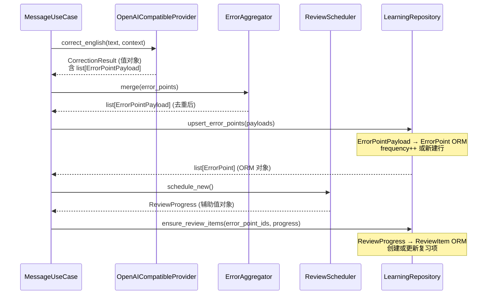

本项目采用 Clean Architecture 分层，领域层（`src/domain/`）承载了核心业务概念的纯 Python 表达。实体与值对象是该层的两类基石——**实体（Entity）** 拥有唯一标识，代表生命周期跨多个用例的持久化状态；**值对象（Value Object）** 无标识，以不可变数据结构封装计算结果和跨层传输契约。这种分离使得领域逻辑完全不依赖 SQLAlchemy ORM 或任何外部框架，保持了核心业务规则的可测试性和可替换性。

Sources: [models.py](src/domain/entities/models.py#L1-L79), [learning.py](src/domain/value_objects/learning.py#L1-L84), [messaging.py](src/domain/value_objects/messaging.py#L1-L27)

## 设计原则：dataclass(slots=True) 与零继承

所有领域对象均使用 `@dataclass(slots=True)` 定义，不继承任何基类。`slots=True` 为每个实例关闭 `__dict__`，改用固定槽位存储字段，带来约 40% 的内存节省和更快的属性访问速度。这种设计同时具有防御性——在运行时无法动态添加未声明的属性，避免了拼写错误引入的隐蔽 Bug。

```python
@dataclass(slots=True)
class UserProfile:
    id: int
    qq_user_id: str
    nickname: str
    joined_at: datetime
    last_active_at: datetime
```

对比基础设施层的 ORM 模型（如 `User(Base, TimestampMixin)`），领域对象刻意不引入 SQLAlchemy 的 `Mapped`、`mapped_column` 或任何 ORM 语义。这种"纯数据类"策略意味着领域层可以独立于数据库技术进行单元测试，无需创建引擎或会话。

Sources: [models.py](src/domain/entities/models.py#L7-L14), [base.py](src/infrastructure/db/base.py#L18-L33)

## 实体一览：拥有身份标识的持久化状态

实体通过 `id` 字段确立身份。即使两个实体的所有其他字段完全相同，只要 `id` 不同就是不同的对象。项目中定义了 **7 个实体**，覆盖用户身份、学习记录和测评报告三大业务子域。



下表总结了全部实体及其业务语义：

| 实体 | 核心字段 | 业务含义 | 所在子域 |
|---|---|---|---|
| **UserProfile** | `qq_user_id`, `nickname`, `joined_at` | QQ 用户身份档案 | 用户身份 |
| **Enrollment** | `user_id`, `group_id`, `status` | 用户在特定群的学习注册关系 | 用户身份 |
| **ErrorPointEntity** | `error_type`, `source_fragment`, `correct_fragment`, `frequency` | 一次英语错误记录（含类型、原文、纠正、频次） | 学习记录 |
| **ReviewItemEntity** | `error_point_id`, `interval_days`, `correct_streak`, `status` | 间隔复习调度项，关联一个错误点 | 学习记录 |
| **DailyTaskEntity** | `lesson_id`, `task_type`, `prompt`, `score_weight` | 每日课程中的单项任务 | 学习记录 |
| **QuizSessionEntity** | `biz_week`, `total_score`, `status` | 一周的测验会话 | 测评报告 |
| **WeeklyReportEntity** | `biz_week`, `summary_text`, `report_json` | 一周学习报告（含 JSON 统计快照） | 测评报告 |

值得注意的是，实体字段名与基础设施层的 ORM 模型字段名保持高度一致（如 `ErrorPointEntity.frequency` 对应 `ErrorPoint.frequency`），但两者是完全独立的类型。Repository 层负责在 ORM 对象与领域实体之间做数据搬运。

Sources: [models.py](src/domain/entities/models.py#L1-L79), [models.py](src/infrastructure/db/models.py#L11-L100)

## 值对象一览：无身份的不可变数据契约

值对象没有 `id` 字段，由其全部属性值决定等价性。在本项目中，值对象承担两类职责：**Provider 计算结果**（翻译、纠错等外部调用的返回值）和**跨层数据传输对象（DTO）**（消息信封、课程包等）。

### 学习子域值对象（learning.py）

| 值对象 | 用途 | 生产者 | 消费者 |
|---|---|---|---|
| **LanguageType** | 语言枚举（`en` / `zh` / `unknown`） | `TencentTranslateProvider` | `MessageUseCase` |
| **TranslationResult** | 翻译结果（原文 + 译文 + 语言对 + 提供者） | `TencentTranslateProvider` | `MessageUseCase` |
| **ErrorPointPayload** | 错误点载荷（类型 + 原文片段 + 纠正片段 + 解释） | `OpenAICompatibleProvider` | `ErrorAggregator` / Repository |
| **CorrectionResult** | 纠错结果（含纠正文本、翻译、自然表达、解释、错误点列表） | `OpenAICompatibleProvider` | `MessageUseCase` |
| **LessonTask** | 课程中的单个任务描述 | `TedContentProvider` | Repository |
| **LessonBundle** | 完整课程包（标题、正文、URL、难度、日期、任务列表） | `TedContentProvider` | `LearningUseCase` / Repository |
| **QuizQuestionBundle** | 周测单题（题干、选项、答案、解析） | `QuizUseCase` | Repository |
| **WeeklyReportBundle** | 周报数据包 | `ReportUseCase` | Repository |
| **RuntimeSetting** | 运行时配置键值对 | `RuntimeConfigService` | Admin 路由 |

其中 `CorrectionResult` 的设计体现了值对象的组合能力：它包含一个 `list[ErrorPointPayload]`，将纠错的宏观结果和微观错误点组织为一个完整的值结构。

```python
@dataclass(slots=True)
class CorrectionResult:
    original_text: str
    corrected_text: str
    zh_translation: str
    natural_expression: str
    explanation: str
    provider: str
    error_points: list[ErrorPointPayload] = field(default_factory=list)
```

Sources: [learning.py](src/domain/value_objects/learning.py#L8-L83)

### 消息子域值对象（messaging.py）

| 值对象 | 用途 |
|---|---|
| **MessageEnvelope** | 消息投递信封，封装纯文本、回退文本和 NapCat 卡片载荷，`delivery_text()` 方法返回实际投递内容 |
| **CardLinkPayload** | 卡片链接签名载荷，包含资源类型、资源 ID、QQ 用户/群 ID 和过期时间 |

`MessageEnvelope` 是贯穿整个消息输出管线的核心值对象。几乎所有用例（任务推送、周测、周报）最终都将其计算结果包装为 `MessageEnvelope` 返回，由外层渲染管线决定使用纯文本还是 NapCat 卡片形式投递。`delivery_text()` 方法提供了优雅的降级逻辑——当 `fallback_text` 不存在时自动回退到 `plain_text`。

Sources: [messaging.py](src/domain/value_objects/messaging.py#L8-L27)

## 领域服务中的辅助值对象

除 `entities/` 和 `value_objects/` 目录外，领域服务层也定义了若干与特定业务算法紧密耦合的值对象。这些值对象不参与跨层传输，仅在对应服务的调用链中使用。

| 值对象 | 所属服务 | 用途 |
|---|---|---|
| **ReviewProgress** | `ReviewScheduler` | 封装间隔复习调度结果（间隔天数、连续正确数、下次复习时间、状态） |
| **LearningEvidence** | `LevelService` | 封装用户学习行为证据（翻译数、纠错数、任务完成数、周测平均分） |

这种"就近定义"的模式保持了高内聚——`ReviewProgress` 只在 `ReviewScheduler.schedule_new()` 和 `update_after_answer()` 中构造和返回，不需要被其他层感知。应用层在接收到 `ReviewProgress` 后直接解构其字段传递给 Repository。

Sources: [review.py](src/domain/services/review.py#L7-L13), [leveling.py](src/domain/services/leveling.py#L6-L11)

## 实体与 ORM 模型的映射关系

领域实体与基础设施层的 SQLAlchemy ORM 模型之间存在一对多的映射关系——并非所有 ORM 模型都有对应的领域实体（如 `ContentItem`、`PointsLedger`、`Streak` 等），但所有实体都能找到对应的 ORM 表。这种不对称映射是有意为之的：领域层只抽象出与核心业务规则相关的概念，技术性辅助表（积分流水、打卡连续天数等）留在基础设施层内部。



灰色标注的 ORM 模型（`ContentItem`、`PointsLedger`、`Streak`）没有对应的领域实体，它们由 Repository 直接管理，应用层通过 Repository 方法间接使用。例如 `award_points()` 方法同时写入积分流水和更新连续天数，但调用方只传入 `user_id`、`points` 和 `reason`，无需了解底层有两张表。

Sources: [models.py](src/infrastructure/db/models.py#L103-L228), [learning.py](src/infrastructure/db/repositories/learning.py#L129-L170)

## 数据流示例：从值对象到实体的完整链路

以消息纠错场景为例，展示值对象如何穿过领域服务最终落库为实体：



关键洞察：`ErrorPointPayload` 作为值对象在 Provider → Aggregator → Repository 全链路中传递，保持了"纠错载荷"语义的纯洁性。Repository 在写入数据库时才将其字段拆解到 ORM 模型中。同样，`ReviewProgress` 由 `ReviewScheduler`（纯函数，无 I/O）计算后传给 Repository 落库。领域服务不接触数据库会话，保持了纯粹的业务逻辑职责。

Sources: [message_usecases.py](src/application/message_usecases.py#L98-L121), [error_points.py](src/domain/services/error_points.py#L8-L27), [review.py](src/domain/services/review.py#L15-L49)

## 设计权衡：Repository 直接返回 ORM 对象

在理想化的 Clean Architecture 中，Repository 应该返回领域实体而非 ORM 对象。但本项目的 Repository 方法大多直接返回 SQLAlchemy ORM 模型实例（如 `ErrorPoint`、`ReviewItem`），而非领域实体（如 `ErrorPointEntity`、`ReviewItemEntity`）。这是一个务实的工程权衡：

- **减少映射代码**：ORM 对象与领域实体字段高度重叠，逐字段映射带来大量样板代码但价值有限
- **延迟重构时机**：v1 阶段保持简单，当业务复杂度增长时再引入完整的反腐败层
- **保持灵活性**：应用层可以直接访问 ORM 对象的延迟加载关系，避免 N+1 问题

当前阶段，`src/domain/entities/models.py` 中的实体定义更像是一份"领域词汇表"——它用纯 Python dataclass 精确记录了业务概念的结构，但尚未被 Repository 全面使用。随着项目演进，这些实体定义将成为引入完整映射层的基础。

Sources: [learning.py](src/infrastructure/db/repositories/learning.py#L32-L56), [models.py](src/domain/entities/models.py#L24-L48)

## 延伸阅读

- 实体的错误点如何通过去重签名合并为 `ErrorPointEntity`，参见 [错误点聚合（ErrorAggregator）与去重签名](10-cuo-wu-dian-ju-he-erroraggregator-yu-qu-zhong-qian-ming)
- 复习项的间隔倍增策略如何操作 `ReviewItemEntity` 的 `interval_days` 和 `correct_streak`，参见 [间隔复习调度（ReviewScheduler）与倍增策略](11-jian-ge-fu-xi-diao-du-reviewscheduler-yu-bei-zeng-ce-lue)
- `LearningEvidence` 值对象如何驱动用户分级判断，参见 [用户分级系统（LevelService）](12-yong-hu-fen-ji-xi-tong-levelservice)
- ORM 模型的完整表结构和 Repository 数据访问实现，参见 [SQLite 数据库模型与 Repository 数据访问](17-sqlite-shu-ju-ku-mo-xing-yu-repository-shu-ju-fang-wen)